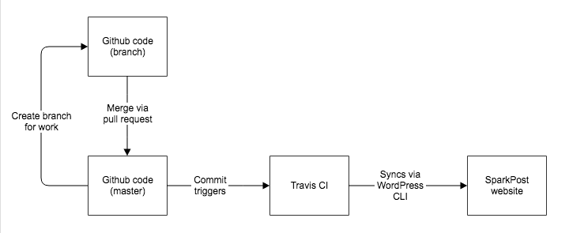

# SparkPost and Momentum documentation

[](https://app.netlify.com/sites/support-docs/deploys)

This repo contains the SparkPost and Momentum documentation published at https://support.sparkpost.com/docs and https://support.sparkpost.com/momentum.

SparkPost documentation is located in the `content/docs/` directory.

Momentum documentation is located in the `content/momentum/` directory.

All content is formatted in [Markdown](https://daringfireball.net/projects/markdown/syntax) and version control is managed by Github.

The framework is built in [Next.js](https://nextjs.org/) and previews/builds/hosting are managed on [Netlify](https://www.netlify.com/).

For more information on SLIs/SLOs including uptime monitoring and error rate monitoring, refer to our [FE Services doc for Support Docs](https://sparkpost.atlassian.net/wiki/spaces/ENG/pages/1238728726/FE+Support+Docs)

- [SparkPost and Momentum documentation](#sparkpost-and-momentum-documentation)
  - [Resources](#resources)
  - [Directory Structure](#directory-structure)
- [Content](#content)
  - [Articles](#articles)
    - [Frontmatter](#frontmatter)
  - [Images and other media](#images-and-other-media)
  - [Categories](#categories)
  - [Navigation](#navigation)
- [Deployment](#deployment)
  - [Pipeline](#pipeline)
- [Development](#development)
  - [Installation](#installation)
  - [Local Environment](#local-environment)
  - [Local environment variables](#local-environment-variables)
  - [How to Preview Changes](#how-to-preview-changes)
  - [How to Deploy Changes](#how-to-deploy-changes)
  - [Lighthouse Performance Audit](#lighthouse-performance-audit)
  - [Uptime Monitoring](#uptime-monitoring)

### Resources

- [Markdown tutorial](http://www.markdowntutorial.com/)
- [YAML tutorial](https://docs.ansible.com/ansible/latest/reference_appendices/YAMLSyntax.html)

### Directory Structure

```
└── content/
      ├── example/  – A example folder for a category, article and media
      ├── momentum/ – Momentum documentation for 4.x, 3.x, and Mobile
      └── docs/     – The full SparkPost documentation
```

## Content

In order to maintain readability, usability, and keep our UX consistent we are [following the guidelines provided to us by the UX team](https://docs.google.com/document/d/1dej9J7N9M8lcbJXnT9kxyNB_EFBPHIBLZBbHaxRWqhQ/edit). \***\*Please review these guidelines before contributing.\*\***

Currently all content is edited using [Github](https://github.com/SparkPost/support-docs). You are free to either edit the content using the [web app in github](https://docs.github.com/en/repositories/working-with-files/managing-files/editing-files) or [the cli](https://cli.github.com/). Whatever you are most comfortable with.

**Important note:** the functionality for the Momentum and SparkPost documentation is identical

### Articles

Markdown articles live in the `docs` or `momentum` folders. Every folder inside of the `docs` or `momentum` folder is category (e.g. api, billing). The articles are formatted using [Markdown](https://daringfireball.net/projects/markdown/syntax). Each article contains YAML metadata at the top, called frontmatter, used to set the title, description, and other options.

The rest of the article content is written in plain Markdown, a simple syntax that can be used to write content for the web. A [Markdown tutorial](http://www.markdowntutorial.com/) is available on GitHub.

#### Frontmatter

**Fields:**

- `title` – Top-level title of the article. This will show up at the top of the page and in search results.
- `description` – Description of the article. This is used for SEO, the search results, and the list of articles in each category.
- `lastUpdated` – This is the date that the article has last been updated and needs to be modified by the editor.

**Example:**

```yaml
title: 'Example Support Article'
description: 'Lorem ipsum dolor sit amet, consectetur adipisicing elit, sed do eiusmod tempor incididunt ut labore et dolore magna aliqua. Ut enim ad minim veniam, quis nostrud exercitation ullamco laboris nisi ut aliquip ex ea commodo consequat.'
lastUpdated: '11/09/2021'
```

### Images and other media

Images and other media should be placed in `docs/<category>/media/<slug>/`, where `category` is the name of the folder containing the article and `slug` is the name of the file without the `.md` extension. For example, the following structure shows an article in the category `api` with some media:

```
docs/api
├── media
│   └── managing-sending-domains
│       └── some-image.png
├── index.md
└── managing-sending-domains.md
```

Note how the name of the file without the `.md` extension is same as the name of the subfolder in the `media` folder.

The file `managing-sending-domains.md` would then contain some Markdown like this:

```markdown
...


...
```

_While this folder structure is encouraged for organizational purposes, any media referenced in the markdown will be imported._

### Categories

Both the Momentum articles and SparkPost support articles are organized into categories. The category is defined by the containing folder.

Categories can be nested to create nested URL structures. For example in the following folder structure, the file `my-article.md` will be deployed to `https://support.sparkpost.com/docs/category/subcategory/my-article`

```
support
├── category
│   └── subcategory
│       └── my-article.md
```

Categories are configured through the `index.md` in the folder. The markdown should contain at least a `name` and `description`.

```md
---
name: 'Category Name Here'
description: 'Description of the category here'
---
```

### Navigation

For each article page hosted on the support.sparkpost.com website, there is a sidebar menu. The top-level menu is configured through next.js. To edit this, speak to the SparkPost FE team.

For large sets of organized documentation it is important that there is a clear navigation and hierarchy. The subnavigation is set through the `content/<category name>` directory folder structure (so `content/momentum/` and `content/docs/`). This is used to generate the Momentum 4.x, Momentum 3.x, and Momentum Mobile navigation in the sidebar seen in the [Momentum documentation](https://support.sparkpost.com/momentum) or Help & API, Guides and Deliverability navigation in the sidebar seen in the [support docs documentation](https://support.sparkpost.com/docs/)

## Deployment



### Pipeline

Deployment of support articles is handled automatically through [Netlify](https://app.netlify.com/sites/support-docs/overview). Once code is merged down to the `main` branch, a build/deployment are triggered. Here are the steps for the preview and build process as outlined in the [FE Docs](https://sparkpost.atlassian.net/wiki/spaces/ENG/pages/1238728726/FE+Support+Docs):

1. create feature branch and make changes
2. open a pull request and preview staging view to verify change
3. merge to main branch to trigger an incremental build and deployment

## Development

The following instructions walk you through how to sync your local version of this repository to your local version of the support.sparkpost.com website. This is only needed when you are debugging the sync scripts or adding new functionality.

_**This is not a required step in contributing to the documentation**_

### Installation

Navigate in your terminal to the root directory (`support-docs/` or whatever you named it) and install all dependencies:

```
npm install
```

### Local Environment

Then, run the development server:

```bash
npm run dev
```

Open [http://localhost:3000](http://localhost:3000) with your browser to see the result.

### Learn More About Next.js

To learn more about Next.js, take a look at the following resources:

- [Next.js Documentation](https://nextjs.org/docs) - learn about Next.js features and API.
- [Learn Next.js](https://nextjs.org/learn) - an interactive Next.js tutorial.

You can check out [the Next.js GitHub repository](https://github.com/vercel/next.js/) - your feedback and contributions are welcome!

### Local environment variables

To run the sync scripts locally you need to define the following environment variables. You can use either the below values as a template, or take a look at `.example.env.local`:

```
NEXT_PUBLIC_GTM_ID=123
NEXT_PUBLIC_ALGOLIA_APP_ID=
NEXT_PUBLIC_ALGOLIA_SEARCH_API_KEY=
ALGOLIA_SEARCH_ADMIN_KEY=

# According to https://github.com/vercel/next.js/issues/3605#issuecomment-370250206, nextjs only
# supports 'production' and 'development' envs out of the box, so we have to create a ENV
# variable if we want a 'test' specific environment

ENV=
```

You will also need a local version of the `.sentryclirc` file and an example can be found in the root of the project directory (`.example.sentryclirc`)

All of these actual variables can be found in [app's Netlify site settings](https://app.netlify.com/sites/support-docs/settings/deploys#environment). If you are having trouble building locally, it may be related to missing a key env variable. If you have access, grab these from the Netlify site settings. Otherwise, contact the FE team.

### How to preview changes

In order to preview changes, you will need access to [Netlify](https://app.netlify.com/sites/support-docs/deploys). Contact FE for assistance.

1. Create a branch
2. Create a PR to `main`
3. Go to https://app.netlify.com/sites/support-docs/deploys
4. You are now in the "deploys" section. Here you can see a list of all builds, "production" and "deploy previews"
5. Look in the list for your branch name and click the latest "deploy preview" that matches

- This will show a version for the PR current build of the static Netlify site

### How to deploy changes

1. Complete the steps above in the "How to preview changes" section
2. Once the PR is approved by a reviewer and the PR is merged and squashed, the build will kick off automatically.

### Lighthouse Performance Audit

We have created a github action (`.github/workflows/lighthouse.yml`) that runs a lighthouse process and creates an [lighthouse report artifact in github](https://github.com/SparkPost/support-docs/actions/workflows/lighthouse.yml). Our goal is to keep these scores in the green as much as possible.

### Uptime monitoring

We plan on leveraging CloudWatch Canary, but right now we have access to Netlify's uptime monitoring on their site.

- https://www.netlifystatus.com/
