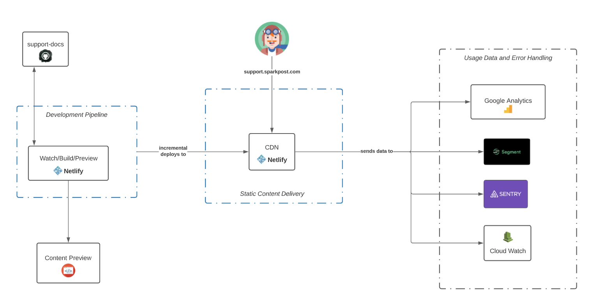

# SparkPost and Momentum documentation

[](https://travis-ci.org/SparkPost/support-docs)

This repo contains the SparkPost and Momentum documentation published at https://www.sparkpost.com/docs and https://www.sparkpost.com/momentum.

SparkPost documentation is located in the `support/` directory.

Momentum documentation is located in the `momentum/` directory.

All content is formatted in [Markdown](https://daringfireball.net/projects/markdown/syntax).

* [SparkPost and Momentum documentation](TODO)
  * [Resources](TODO)
  * [Directory Structure](TODO)
* [Content](TODO)
  * [Articles](TODO)
    * [Frontmatter](TODO)
  * [Images and other media](TODO)
  * [Categories](TODO)
  * [Navigation](TODO)
    * [Table of Contents](TODO)
    * [Sidebar](TODO)
* [Deployment](TODO)
  * [Pipeline](TODO)
  * [Scripts](TODO)
    * [Environment variables](TODO)
* [Development](TODO)
  * [Installation](TODO)
  * [Environment variables](TODO)
  * [Sync locally](TODO)
  * [Cleaning WordPress](TODO)
  * [Adding a new article type](TODO)

##### Resources:

* [Markdown tutorial](http://www.markdowntutorial.com/)
* [YAML tutorial](TODO)

### Directory Structure

```
├── bin/      – Scripts for rendering the markdown to html and deploying the HTML to WordPress
├── example/  – A example folder for a category, article and media
├── momentum/ – Momentum documentation for 4.x, 3.x, and Mobile
└── support/  – The full SparkPost documentation
```

## Content

**Important note:** the functionality for the Momentum and SparkPost documentation is identical. Although today they use different options, they share the same options.

While this document 

### Articles

Markdown articles live in the `support` or `momentum` folders. Every folder inside of the `support` or `momentum` folder is category (e.g. api, billing). The articles are formatted using [Markdown](https://daringfireball.net/projects/markdown/syntax). Each article contains YAML metadata at the top, called frontmatter, used to set the title, description and other options.

The rest of the article content is written in plain Markdown, a simple syntax that can be used to write content for the web. A [Markdown tutorial](http://www.markdowntutorial.com/) is available on GitHub.


##### Frontmatter

**Fields:**

* title – Top-level title of the article. This will show up at the top of the page and in search results.
* description – Description of the article. This is used for SEO, the search results, and the list of articles in each category.
* notification – A notification to show at the top of the article, before the content and below the title. [How to Use Binding Groups](TODO) is an example of this.

**Example:**

```yaml
title: "Example Support Article"
description: "Lorem ipsum dolor sit amet, consectetur adipisicing elit, sed do eiusmod tempor incididunt ut labore et dolore magna aliqua. Ut enim ad minim veniam, quis nostrud exercitation ullamco laboris nisi ut aliquip ex ea commodo consequat."
```
### Images and other media

Images and other media should be placed in `articles/<category>/media/<slug>/`, where `category` is the name of the folder containing the article and `slug` is the name of the file without the `.md` extension. For example, the following structure shows an article in the category `api` with some media:

```
articles/api
├── media
│   └── managing-sending-domains
│       └── some-image.png
├── index.md
└── managing-sending-domains.md
```

Note how the name of the file without the `.md` extension is same as the name of the subfolder in the `media` folder.

The file `managing-sending-domains.md` would then contain some Markdown like this:

```markdown
...


...
```

_While this folder structure is encouraged for organizational purposes, any media referenced in the markdown will be properly imported._

### Categories

TODO

* Differences between category=custom and a regular post
* Category types of list, custom, and rollup, as well as when to use them


### Navigation

TODO

* Navigation file and navigation shortcode

#### Table of Contents

TODO 

#### Sidebar

The sidebar navigation is configured manually through WordPress. To edit this, speak to SparkPost Marketing team.

## Deployment



### Pipeline

Deployment of support articles is handled automatically through [Travis CI](https://travis-ci.org/SparkPost/support-docs). Once code is merged down to the master branch, a build/deployment are triggered. The following occurs during this automated process:

* Navigation file (navigation.yml) is synced to WordPress
* Categories for the articles are synced with WordPress
  * If it is a "custom" type, the content is converted from Markdown to HTML before it is synced
* Articles are converted from Markdown to HTML
* Articles and their images are synced with WordPress

## Development

The following instructions walk you through how to sync your local version of this repository to your local version of the sparkpost.com website. This is only needed when you are debugging the sync scripts or adding new functionality. 

**This is not a required step in contributing to the documentation**

### Installation

Run the following command to install the [Wordpress CLI](http://wp-cli.org/), [jq](https://stedolan.github.io/jq/), and NPM dependencies. Note the script is written to work on Macs only.

```bash
./bin/bootstrap.sh
```

### Environment variables

To run the sync scripts locally you need to define the following environment variables. You can use the below values as a template:

```bash
export WP_DEVELOPMENT="/my_wp/path" # This needs to be set to the absolute path to the wordpress core directory
export WP_USER="my.account@example.com" # Defaults to the Wordpress Support account
export GITHUB_TOKEN="some_access_token" # This is set to raise the rate limiting to get the contributors
```


### Sync locally

After installing the dependencies and setting up the required environment variables, you are ready to sync your local support-docs repository to your local WordPress instance.

Run the following three commands in sequence to sync all the support articles.

The `--all` flag on the each of the deploy scripts redeploys all the of respective resource. If this is not set, then the files edits in the commit range inside of the `$TRAVIS_COMMIT_RANGE` is used. Learn more about the [$TRAVIS_COMMIT_RANGE](TODO).

```bash
./bin/deploy-navigation.sh --directory='support' --type='support_article' --tax='support_category' --all
./bin/deploy-categories.sh --directory='support' --type='support_article' --tax='support_category' --all
./bin/deploy-articles.sh --directory='support' --type='support_article' --tax='support_category' --all
```

To sync all of the Momentum articles, run the following:

```bash
./bin/deploy-navigation.sh --directory='momentum' --type='momentum_article' --tax='momentum_category' --all
./bin/deploy-categories.sh --directory='momentum' --type='momentum_article' --tax='momentum_category' --all
./bin/deploy-articles.sh --directory='momentum' --type='momentum_article' --tax='momentum_category' --all
```

### Cleaning WordPress

If you want to clean out the navigation, articles, categories, and related media, run the following command:

```bash
./bin/clear-data.sh
```


### Adding a new article type

TODO