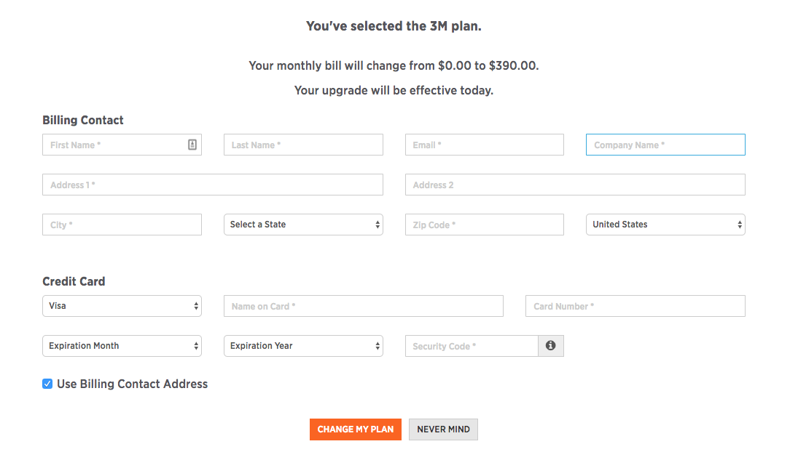

On the dashboard, go to Account –> Billing. There you will be able to see the plan you are currently on, as well as all of the other plans we provide.

Once you decide on the plan you would like to upgrade to, click on it. A window will drop down and you will see a form requesting credit card information. Fill it out, and you’re good to go!

If you want something more customized, please contact our [Sales team](https://www.sparkpost.com/sales/).

If you have any other questions concerning your billing account, please contact our [Billing team](https://app.sparkpost.com/dashboard/?supportTicket=true&supportIssue=general_billing).
