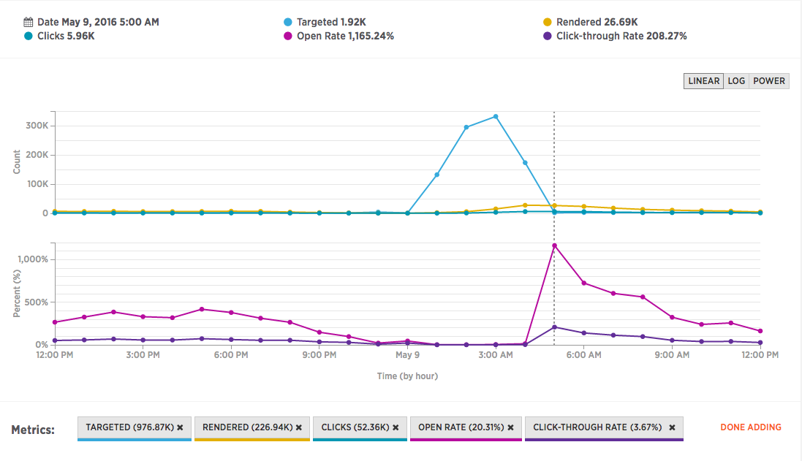

Time series graphs on the summary page calculate most **rate** metrics against the number of targeted messages. Rolling your mouse cursor over a specific point in time on the graph will display the results exactly at that point in time. As an example, if you have previously sent out a mailing and have included click and open tracking options on those messages, clicks and opens/renders will continue to be registered after the mailing has completed, after there are no more messages being targeted. 

This creates two scenarios in which rate calculations on the time series graph will not show correct data.

1.  If targeted messages are zero at the given point in time on the graph, and a fair amount of opens/renders and clicks are being recorded, this will give an artificially inflated open and click through rate which will often exceed 100%, or much, much higher (as the attached screenshot shows).
2.  If messages are still being shown as targeted on the time series graph, and there hasn't been sufficient time for recipients to open/render or click on your messages, this will show an artificially lower open or click through rate than the actual correct value.

It is recommended that you do not rely on the time series graph for **rate** calculations for these reasons, and instead rely more on the rate calculations listed *below* the time series graph where the **metrics **calculations are displayed.