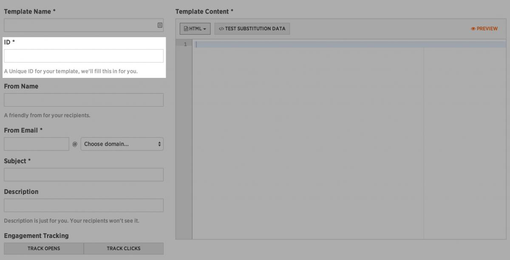
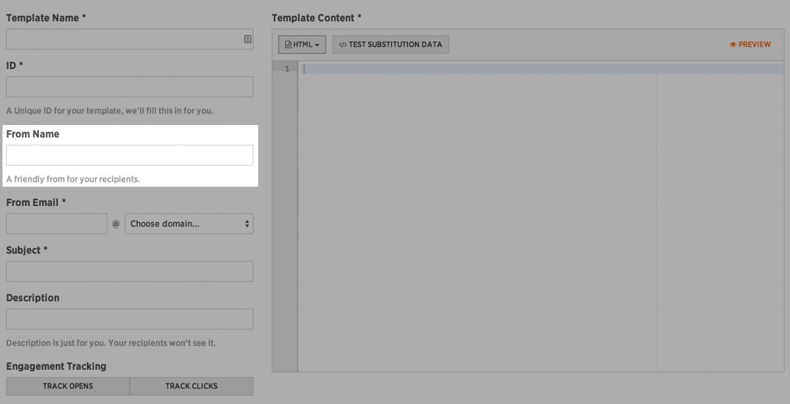
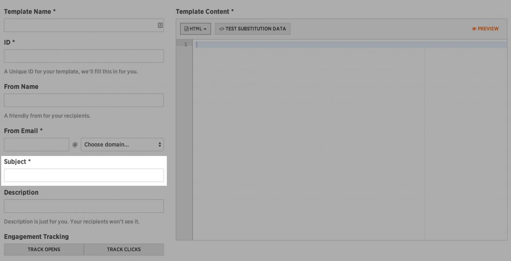
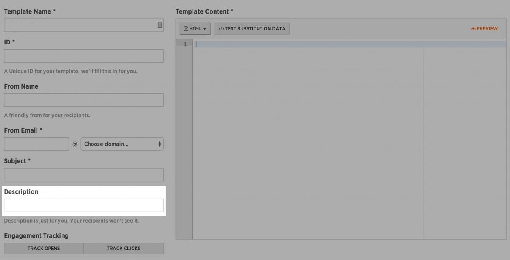

## Create a Template

Once you understand how to [send an email (transmission)](https://support.sparkpost.com/customer/portal/articles/1929887-sending-your-first-email "Sending an email (transmission)"), you'll want to know how to create templates in SparkPost.

Currently there are two ways you can create templates in SparkPost:

**[Create templates in SparkPost using the App](https://support.sparkpost.com/customer/portal/articles/1929890-creating-a-template#create-templates-with-the-app "Create templates in SparkPost using the application")**                                                                                                                                                                                                              

**[Create templates in SparkPost using the API](https://support.sparkpost.com/customer/portal/articles/1929890-creating-a-template#create-templates-with-the-api "Create templates in SparkPost using the API")**                                                                                                                                                                                                      

## Why create templates in SparkPost?

*   **Reference:** Easily communicate with your team by having a set of named templates to reference.
*   **Error Reduction:**            Reduce duplicated efforts and potential embarrassing emails with typos or errors.
*   **Simplification:** Building a library of "go-to" templates for recurrent use-cases simpler for your development team.
*   **Systemize:** Using SparkPost templates in concert with substitution_data can make it easy to create re-usable templates for your systems

## Creating Templates with the App

Creating a template using the SparkPost Application (UI) is super simple. To get started, let's go step-by-step through how you can define a new template...

### Defining Your Email Template in SparkPost

1.  **Open the templates view:**                     Click on "Templates" in the main SparkPost navigation.
    

2.  **Make a new template:**                 Click on the "New Template" button to open the SparkPost template editor.
    

3.  **Name your template:**                Input a human-friendly name for your template in the "Template Name" field. This field will NOT appear to your recipients and is used to help remind you of the purpose of the template.
    

4.  **Provide an ID for your template [optional]:**                                     Input an ID for your template, this is used when referencing the template via the API. *If you do not provide an ID, SparkPost will create an ID for you*                                                              . This field will NOT appear to your recipients and is used to help remind you of the purpose of the template.
    

5.  **Define the From Name of the template:**                                Input the name of the person or group this email will appear "from" to your recipients. This is the name displayed in your recipient's email client.
    

6.  **Define the From Email of the template:**                                 Input the user and choose the domain that this email will appear to come from. This is the email address that users will target if they reply to your email transmission.
    

7.  **Define the Subject of the template:**                              Input the subject line of the email. This will appear in your recipient's email client.
    

8.  **Provide a description of the template:**                                Input a description of this email. This field will NOT appear to your recipients and is used to help remind you of the purpose of the template.
    

9.  **Choose Engagement Tracking Options:**                              If you would like this template to have open and click tracking enabled, click on either of these buttons.                                                                                                               *Orange === Enabled, Grey === Disabled
    *                                                                                                                                             

10.  **Define the content of the template:**                             
    *   **[Creating HTML Content](https://support.sparkpost.com/customer/portal/articles/1929890-creating-a-template#sparkpost-templates-html-content "Creating HTML content for SparkPost Email Templates")**                                                                                                                                                                                         
    *   **[Creating TEXT Content](https://support.sparkpost.com/customer/portal/articles/1929890-creating-a-template#sparkpost-templates-text-content "Creating TEXT content for SparkPost Email Templates")**                                                                                                                                                                                         
    *   **[How to Use Substitution Data](https://www.sparkpost.com/api#/reference/substitutions-reference "How to use Substitution Data to Create Dynamic Email Transmissions")**                                                                                                                                                                 

At this point, we are *technically* done with our template and we could "Save" or "Save and Publish"...but let's take a few minutes to test this template and make sure it is behaving as we expect.

### How to Test and Preview templates with the SparkPost Application (UI)                                                                  

To test an email is pretty easy, you simply make sure all the above steps are completed and then click the "Preview" button. This allows you to view your email template.

To send yourself (or approvers) a test transmission of your email template, enter the email addresses (comma separated) into the "To" field and click on the "Send Email" button.

**Please be aware, that sending a test email is an actual transmission (so make sure you don't have any LIVE customer email addresses in the "To" field).**                                                                                                                                                 

Of course, if you are using Substitution Data in your emails there is a little more to it. [Read more about using substitution data in SparkPost to create dynamic email templates](https://www.sparkpost.com/api#/reference/substitutions-reference).

## Creating Templates with the API                       

### Prerequisites

*   **SparkPost API Key:**          You will need to have a SparkPost API Key with all the appropriate data-access permissions for Templates API management. [How to create a SparkPost API Key](https://support.sparkpost.com/customer/portal/articles/1933377-create-api-keys "Read how to create a SparkPost API Key")
*   **HTTP Request Knowledge:**                    You will need to understand how to make HTTP(S) requests.
*   **Tools:** You will need to have a REST Client, or access to a terminal which supports cURL.

Once you have all the prerequisites on-hand, you're ready to read the [Templates API Documentation](https://www.sparkpost.com/api#/reference/templates "Templates API Documentation"). All of the SparkPost API Reference documents contain all the data specifications for the objects upon which you're interacting and a set of request examples.

## Authoring HTML Content for your Templates

If your email template requires any type of customized data to be displayed, please take a moment and read [How to use substitution data to create dynamic email transmissions](http://docs.sparkpostapi.apiary.io/#reference/substitutions-reference "How to use Substitution Data to Create Dynamic Email Transmissions").

*   **Choose HTML in the Template Editor:**                              Choose "HTML" in the drop-down (note this may be labeled "Text" if you were [authoring the text version of your email template](https://support.sparkpost.com/customer/portal/articles/1929890-creating-a-template#sparkpost-templates-text-content "Authoring TEXT Content in Email Templates").
*   **Insert your HTML:**            You can either use the SparkPost HTML editor or you can copy and paste your HTML into the Template Editor.
*   **Include Test Substitution Data [optional]:**                                    If your template's HTML is using [substitution data](https://www.sparkpost.com/api#/reference/substitutions-reference "Substitution Data Reference"), then you will need to add some "Test Substitution Data". This is a JSON object that you can author (or copy/paste) by clicking the "Test Substitution Data" button.
*   **Preview your HTML Template:**                     Once you have added the HTML you wish to use, click the "Preview" link to view the rendered output example.

## Authoring TEXT Content for your Templates

If your email template requires any type of customized data to be displayed, please take a moment and read [How to use substitution data to create dynamic email transmissions](https://www.sparkpost.com/api#/reference/substitutions-reference "How to use Substitution Data to Create Dynamic Email Transmissions").

*   **Choose TEXT in the Template Editor:**                              Choose "TEXT" in the drop-down (note this may be labeled "HTML" if you were [authoring the HTML version of your email template](https://support.sparkpost.com/customer/portal/articles/1929890-creating-a-template#sparkpost-templates-html-content "Authoring HTML Content in Email Templates").
*   **Insert your TEXT:**            You can either use the SparkPost TEXT editor or you can copy and paste your TEXT into the Template Editor.
*   **Include Test Substitution Data [optional]:**                                    If your template's TEXT is using [substitution data](https://www.sparkpost.com/api#/reference/substitutions-reference "Substitution Data Reference"), then you will need to add some "Test Substitution Data". This is a JSON object that you can author (or copy/paste) by clicking the "Test Substitution Data" button.
*   **Preview your TEXT Template:**                     Once you have added the TEXT you wish to use, click the "Preview" link to view the rendered output example.

Outstanding! You've sent your first email / transmission in SparkPost and you've created your first template.