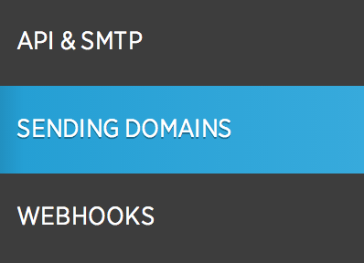
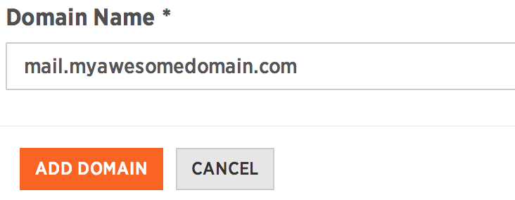
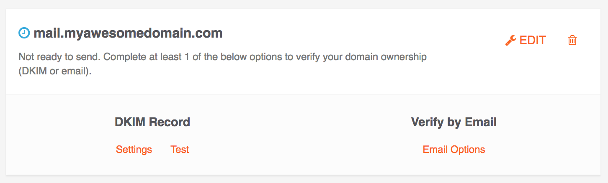

## Prerequisites 

To create a sending domain in SparkPost, you will need ownership or administrative access to your domain name, for example: *myawesomedomain.com.* You will also need access to make DNS configuration changes through your domain registrar (or DNS provider) for your Sending Domain.

If you do not have a domain name, you'll need to purchase one to use with SparkPost. Here are a few useful and popular domain name registrars:

* [Rackspace](http://www.rackspace.com/)
* [GoDaddy](https://support.godaddy.com/help/article/680/managing-dns-for-your-domain-names)
* [DreamHost](http://wiki.dreamhost.com/Custom_DNS)
* [Cloudflare](https://www.cloudflare.com/plans)
* [Bluehost](http://www.bluehost.com/)

**Note:** We do not recommend the '1and1.com' domain registrar as it appears difficult for users to set their DNS settings appropriately.

## How to create your Sending Domain to work with SparkPost

1. Log in to your SparkPost account using your username and password.
1. Click **'Account' **in the SparkPost application navigation.
1. From the Account sub-menu, select [Sending Domains](https://app.sparkpost.com/#/configuration/sending-domains).

    
1. Click on the "New Domain" button to view the page where you will input your Sending Domain.

**Example:** If you wanted to use the subdomain "mail" on your primary domain "myawesomedomain.com" you would enter:

*mail.myawesomedomain.com*

To save your new Sending Domain, click the Add Domain button.

You can use sub-domains or a primary domain for sending domains, if you wish. However, do not:

* Include any paths or query string in the Domain Name field
* Include any protocol identifier (http:// or https://)

Once you save your sending domain, you will see it listed by name (along with some extra information) in the sending domains view as shown in the screenshot below:

Once your sending domain has been successfully defined within SparkPost **you still need to [Verify Your Sending Domain](https://support.sparkpost.com/customer/portal/articles/1933360-verify-sending-domains) as the next step in the process.**