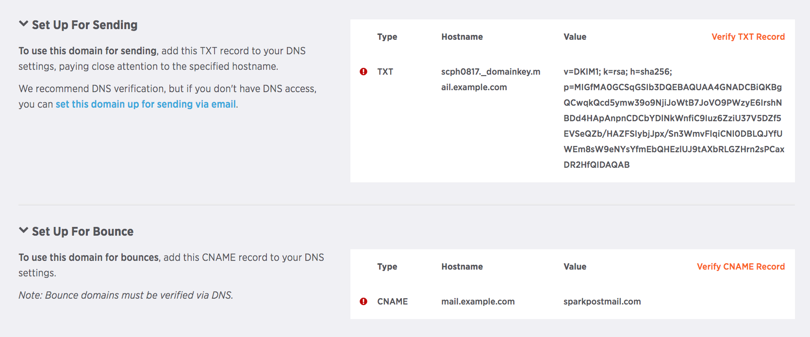
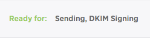
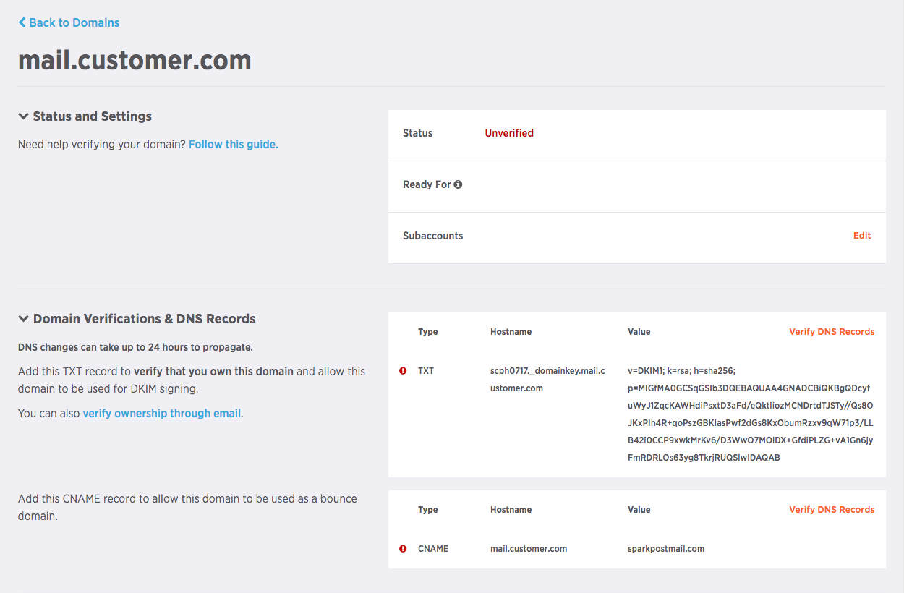
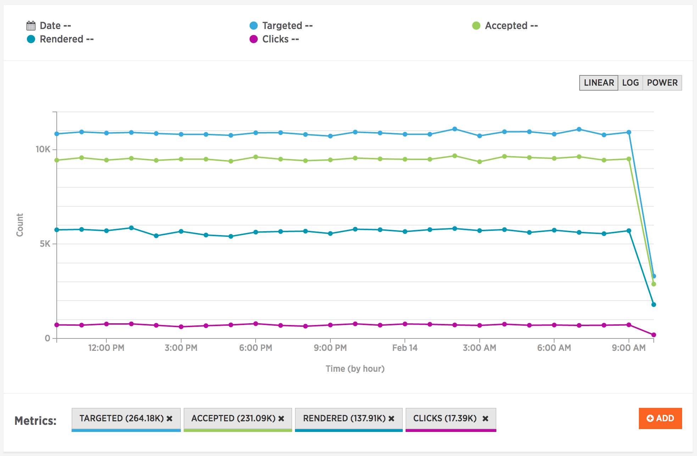
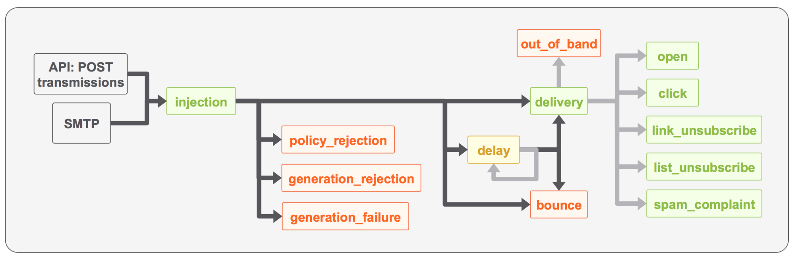

Welcome to SparkPost! This guide describes the steps you’ll need to follow to start sending mail using our service. We'll run through account setup and best practices to have in place before you begin sending. We'll also point out some useful resources along the way to help you get the best from SparkPost.

Note: SparkPost is a developer-centric email delivery service. That means pretty much everything described in this guide can be done through the SparkPost API. If you'd like to just skip to the end, the [SparkPost API documentation](https://developers.sparkpost.com/api/) is worth a visit.

* [Signing Up And In](#signing-up-and-in)
* [Preparing Your "From:" Address](#preparing-your-from-address)
* [Important: Coming From Other Email Services](#important-coming-from-other-email-services)
* [Sending Email](#sending-email)
* [Tracking Recipient Behavior](#tracking-recipient-behavior)
* [Improving Reputation And Branding](#improving-reputation-and-branding)
* [Reports, Analytics and Tracking](#reports-analytics-and-tracking)
* [Where To Next?](#where-to-next)
* [How To Get Help](#how-to-get-help)

## Signing Up And In

First things first: sign up for your free SparkPost account [here](https://app.sparkpost.com/sign-up). After sign-up, SparkPost will send you a verification email; please do verify your email address so SparkPost can contact you if you need support later on and send you important service announcements.

## Preparing Your "From:" Address

The very first thing your recipients see when they open your email is your address in the From field so it's important to set it properly from the get-go. In SparkPost, that means creating a sending domain, the domain name you'll use to send email from. You can either use a top-level domain such as *myawesomedomain.com* or, if you prefer, a subdomain like *mail.myawesomedomain.com*. You can register as many sending domains as you need on your SparkPost account.

### Prerequisites

To create a sending domain in SparkPost, you will need ownership or administrative access to your domain name, for example: *myawesomedomain.com*. You will also need access to make DNS configuration changes through your domain registrar (or DNS provider) for your sending domain.

If you do not have a domain name, you'll need to purchase one to use with SparkPost. Here are a few useful and popular domain name registrars:

* [Cloudflare](https://www.cloudflare.com/plans)
* [GoDaddy](https://support.godaddy.com/help/article/680/managing-dns-for-your-domain-names)
* [NameCheap](https://www.namecheap.com/)
* [Rackspace](http://www.rackspace.com/)
* [DreamHost](http://wiki.dreamhost.com/Custom_DNS)
* [DNSSimple](https://dnsimple.com/)
* [Bluehost](http://www.bluehost.com/)

To set up your sending domain, you add the domain to your SparkPost account, verify that you own it and wait a moment while our Compliance team runs a few quick checks. Follow the detailed steps below to get it done.

Note: SparkPost's Compliance team expect to see a [legitimate web presence](https://www.sparkpost.com/docs/getting-started/requirements-for-sending-domains/#website-requirements) on each sending domain so please ensure your website is accessible before adding a domain to your SparkPost account.

### Step 1: Creating A Sending Domain

To create your sending domain, visit the [Account -> Sending Domains](https://app.sparkpost.com/account/sending-domains) section of your SparkPost account and click the New Domain button. Enter your domain name and click Add Domain.

!(media/getting-started-sparkpost/adding-sending-domains.png)

*Adding a sending domain*

### Step 2: Verifying Domain Ownership

Your new sending domain should now be visible in the [Sending Domains](https://app.sparkpost.com/account/sending-domains) list on your account. Before you can send mail using your sending domain, SparkPost needs to verify that you own it.

To do that, you'll publish a type of DNS record called a DKIM record on your domain and ask SparkPost to check it for you. As a convenient side-effect, that DKIM record will also help your reputation as an email sender. DKIM is useful to your recipients to verify that mail that looks like it came from you was in fact sent by you and it arrived intact.

Note: you will need admin access to your DNS configuration to complete this step.

To generate the DKIM DNS record for your sending domain, click the DKIM record *Settings* link under your domain on the [Sending Domains](https://app.sparkpost.com/account/sending-domains) list. Then use the revealed domain name, record type and value to update your DNS configuration. Each DNS provider has a slightly different interface; you'll want to create a "TXT" record with the hostname and value SparkPost shows you.



*Sending domain DKIM record*

Here are some how-to documents for common DNS providers:

* [CloudFlare](https://support.cloudflare.com/hc/en-us/articles/200168626-How-do-I-add-a-SPF-record-)
* [GoDaddy](https://www.godaddy.com/help/manage-dns-for-your-domain-names-680)
* [NameCheap](https://www.namecheap.com/support/knowledgebase/article.aspx/317/2237/how-do-i-add-txtspfdkimdmarc-records-for-my-domain)
* [Rackspace](https://www.rackspace.com/knowledge_center/article/creating-a-spf-txt-record)
* [Dreamhost](http://wiki.dreamhost.com/Custom_DNS#TXT_Record)
* [DNSSimple](https://support.dnsimple.com/articles/dkim-record/)
* [BlueHost](https://my.bluehost.com/hosting/help/txt_record)

Once your DKIM DNS record is configured and published, go back to your [Sending Domains](https://app.sparkpost.com/account/sending-domains) account settings and click *Test* under the DKIM settings for your domain. Once SparkPost is able to retrieve your DKIM record, you'll see a green tick beside the DKIM record section.

Note: DNS changes can take between a few minutes and 24 hours to propagate so a little patience might be required before SparkPost is able to verify your DKIM record.

Alternately, you can verify ownership by receiving an email to an *admin account* on your domain. From Account -> [Sending Domains](https://app.sparkpost.com/account/sending-domains), the "email options" link under your sending domain will walk you through that process.

### Step 3: Compliance Checks

Your domain is now almost ready to send. Once ownership verification completes, your domain will be submitted to our Compliance robots for a few additional checks. Once they complete, you'll see "sending, DKIM signing" next to the green "ready for" text.



*Ready to send*

## Important: Coming From Other Email Services

Now that you have an account and a domain, it's tempting to just start sending mail. If you're coming from another email service though, there is just 1 more vitally important step required to ensure you only send mail to the right people.

Most services will build up a list of addresses to avoid emailing in a suppression or black list. This list contains all your collected typo addresses along with those which have unsubscribed over time and also those who have complained. Your SparkPost account has a suppression list but it's empty to begin with and it really needs all those addresses from your old service.

It is extremely important you bring your suppression list into SparkPost to avoid sending mail to those addresses. Otherwise your account could be suspended and your reputation as an email sender will suffer.

You can upload a CSV suppression list to your account at Lists -> [Suppressions](https://app.sparkpost.com/lists/suppressions). The format is nice and simple:

* Email address
* Suppression type: "transactional" or "non_transactional" depending on which type of mail should be suppressed
* Transactional emails one-time notifications such as password resets and purchase confirmations
* Non-transactional emails include high-volume traffic such as newsletters and marketing communications
* Description: notes on why this address is suppressed

Once your suppression list has been imported, you are ready to send safely and successfully.

## Sending Email

SparkPost is a developer-centric email delivery service. That means it comes with a comprehensive REST API for sending mail, tracking engagement and so on. If you'd like to dive right in, you can read the [API reference documentation](https://developers.sparkpost.com/api/) and we have a [collection](https://www.getpostman.com/run-collection/81ee1dd2790d7952b76a) for [Postman](https://www.getpostman.com/) to help you experiment with manual API calls.

In case you need it, SparkPost also supports [SMTP-based email delivery](https://developers.sparkpost.com/api/smtp-api.html) with a few modern twists.

### Authentication

Whether you use the API or SMTP, SparkPost expects an API key along with each request you make, as an authentication token. You can issue and manage the API keys on your account from from Account -> [API Keys](https://app.sparkpost.com/account/credentials), each with its own permissions so you can restrict what each key is used for.

For REST API calls, your API key must be included in an Authorization header on your HTTP request:

```
Authorization: 0abff4032MYAPIKEY28237aabaddff20758587
```

For SMTP delivery, the API key is used as an SMTP authentication password. You can read more about that in the Sending With SMTP section below.

### Sending With The REST API

The modern way to send email with SparkPost is using the REST API's transmissions endpoint which supports high volume, multi-recipient delivery, [personalized message templates](https://developers.sparkpost.com/api/substitutions-reference.html), per-recipient metadata and a [slew of other capabilities](https://developers.sparkpost.com/api/transmissions.html) besides. Here's a simple transmission request:

```bash
# e.g. if your new sending domain was mail.example.com
curl -XPOST \
  https://api.sparkpost.com/api/v1/transmissions \
  -H "Authorization: <YOUR API KEY>" \
  -H "Content-Type: application/json" \
  -d '{"content": {"from": "ernest@mail.example.com", "subject": "Don't you like to write emails?", "text": "It's such a swell way to keep from working and yet feel you've done something."}, "recipients": [{"address": "F. Scott <developers+curl@sparkpost.com>"}]}'
```

### SparkPost API Client Libraries

SparkPost provides libraries, add-ons and plugins for various environments, to simplify your integration:

* [PHP](http://github.com/SparkPost/php-sparkpost)
* [Python](https://github.com/SparkPost/python-sparkpost)
* Node.js - [client library](https://github.com/SparkPost/node-sparkpost) and [Nodemailer transport](https://www.github.com/SparkPost/nodemailer-sparkpost-transport)
* [Java](https://github.com/SparkPost/java-sparkpost)
* [Go](https://github.com/SparkPost/gosparkpost)
* [Elixir](https://github.com/SparkPost/elixir-sparkpost)

SparkPost also offers a [Heroku add-on](https://elements.heroku.com/addons/sparkpost), a [Zapier zap](https://zapier.com/zapbook/sparkpost/) and a [WordPress plugin](https://github.com/SparkPost/wordpress-sparkpost).

### Sending With SMTP

If you need to integrate with a service which only speaks SMTP, you can use these settings:

* SMTP host: smtp.sparkpostmail.com
* Port: 587 or 2525
* Encryption: STARTTLS
* Username: SMTP_Injection
* Password: <api key with "send via SMTP" permission>

Note: some hosting providers block outbound SMTP so you may need to request that access before you can send via SMTP from your host.

You can also review these settings from Account -> [SMTP Relay](https://app.sparkpost.com/account/smtp). For more details including how to use advanced SMTP features, check out the [SMTP API reference](https://developers.sparkpost.com/api/smtp-api.html).

## Tracking Recipient Behavior

SparkPost can automatically track when your recipients open your email and click on the links inside.

Either way, you can use the engagement tracking report in Reports -> [Engagement](https://app.sparkpost.com/reports/engagement) to review a summary of recipient engagement with your emails. You can also search the message events report in Reports -> [Message Events](https://app.sparkpost.com/reports/message-events) to see individual, per-email open and click events.

### Tracking With The REST API

The SparkPost API has open and click tracking enabled by default. You can also control open and click tracking on each transmission by setting the `options.open_tracking` and `options.click_tracking` fields respectively.

### Tracking With SMTP

To enable tracking on SMTP, you can add an `X-MSYS-API` header to your messages with the open_tracking and click_tracking fields set:

```
X-MSYS-API: { "options" : { "open_tracking" : true, "click_tracking" : true } }
```

You can also control SMTP tracking at the account level in Account -> [SMTP Relay](https://app.sparkpost.com/account/smtp).

## Improving Reputation And Branding

To maintain your sending reputation and ensure the mail you send is branded as your recipients expect, you can create a custom bounce domain and custom tracking domain for your SparkPost account.

### Custom Bounce Domain

Each email you send will have 2 main sender addresses:

* The header from address is the one that appears in the From: field. The header from address includes one of your sending domains.
* The bounce address is used by mail software to return undeliverable mail, report on errors and it is also associated with your reputation as a sender.

By default SparkPost uses a generic bounce domain for your email, such as *sparkpostmail.com*. By using the [Sending Domains API verify endpoint](https://developers.sparkpost.com/api/sending-domains.html#sending-domains-verify-post) or the UI, you can configure your sending domain as a bounce domain as well, which will allow for a deliverability best practice called *strict alignment*. This is when the domains used for a sending domain and a bounce domain are the same. We highly recommend creating bounce domains for all of your sending domains if possible to establish the best possible reputation with the ISPs. To set this up, add the CNAME record provided in the API documentation or the UI to your DNS records, and then verify it via the sending domains API or UI. The following is a screenshot of the UI showing the CNAME verification in addition to the DKIM verification process.



### Tracking Domain

SparkPost changes each link in your email to add tracking information, replacing each URL with a tracking service URL using the generic SparkPost domain name: spgo.io. You can create your own tracking domains from Account -> [Tracking Domains](https://app.sparkpost.com/account/tracking-domains) and also [through the API](https://developers.sparkpost.com/api/tracking-domains.html).

## Reports, Analytics and Tracking

You can use message events, metrics, and webhooks to keep track of your SparkPost account activity and email delivery performance. Metrics and message events are both available visually and through the SparkPost API, while webhooks offer an efficient way to have SparkPost push message events directly to your own app.



*Summary report*

### Message Events

Message events offer fine grained, per-recipient details, useful for checking the status of a single message or recipient. When you ask SparkPost to send an email, it emits a sequence of events so you can see when it's delivered, when the recipient opens it and clicks on links, and various related events. Here's a diagrammatic view of SparkPost's major message events in sequence:



*SparkPost message events in sequence*

You can search 10 days of message events from your account in Reports -> [Message Events](https://app.sparkpost.com/reports/message-events) with the same data available through the [message events API endpoint](https://developers.sparkpost.com/api/message-events.html).

### Webhooks

SparkPost also includes a webhooks facility to give your app the ability to store and act upon a live stream of message events. You can register your own HTTP endpoint for a webhook from Account -> [Webhooks](https://app.sparkpost.com/account/webhooks), read up on [how to handle webhook events](https://www.sparkpost.com/blog/webhooks-beyond-the-basics/) and [check out the API documentation](https://developers.sparkpost.com/api/webhooks.html) for the details.

### Metrics

Metrics offer a high-level view of your account, rolling up those message-level events into summaries for reviewing trends over time. The [Reports](https://app.sparkpost.com/reports/summary) section of your SparkPost account provides an easy way to review your sending history. As with most SparkPost features, you can also access these metrics by [API call](https://developers.sparkpost.com/api/metrics.html) to feed your own applications.

## Where To Next?

Beyond the basics, SparkPost also has a slew of additional capabilities which may prove useful. Here are some common follow-on topics to explore.

### Email Templates And Personalization

If you're sending similar content to lots of people, SparkPost templates let you write the message once using substitution variables and logic for personalization, then make a single API call to generate and deliver that message to all your recipients together. You can create and edit templates on your account in the [Templates](https://app.sparkpost.com/templates) section. The SparkPost [template substitution syntax](https://developers.sparkpost.com/api/substitutions-reference.html) is explained in the API documentation as well as the relevant [API endpoints for managing templates](https://developers.sparkpost.com/api/templates.html) from your own apps.

### Service Providers

If you send mail from your SparkPost account on behalf of your own customers and want to keep their activity separate from each other, and from yourself, you should probably consider using [subaccounts](https://developers.sparkpost.com/api/subaccounts.html). You can provision sending domains and API keys on a per-subaccount basis from your account and using the API, as well as retrieving metrics and message events for each subaccount.

### Receiving Email

SparkPost can receive email on your behalf and forward to your own HTTP endpoints by using [relay webhooks](https://developers.sparkpost.com/api/relay-webhooks.html).

## How To Get Help

For general questions, you might find a ready-made answer by searching SparkPost's [support articles](https://www.sparkpost.com/docs/).

If you run into an issue with your account or the SparkPost service, you can contact our Support team by submitting a ticket through the [Support portal](https://www.sparkpost.com/docs/). You can also follow the [SparkPost status page](http://status.sparkpost.com/) for service updates.

If you're interested in chatting with our customers, discussing your integration and getting involved with our developer community, join our [Community Slack team](http://slack.sparkpost.com/).
