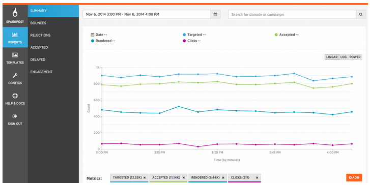

## What is SparkPost?

SparkPost is a new cloud email platform focused on developers like you that offers reliable, secure, and ultra-fast email deliverability services that scale! SparkPost is built using an "API First" approach using confidence-building test-driven development, so the services and application are highly stable and can easily support enterprise-level production usage.

If you'd like to see a video walkthrough of creating and setting up your SparkPost account, check out our Getting Started [Video Walkthrough](https://support.sparkpost.com/customer/portal/articles/2051787-getting-started-video).

### Enough talk, let's get your account configured to start sending!

* * *

1.  **[Create your Sending Domain](https://support.sparkpost.com/customer/portal/articles/1933318-create-and-verify-sending-domains)**                                                                                                                       
2.  **[Verify your Sending Domain](https://support.sparkpost.com/customer/portal/articles/1933360-verify-sending-domains)**                                                                                                            
3.  [**Create an API Key**](https://support.sparkpost.com/customer/portal/articles/1933377-create-api-keys) 
4.  **[Send your first email (Transmission) using SparkPost!](https://support.sparkpost.com/customer/portal/articles/1929887-sending-your-first-email)**