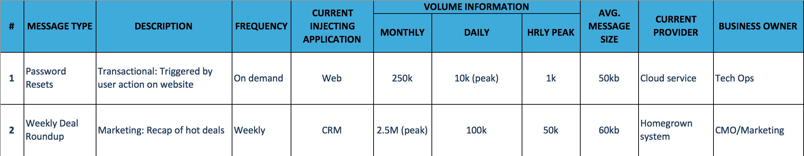

Welcome to the SparkPost Elite family! 

We’ll get started with a kick-off call led by your Technical Account Manager (fondly known as your "TAM") that will include members of our Customer Success, Deliverability Services and Product teams as well as the key stakeholders on your side.  We’ll review the on-boarding process in detail, the migration plan and your unique integration needs.  In preparation for this meeting, you should start thinking about (1) the types of messages that you will migrate to Elite, and, (2) managing DNS for the related domains.

**Message Landscape** 
We’ll provide you a message landscape spreadsheet to outline the messages that will be migrated to SparkPost Elite.  This will allow us to have a full understanding of your current messaging programs.  The more data you have available for this document, the better, as it allows our delivery team to make the most accurate message segmentation plan possible for you, as well as helping us formulate a solid migration plan from your existing provider.

Here's a sample:

 

**Domain Management**           
We strongly recommend that our customers create a new subdomain for each message stream and delegate DNS management to SparkPost.  Having us manage the DNS removes an ongoing administration need from your team and provides flexibility to make changes quickly and efficiently to address deliverability needs.  **Getting approval early in the on-boarding process for delegation will help accelerate the timeline.**                                                                                              (While more than 90% of our customers are able to delegate DNS management to us, if this is not possible, we can explore alternatives.)

What’s Next?
**3… Kick-Off Call:**  Your TAM will be in touch shortly to schedule the kickoff call.
**2… Service Handover**                 : Once your environment is ready, we’ll hand it over to you with all the necessary instructions.  (For now, if you need access to do some preliminary or initial testing, you can always sign up for a free account at Sparkpost.com, which will allow you to start getting acclimated to our service.)
**1… Go Live!** 

We’re excited to have you as an Elite customer and we are looking forward to getting started!