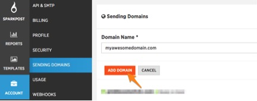
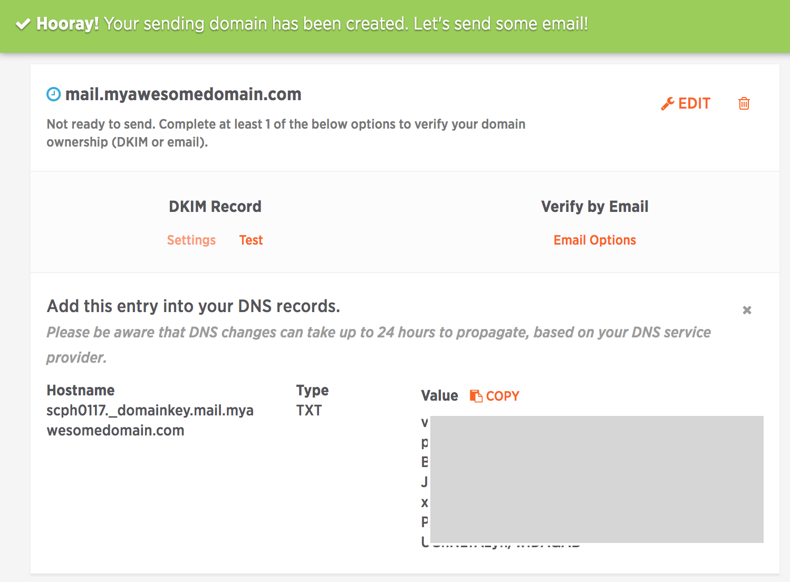

1.  In SparkPost, go into Account, and then Sending Domains 

2.  Put in your Domain Name, leaving off the http(s)://, and click on Add Domain 

3.  When you get to the next screen you will see that your domain has been created, but now, you will see little notifications that your domain is not ready to send, and DKIM Record appears. Click on Configure below DKIM, and you will see what you need to put into the DNS of your domain server. 

    

4.  Depending on what domain provider you are using, their DNS may look different, but it’s all essentially the same. There will be a TEXT field, and you can put DKIM in the text fields. We have provided you with many domain provider’s steps to go through to put your SPF and DKIM into their settings, [here](https://support.sparkpost.com/customer/portal/articles/2034498-setting-up-spf-and-dkim-with-domain-providers).

    

5.  Paste the DKIM into the DNS. 

6.  Though the DKIM (or domain key) looks long, do not break it into 2 or more lines. It may not look like it can handle all of the characters, but it can. As well, the DNS might also require your Hostname. 


    

7.  It can take a bit of time for these to propagate. You can check the TTL (time to live) amount within your DNS – usually they are beside the record type. It can take up to that time both to be completed, and ready to go. Once they do, this is what it should look like:

    

8.  You can have as many sending domains as you’d like. However, they can only be in ONE SparkPost account.