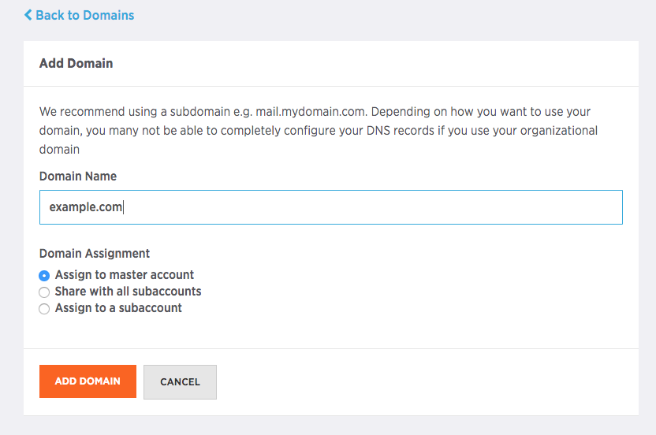
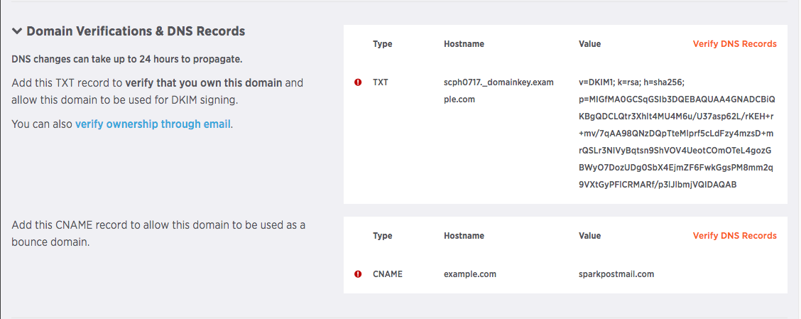
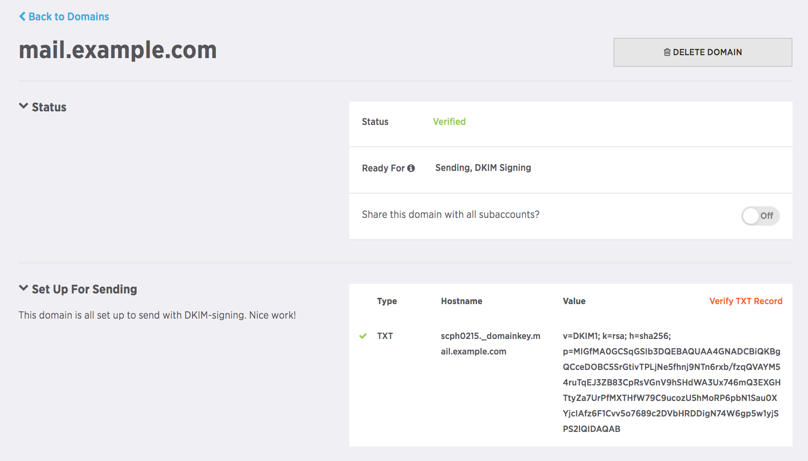

The following are instructions for creating sending domains via the SparkPost UI.

1. In the SparkPost UI, click Account, and then click Sending Domains.
1. Type your sending domain in the box, and then choose your subaccount options for the sending domain. For more information on subaccounts, please see [this support article](https://www.sparkpost.com/docs/user-guide/subaccounts/). Click "Add Domain" when you are finished. 

3. The next screen will display your newly created domain, but a red "Unverified" status will show in the upper right box. A sending domain must be verified before it can be used on SparkPost. In order to verify the domain, you must place the DKIM TXT record displayed in the middle box into DNS.

4. Depending on what domain provider you are using, their DNS may look different, but how it works is essentially the same across all providers. There will be a TEXT field, and you can put the DKIM record in the text fields. We have provided you with many domain provider’s steps to go through to put your DKIM record into their records [here](https://www.sparkpost.com/docs/getting-started/getting-started-sparkpost/#prerequisites).

4. Paste the "value" portion DKIM into your DNS TXT record for the hostname provided in the UI. Please note that the hostname for this record will be "domainkey._yoursendingdomain", and not the domain itself.

4. Though the DKIM record (or domain key) looks long, do not break it into 2 or more lines. It may not look like DNS can't handle all of the characters, but it can.

4. It can take a bit of time for DKIM records to propagate. You can check the TTL (time to live) amount within your DNS provider – usually they are beside the record type. It can take up to that time both to be propagated and ready to go. Once they do, you may click the orange "Verify DNS Records" in the UI. If the domain validates successfully, this is what it should look like:

    

1. You can have as many sending domains as you’d like. However, they can only be in ONE SparkPost account. Duplicates across multiple accounts are not permitted.
