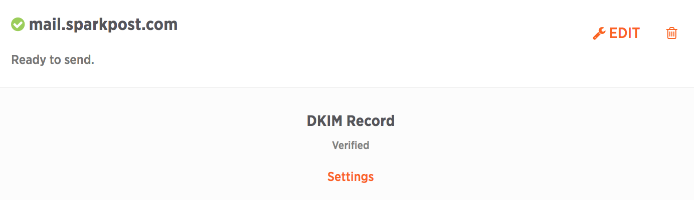

A sending domain is a domain that is used to indicate who an email is from via the (you guessed it) "From:" header. DKIM DNS records should be configured for a sending domain, which allows recipient mail servers to authenticate your messages' content. The Sending Domains API provides the means to create, list, retrieve, update, and verify a custom sending domain. This article outlines how to complete sending domain verification.

Setting up DKIM DNS records for your sending domain is the best practice for validation, and it does double duty. First, it verifies to SparkPost that you own this domain. DKIM also verifies the content of your email to inbox providers receiving email from your domain. If DKIM DNS records cannot be configured, domains may be verified by confirming access to admin email accounts (abuse@ or postmaster@).

**Note**: Remember that DNS changes can take time to propagate. Check with your provider for guidance on expected propagation delay.

## Create a Sending Domain

Before you can verify a sending domain, you must first [Create a Sending Domain](https://support.sparkpost.com/customer/portal/articles/1933318-create-and-verify-sending-domains).

After creation, you will notice that there are warning indicators that show that the new sending domain is "Not Ready to Send". That is because we still have a few things left to configure. We have to add a new DKIM TXT record to our DNS that helps improve deliverability rates into our recipient's inboxes. This is the [DKIM TXT record](http://en.wikipedia.org/wiki/DomainKeys_Identified_Mail).

## Setting Up DKIM DNS Records

To obtain the DKIM TXT record information you'll need to add to DNS, click on the associated Settings link under DKIM Text Record.

Make the updates to the DNS associated with the Sending Domain you have configured. Here are links on how to do this with the Domain Registrar service providers we listed earlier:​

* [Rackspace](http://www.rackspace.com/apps/support/portal/1212)
* [GoDaddy](https://www.google.com/url?sa=t&rct=j&q=&esrc=s&source=web&cd=7&cad=rja&uact=8&ved=0CFAQFjAG&url=http%3A%2F%2Fsupport.godaddy.com%2Fhelp%2Farticle%2F680%2Fmanaging-dns-for-your-domain-names&ei=Ux9dVPbIIcWcygS-zILgBA&usg=AFQjCNEi4HSQ0XZxEbRsfj3RTnaeuzLsUQ&bvm=bv.79189006,d.aWw)
* [DreamHost](http://wiki.dreamhost.com/DKIM)
* [Cloudflare](https://support.cloudflare.com/hc/en-us/articles/200168696-How-do-I-add-DKIM-records-)
* [Bluehost ](https://my.bluehost.com/hosting/help/559)

You can find setup instructions for these domain providers and more at [this page](https://support.sparkpost.com/customer/portal/articles/2034498-setting-up-spf-and-dkim-with-domain-providers).

## Testing DKIM Records

Once you have updated your sending domain's DNS entries according to the information above, you will need to verify your sending domains, making sure that the records exist in DNS and are addressable by SparkPost.

On the Sending Domains page, next to the domain you have just edited, you'll see two links under DKIM Record: Settings and Test. Click on the Test link to indicate to SparkPost that you have added the new DNS entry. If the DNS records have been added correctly and SparkPost is able to verify both the DKIM TXT record is in place, the icon next to your domain will change to "verified" (green circle with checkmark).

If you do not see the "verified" icon, then your DKIM record is NOT verified. Please make sure that your entry matches the text shown under Settings and that the DNS entry has properly propagated (this can take some time depending upon your DNS record's TTL [Time To Live] settings).

Below is an example of how a domain with a DKIM Record that has been configured correctly will look in the UI.

**Note**: ​If you see the message "Ready to Send" next to your Sending Domain, including green check marks next to DKIM record, then verification of your Sending Domain is complete. Moreover, green check marks next to **abuse@** and **postmaster@** indicate that these domains have been verified.  Congratulations!

Next, [Create a SparkPost API Key](https://support.sparkpost.com/customer/portal/articles/1933377-create-api-keys) so you can start sending messages.

You can also use our DKIM tool for your DKIM needs [DKIM Validator](https://tools.sparkpost.com/dkim).