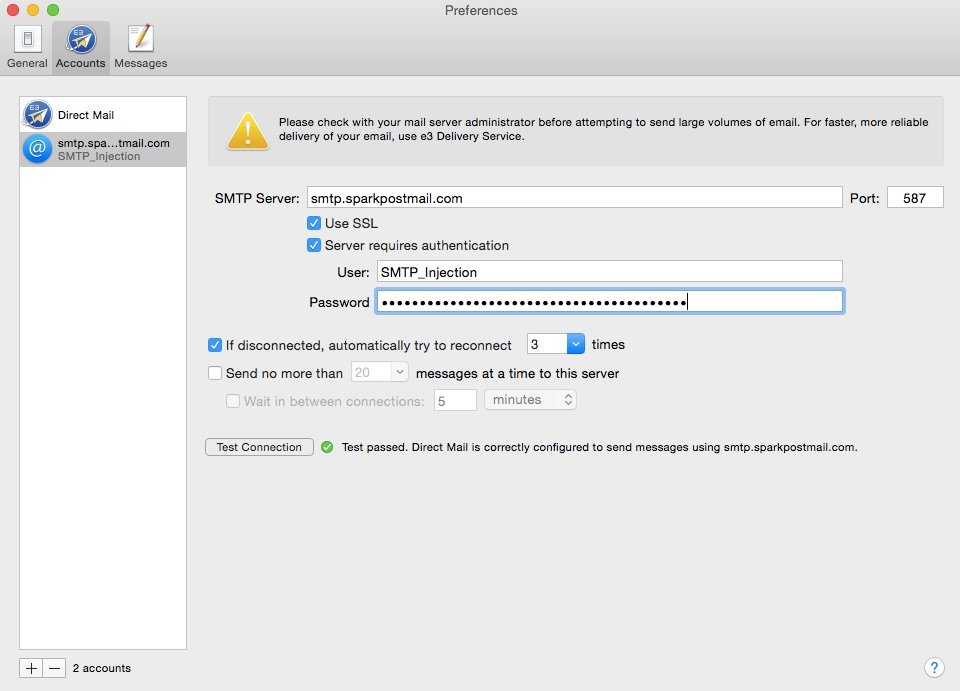

The following steps will walk you through using SparkPost with [e3 Software's DirectMail for Mac](http://directmailmac.com). 

First you need to enable SMTP Access - check out DirectMail's article here: [http://directmailmac.com/support/article/232](http://directmailmac.com/support/article/232)

Set up a new Mail Server profile and configure as below:

The password is a valid API key you have generated from your SparkPost account with the 'Send via SMTP' permission enabled.

Note that your From address much be from a domain that you have configured and verified on your SparkPost account (such as 'newsletter@myawesomedomain.com', etc.).

Happy Sending!