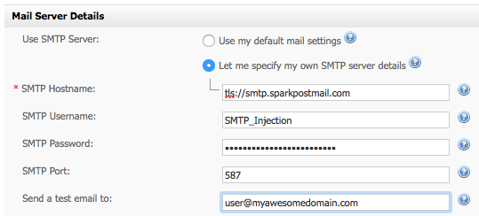

Using SparkPost with [Interspire's Email Marketer](http://www.interspire.com/emailmarketer/) platform is easy! Interspire Email Marketer is a popular and easy to use full-blown campaign management / campaign marketing front-end that can be used with SparkPost as the SMTP relay server.

On Email Marketer's dashboard, go to the Settings menu at the very top right and select 'Email Settings'.  This will bring up the email configuration page.

Select 'Let me specify my own SMTP server details':

Use the following entries:

For SMTP Hostname: tls://smtp.sparkpostmail.com
For SMTP Username: SMTP_Injection
For SMTP Password: A valid SparkPost API key you have generated with the 'Send via SMTP' permission enabled
For SMTP Port: use port 587
And use whatever address (on your configured sending domain) you want for the test email

To create a valid API key for your SparkPost account that you can use for this, check out [this article](https://support.sparkpost.com/customer/portal/articles/1933377-create-api-keys?b_id=7411).