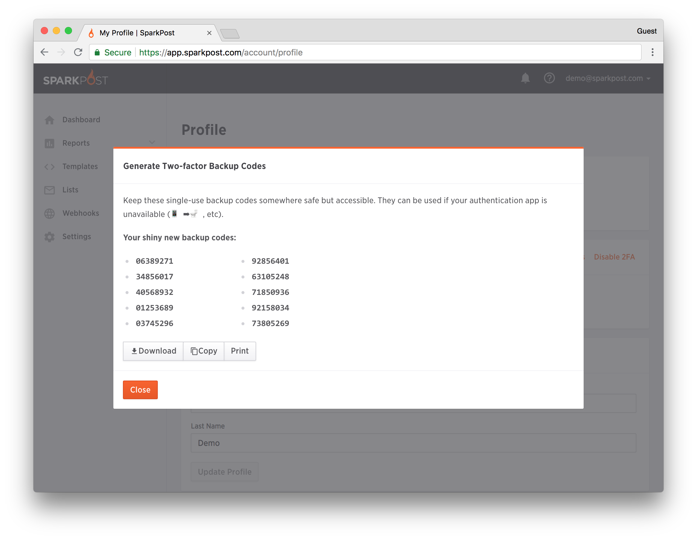
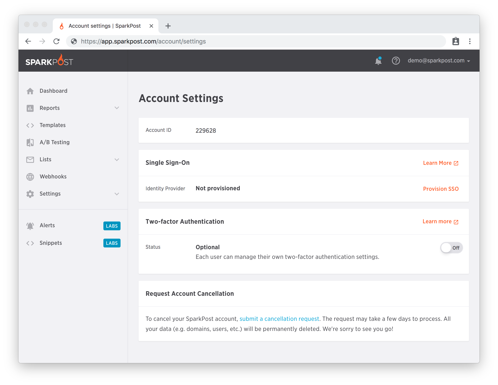
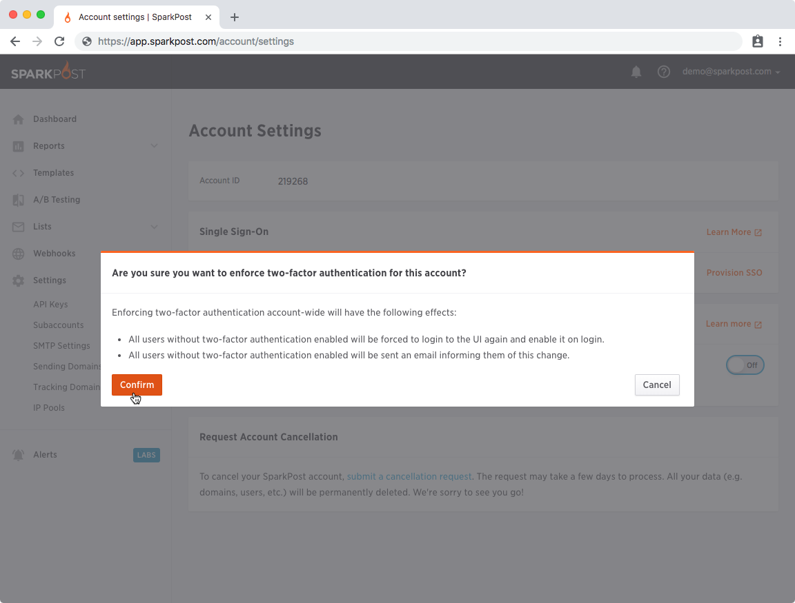
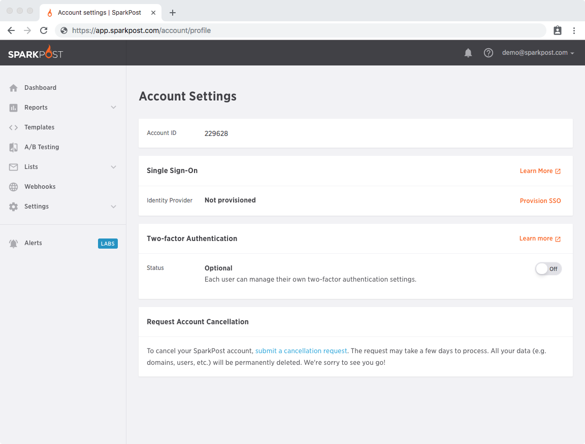
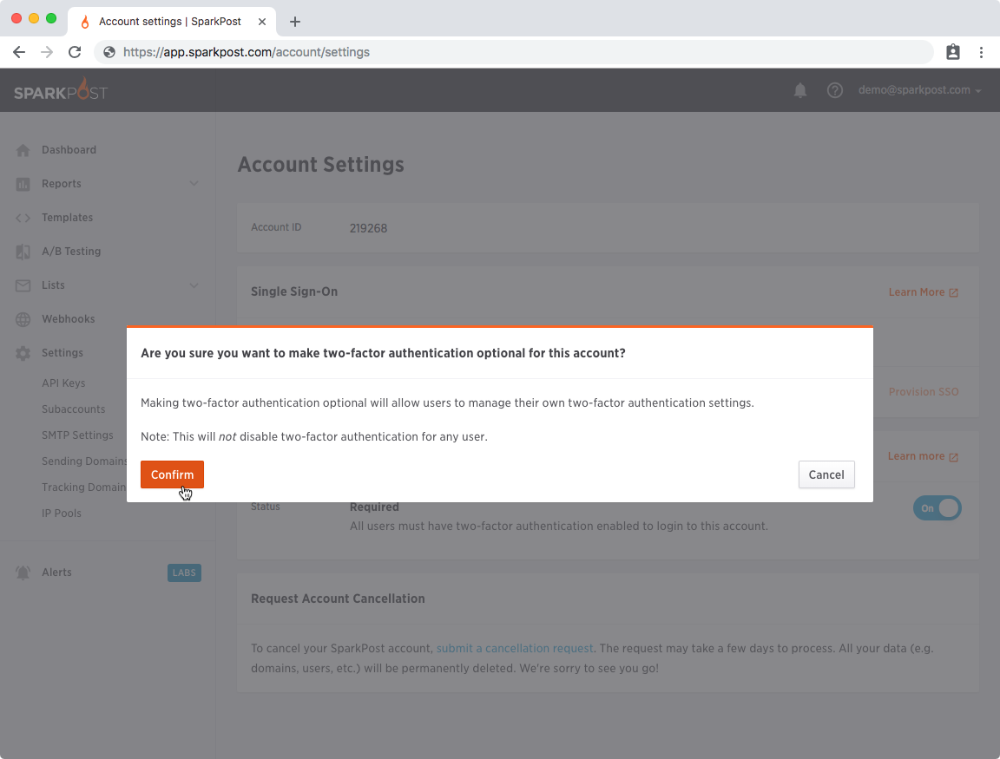
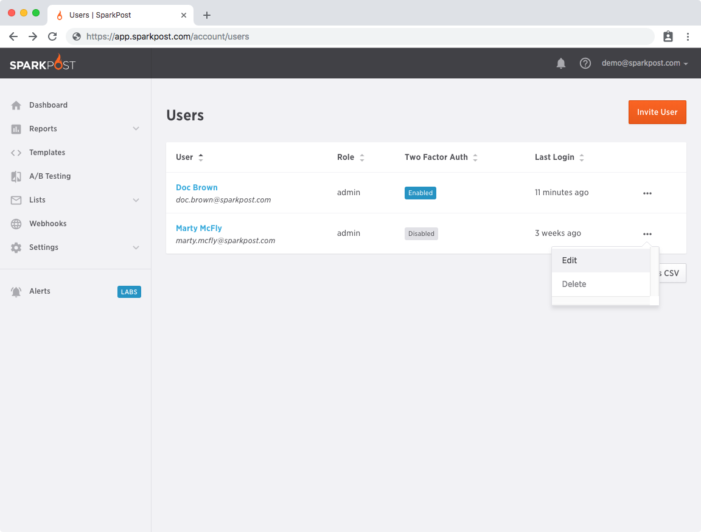

At SparkPost, we take the security of your account very seriously, which is why, for example, we make it easy to apply the [principle of least privilege](https://www.us-cert.gov/bsi/articles/knowledge/principles/least-privilege) when assigning grants to API keys, and even restricting API keys based on source IP address. 

In order to provide you with even greater security, we have introduced Two-Factor Authentication. This allows you to use your account in conjunction with a standard 3rd party Authenticator app such as [Google Authenticator](https://support.google.com/accounts/answer/1066447), [Duo](https://duo.com/product/trusted-users/two-factor-authentication/duo-mobile), or [Authy](https://www.authy.com/app/mobile/) available for iOS, Android, etc.

# Enabling Two-factor Authentication

To enable Two-Factor Authentication, go to the Account menu in the top right and select **Profile**.

Click on **Enable 2FA** and you'll see a screen like this:

Open up your chosen Authenticator App and scan the QR code. If you can’t, or don’t want to scan the QR code, you can also type the 23-character key into your App. 

**NOTE: It is essential that you do store the authentication token somewhere safe! We are unable to reset or remove Two-Factor Authentication from your account should you lose your device.**

Enter a generated 2FA passcode and click on **Enable 2FA** to finish enabling 2 factor authentication.

You may also generate backup codes (after entering your password), which are 8 digits long and can be used instead of entering the code generated by your chosen Authenticator App.

These codes only expire when they are used, and come in handy if your phone disappears. You can also download the codes as a text file, which gives you a simple way to keep track of which ones have been used - add the current date next to the code you’re using.

The next time you log in to your account, after entering your username and password into the login page, you'll see this second level of authentication requested:

Open up your Authenticator App again and look for the SparkPost entry.  You will see a 6-digit number and an expiration timer.  Type that number into the secondary log in page before the timer in your app expires and you'll then be logged in to your account - it's as easy as that! This field also accepts backup codes.

Enabling Two-factor Auth will prevent anyone that does not have access to your Authenticator app or backup codes from logging into your account - even if they somehow get your username and password.

Now you are all set! Two-Factor Authentication is now enabled for your account.

# Requiring Two-factor Authentication For All Users
Requiring two-factor authentication enforces that *all* users on the account (including the administrator) set up two-factor authentication before performing sensitive account actions. Once set, any users without two-factor authentication enabled will be required to logout and set up two-factor authentication on next login.
**If single sign-on is enabled, it will be disabled in favor of the two-factor authentication requirement.**
### Enabling Two-factor Authentication Requirement
Two-factor authentication can be configured from an account administrator's [Account Settings](https://app.eu.sparkpost.com/account/profile) ([EU](https://app.eu.sparkpost.com/account/settings)) page in the **Two-factor Authentication** section. When disabled, the status will be set to `Optional`.

To require two-factor authentication for all users, set the slider the from `Off` to `On`.

A warning will prompt you to confirm the changes to the account. Once enabled, the status will be set to `Required`. An email will be sent to users informing them of the new security requirements, along with steps needed to set up two-factor authentication.
### Disabling Two-factor Authentication Requirement
An account administrator can remove the requirement for two-factor authentication from the [Account Settings](https://app.sparkpost.com/account/settings) ([EU](https://app.eu.sparkpost.com/account/settings)) page.

Set the slider `Off` to disable it.

You will prompted with a warning notifying of potential changes to the specific user. The status will change to `Optional`. Removing the two-factor authentication requirement will not change any existing settngs for users.
### Reset Two-factor Authentication Settings
In the event that a user lost or replaced their authentication device while two-factor authentication is enabled, an account administrator can reset the user's settings. If two-factor authentication is required for all users, the user will need to re-enable two-factor authentication at next login.
**Any existing backup codes will be invalidated and new codes will need to be requested by the user.**
To reset two-factor authentication settings for a user, head to the [Users](https://app.sparkpost.com/account/users) ([EU](https://app.eu.sparkpost.com/account/users)) page.

Once there, you can access the user options dropdown by clicking the **...** for a specific user. Select the **Edit** option to go to that user's settings.

Once at user's settings page, click the **Disable Two-factor Authentication** option.

A warning will prompt you to confirm the changes to the user's settings. An email will be sent to the user to informing them about the change.

