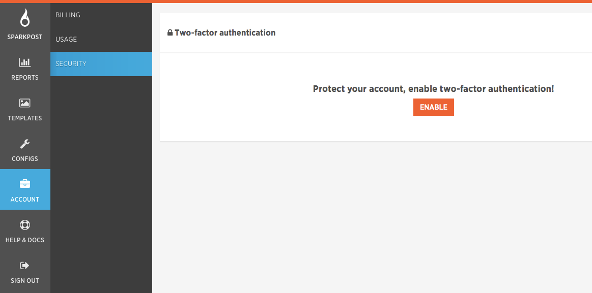
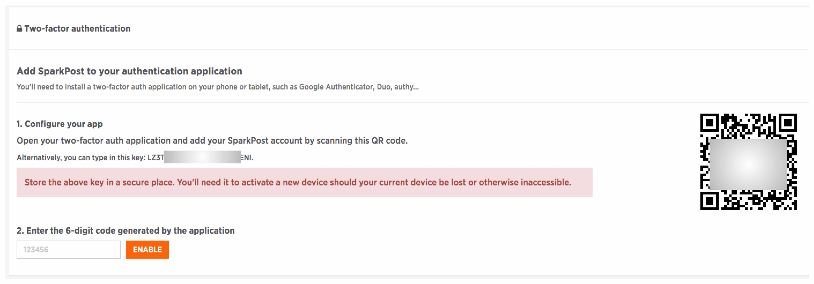
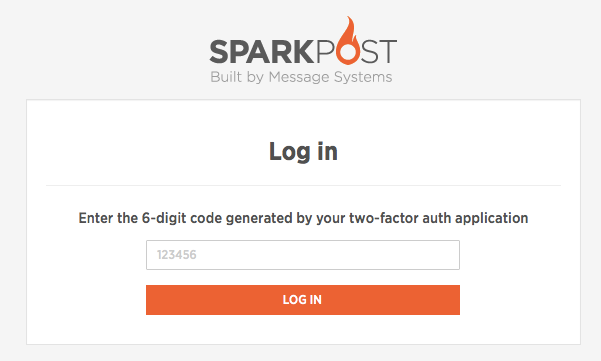

At SparkPost, we take the security of your account very seriously (which is why we have fairly strict requirements on the password you choose for your account as an example).

In order to provide you with even greater security, we have introduced Two-Factor Authentication.  This allows you to use your account in conjunction with a standard 3rd party Authenticator app (such as Google Authenticate, available for iOS, Android, etc.)

To enable Two-Factor Authentication, go to your 'Account' tab on the left-hand side of the dashboard and select the 'Security' page:

Click on 'Enable' and you'll see a screen like this:

Open up your Authenticator App (such as Google Authenticate) and scan the QR code presented or alternatively type in the key shown. 

Now you are all set! Two-Factor Authentication is now enabled for your account.

**NOTE: It is essential that you do store the authentication token somewhere safe, we are unable to reset or remove Two-Factor Authentication from your account should you loose your device.** 

Next time you log in to your account, after you have entered your username and password into the regular login page, you'll see this second level of authorization requested:

Open up your Authenticator app again and look for the SparkPost entry.  You will see a brand new 6-digit number on your Authenticator app.  Type that number into the secondary log in page and you'll then be logged in to your account - it's as easy as that!   This will prevent anyone that does not have access to your Authenticator app from logging into your account - even if they somehow get your username and password.