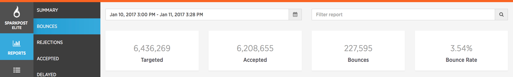
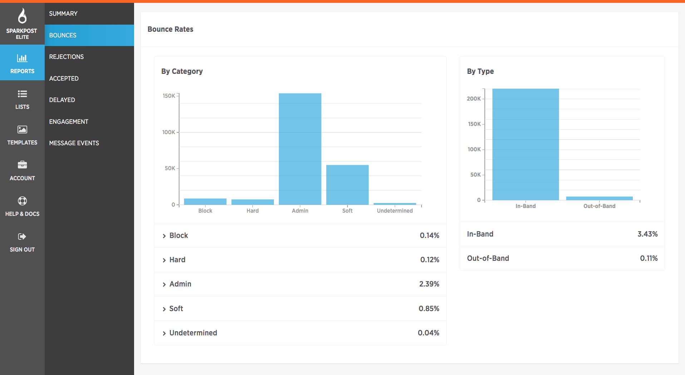
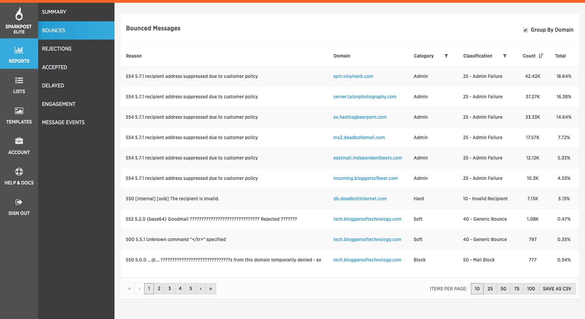

When you first click on this tab, you have the drop down date like in Summary, where you can select which time frame to look at.  You can also further select a domain, campaign or template for more granular evaluation.

Below that, you will see 4 categories:

1. Targeted: number of emails you sent to SparkPost
1. Accepted: number of emails that was accepted by the recipient server 
(250ok)
1. Bounces: emails that were rejected from the recipient server

1. Bounce Rate: the percentage of bounces for the particular date range selected. Again, you can also select domain, campaign or template. 


Bounces can fall in to two different sections: Category and Type.

## Category

When a recipient email server rejects or bounces an email, they will provide us with reasons that we parse and further classify in to one of five sub-categories:

**Blocked** – These emails were refused because the recipient server determined that the content is spammy, the IP has poor reputation, or a myriad of other filter verdicts. These are rejected at the recipient server level, and never reach the intended recipient.

**Hard** – Bounces which are rejected as being determined invalid. There either was a typo in the email address (me@gmial.com), the email doesn’t exist, or it no longer exists.

**Admin** - These emails were blocked by SparkPost due to a previous unsubscribe, spam/feedback loop complaint or hard bounce.  Admin Failures are a result of SparkPost monitoring and protecting your sending reputation.  We encourage you to remove recipients who have resulted in a negative signal, but we will systematically disallow any subsequent mailings to these addresses.

**Soft** – Emails that have been temporarily bounced due to various reasons, generally on the recipient server side. These are safe to resend.

**Undetermined** – In rare cases, the failure code provided from the recipient server is either unparsable or so generic that we cannot determine the exact cause for the failure. 

## Type

There are 2 different Types of bounces, In-Band and Out-of-Band:

1. In-Band – The recipient server has rejected the email immediately. This signal is received during the message transmission.  This is also known in the industry as 'in-protocol'.  In-Band bounces make up the majority of all bounce types
1. Out-of-Band – Some recipient servers will initially accept the emails, then determine at a downstream process to rejected it.  In this case, you may not get a report of the bounces right away. You will receive a delivered event AND a bounce event. 

**Bounced Messages**

Further down the page, you will see more detail on the various types of bounces your sends have encountered.  This chart can be downloaded for further evaluation.  

