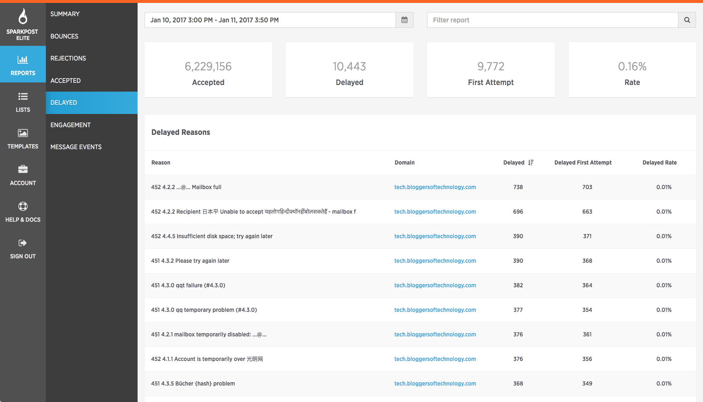

Here, you will be able to see how many emails were automatically accepted, how many were delayed, how many were delivered on the very first attempt, and what that converts to as a percentage. It will also show you the reasons for the delay below. You can sort according to domains in this screen as well, which is really handy if you want to see this from a domain level.
