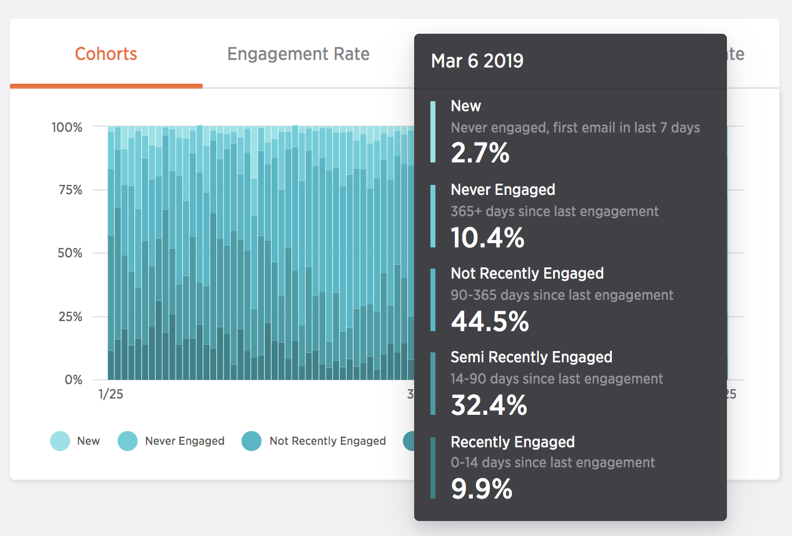
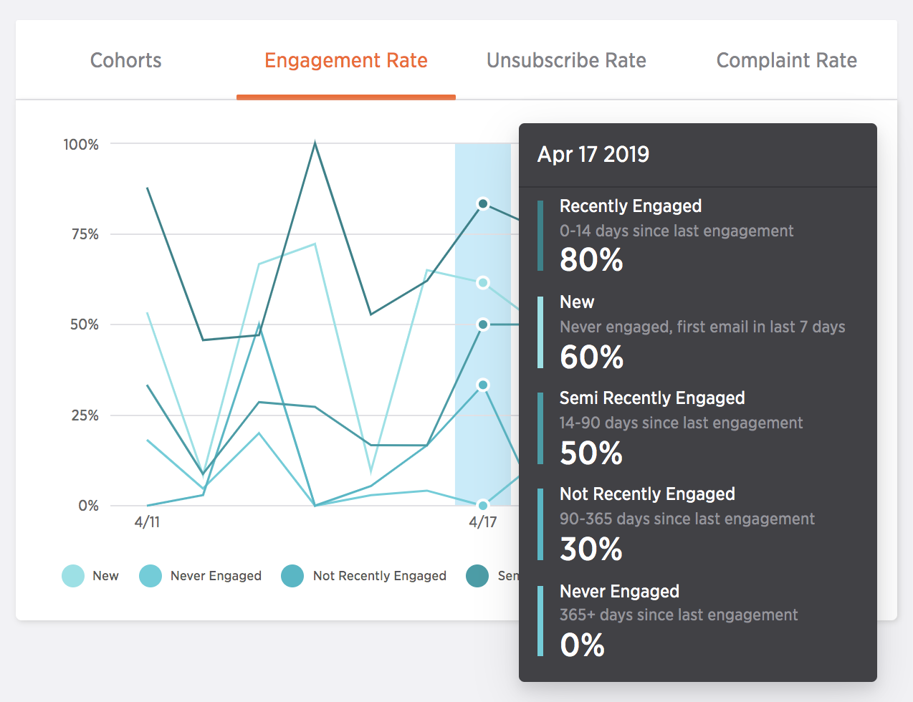

## Engagement Recency Cohorts

Mailbox providers like Gmail closely monitor recipient engagement to determine inbox placement, making their engagement a critical part of your email health. Engagement Recency summarizes how your recipient engagement changes over time, categorizing your recipients into different cohorts based on the recency of their last interaction.  With this data, Signals provides recommendations to increase your engaged recipients and reduce unsubscribes, bounces, and spam complaints.

_**Note:** For Engagement Recency to function, you must enable at minimum either open or click tracking. For best results, enable both._

Recipients are divided into the following cohorts:
* **Never Engaged** – Recipients who have received email but have not engaged with your messages in the past 365 days.
* **Not Recently Engaged** – Recipients who have engaged with your email in the past 365 days, but not in the past 90 days.
* **Semi-Recently Engaged** – Recipients who have engaged with your email in the past 90 days, but not in the past 14 days.
* **Recently Engaged** – Recipients who have engaged with your email in the past 14 days.
* **New Recipients** – Recipients who have received their first email from you within the past 7 days and who have not yet engaged with your messages.

### Recommendations

Signals provides guidance and changes you can make to your sending to ensure you're sending relevant content to recipients who are interested. It also issues warnings when your cohort breakdown enters dangerous levels, as recipient engagement plays a significant factor in inbox placement.

## Behavior by Engagement Cohort

Understanding your recipients is an important step to optimizing your sending and messaging. The three Behavior by Engagement Cohorts reports provide metrics about how each of your different cohorts are engaging with your email, as well as suggestions on how to interpret them. 

48 hours after emails are send we analyze the behavior by each cohort to give you an accurate view into their patterns.

The behaviors include:
* Engagement 
* Unsubscribes
* Spam Complaints

_**Note:** Not all mailbox providers surface spam complaints. While your known complaint rate might be low or zero, there may be complaints that aren't reported. This means that any changes in your complaint rate should be taken seriously._

Each cohorts behavior rate is depicted by a separate line corresponding to the cohort color. Below is the engagement rate broken down by cohorts.

### Recommendations

Signals provides recommendations around the behavior rates of each cohort to help you understand how your sending is performing. Recommendations can include investigating spam foldering, improving your onboarding, and other actionable changes you can make to improve your sending.
