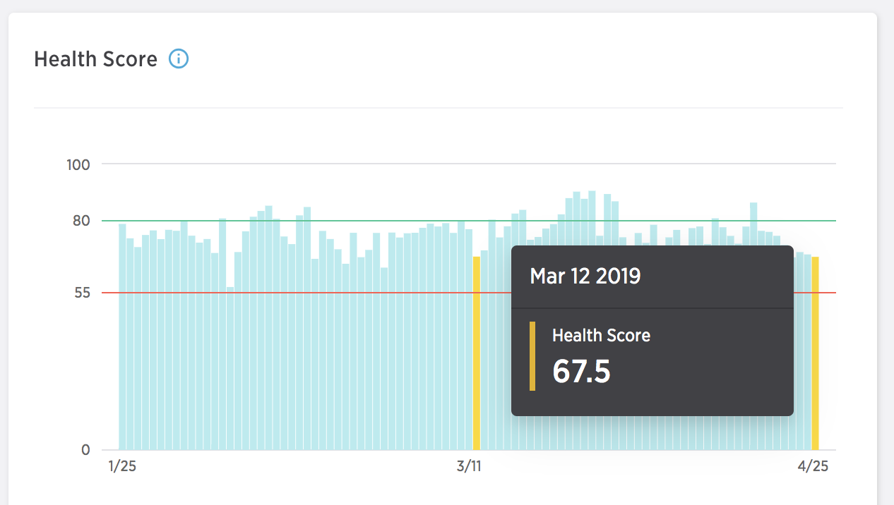

##  Health Score
Your Health Score is a predictive score to help you monitor your email health and identify problems before they negatively impact your ROI. Each day, the Health Score model predicts your overall engagement as compared with all senders using SparkPost, by analyzing dozens of different sending factors from your bounce rate to the relationship you have with your recipients. You'll receive a score between 0 and 100, informing you of your sending health. A good score is anything above 80.

_**Note:** To provide the actionable insights and accurate analysis, the Health Score requires a minimum number of emails sent each day.  For any period where your sending does not pass these minimums, the app notifies you that it doesn't have enough data._

The Health Score is a combination of eight different components which are informed by all the events passing through SparkPost including bounces, spam trap hits, and user engagement. You can view these components for each day you have a health score on the right of the Health Score chart.

The relative size of the component in the chart indicates the impact it had on your health score.

The components are as follows:
* **List Quality** – Percent of injections sent to email addresses matching patterns that may indicate a low-quality list.
* **Hard Bounces** – Percent of injections that returned hard bounces.
* **Block Bounces** – Percent of injections that returned block bounces.
* **Complaints** – Percent of injections that received a spam complaint.
* **Transient Failures** – Percent of injections that returned transient failures.
* **Other Bounces** – Percent of injections that returned a different bounce category.
* **Engaged Recipients** – Percent of injections that were sent to new recipients or recipients who have engaged within the past 30 days.
* **Unengaged Recipients** – Percent of injections that were sent to recipients who most recently engaged more than 90 days ago or never engaged.

### Component changes over time

In the components chart, you can select a bar to examine. When selected, a chart of the component's change over time is displayed. This chart allows you to see not only how your health score changed, but also how each component shifted over the selected timeframe.

### Recommendations

Signals provides a list of items needing attention and actions to take to improve any of the components that are negatively affecting your Health Score. By taking action to improve these items you'll see your Health Score, and therefore your deliverability and engagement, improve over time.