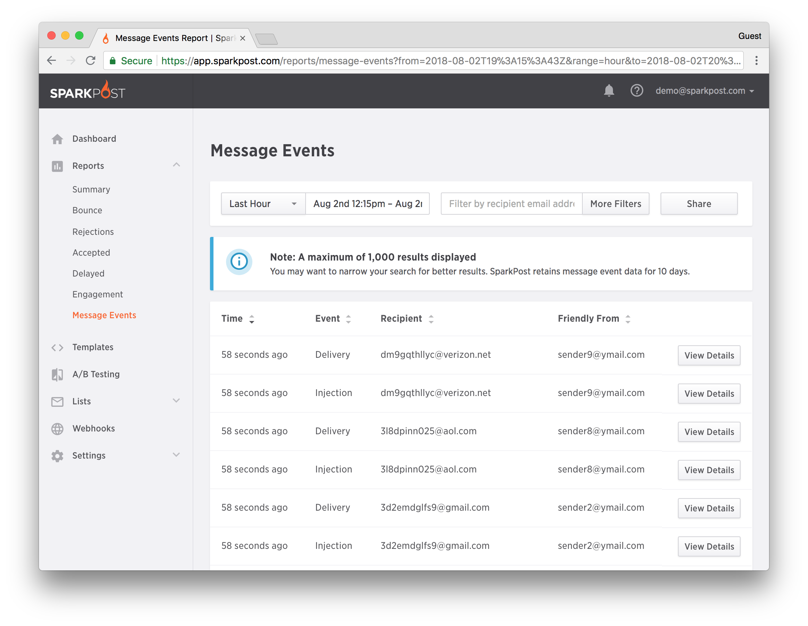

With the addition of the Message Events API we have added the power searching for message event data based on recipients, campaigns, and more.  This new API endpoint provides our customers with a way to pull data – on demand – for use in internal reporting, triggering message generation, or other programmatic processing of event data.

Message Events provides you with the ability to:

* Retrieve all events or specific events, such as bounces, deliveries, or clicks
* Filter the data by date range, campaign, or just about any other field

**Note**: Message events data is available for 10 days. Moreover, rolled up data is available via our metrics endpoints or the UI reports for much longer.

## How do I view Message Events?

Complete the following steps from the main menu in SparkPost.

1.  Click on Reports from the main menu.
1.  Select Message Events from the Sub-menu to view the same.
1.  Perform a filtered search for message event data - the response is sorted by descending timestamp.




## Use Cases: How can I use Message Events?

### Transactional Messages: Searching for an Individual Recipient

Let’s look at a customer service example. A customer calls your support line because they did not receive an important notification, such as an alert or a receipt or a password reset. You can build a simple UI that allows your customer service rep to search for an individual recipient to determine if he or she received the message.

The API call would look something like this:

```
curl -XGET -H ‘Authorization: <API_KEY_HERE>'
```

If the recipient received the message — and maybe even opened it, the customer service representative can provide a time/date to help them find it. In boxes are pretty full these days and it is easy to lose messages.

### Marketing Messages: Building a Customer Profile Database

In this use case you can use the data to build a customer profile database — who is engaged (opened / clicked within 90 days), and use that to drive additional messaging. Moreover, you could further break it down by campaign — for example, are certain users more responsive to certain campaigns than others? This is the foundation A/B Testing and segmentation analysis.

Here is a sample call to get opened or clicked within a specific day in the Central Time Zone

The API call would look something like this:

```
curl -XGET -H ‘Authorization: <API_KEY_HERE>'
```

Finally, you could connect the results to existing data you already have about the recipient, such as purchase history or website data, in an effort to create a richer profile.
