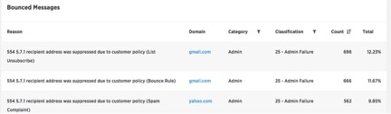

This is an overview of all rejections, regardless of what type of rejection they were.

**Targeted:**  Number of emails you sent to SparkPost.

**Injected:**  Emails that were injected into the send pipeline. There could be a difference in these two numbers based on suppression events (previous unsubscribes, spam/complaints or hard bounces).

**Rejected:**  All bounces, regardless of category.

**Rejection Rate:**       This is how many emails were bounced versus how many were targeted; lower is better.

**Rejection Reasons:**          In this visual, you see the Reason for the rejections, the domain, and the Category. However, these categories are different than the Bounce categories in the previous tab. These show Generation Failure, and Generation Rejection. The word ‘generation’ in this case means that all of the failures and rejections that occurred within the criteria of your time frame. For instance, if you set the time for the past 24 hours, the generation would refer to how many times this particular rejection reason occurred for this domain in this time.

Generation Failure – This error is returned when the email sent to SparkPost did not meet requirements.  Most often, there was a message payload formatting issue.  Look to the REST call responses for more granular information.

Generation Rejection – any rejection that occurs due to the email itself. This could be any of the bounce categories discussed earlier.

                        