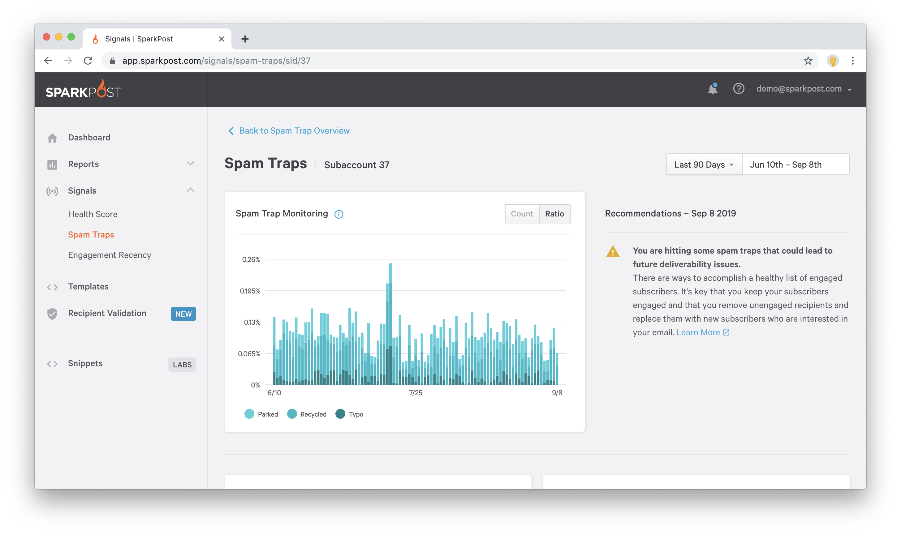
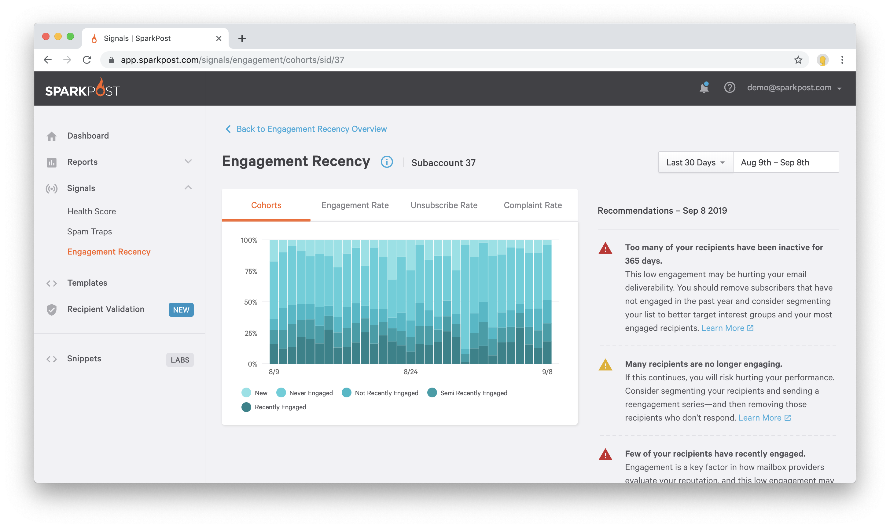
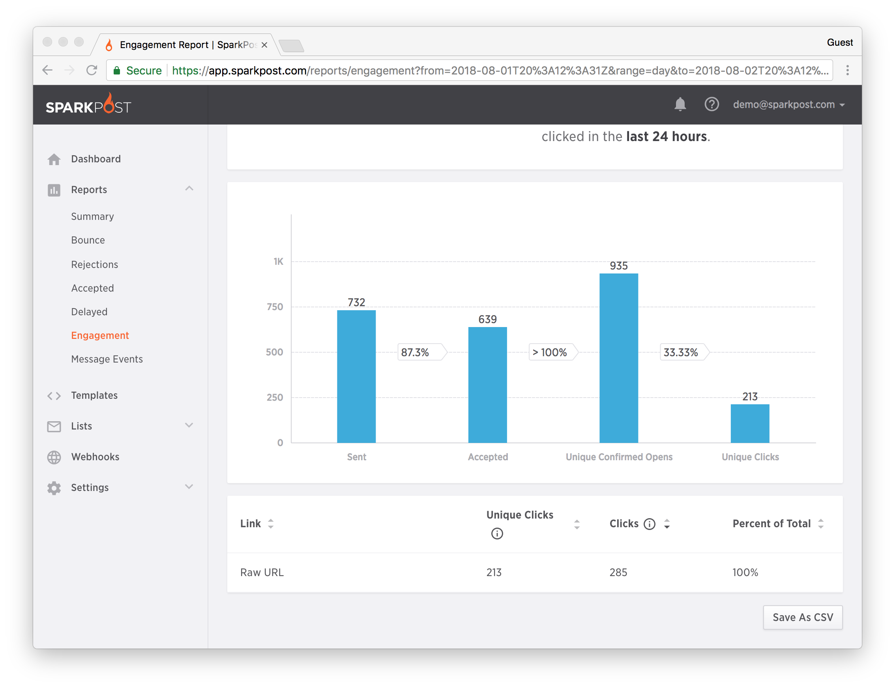

One of the major benefits of SparkPost is the vast amount of reporting and analytics provided. With over forty different metrics about the entire lifecycle of your email transmissions, you can understand the success of your program, track key numbers, and find areas to improve your sending program.

## Summary Report

The default reporting view is the Summary report, as seen below. It provides you the ability to select from all metrics SparkPost tracks, adjust reporting date ranges, and filter by campaign, sending domain, recipient domain, and more. [Learn more](./summary) about the Summary report.

## Bounce, Rejections, Accepted, Delayed Reports

Bounce, Rejections, Accepted, and Delayed reports in SparkPost provide the same date and filtering tools as the Summary report, with additional data and visualizations. Each report focuses on a different type of event and provides a breakdown into the different categories in the event, along with messages which provide information about why the event happened. For example, for the Bounce report, you'll see what reason mailbox providers are returning when they bounce your email.

## Health Score

The Health Score is a predictive score to help you monitor your email health and identify problems before they become apparent in through traditional metrics. Use it to discover areas of your sending that are low-performing and get recommendations on how to improve. [Learn more](./health-score) about the Health Score.

## Spam Trap Monitoring

Spam traps are email addresses that you should not send to, which are used by different organizations to find senders who don't follow good practices. If you send to too many of these addresses, your mail could end up being blocked, delayed or placed in the spam folder. Spam Trap Monitoring reports how many emails per day you are sending to spam traps so you can identify problems and improve your list management practices. [Learn more](./spam-trap-monitoring) about Spam Trap Monitoring.

## Engagement Recency Cohorts

You have a relationship with each person you send to. A powerful way to analyze that relationship is how recently they've engaged with your emails. The more recent they've engaged, the better your relationship. Each cohort is a group of recipients based on how recently they've engaged with your emails. For each day, Engagement Recency Cohorts display how much of your mail you sent to each group, so you know if your recipients are engaged with your email and you have a good relationship or if you need to remove disengaged folks and send more engaging content. [Learn more](./engagement-recency) about Engagement Recency Cohorts.

## Engagement Report

The Engagement report provides a visualization which helps you understand the performance of your transmissions. It also contains a "Links" set of tabular data which shows you which links in your email have been clicked most often by your recipients for the filtered time range.

