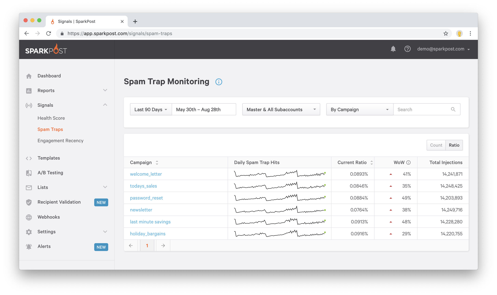
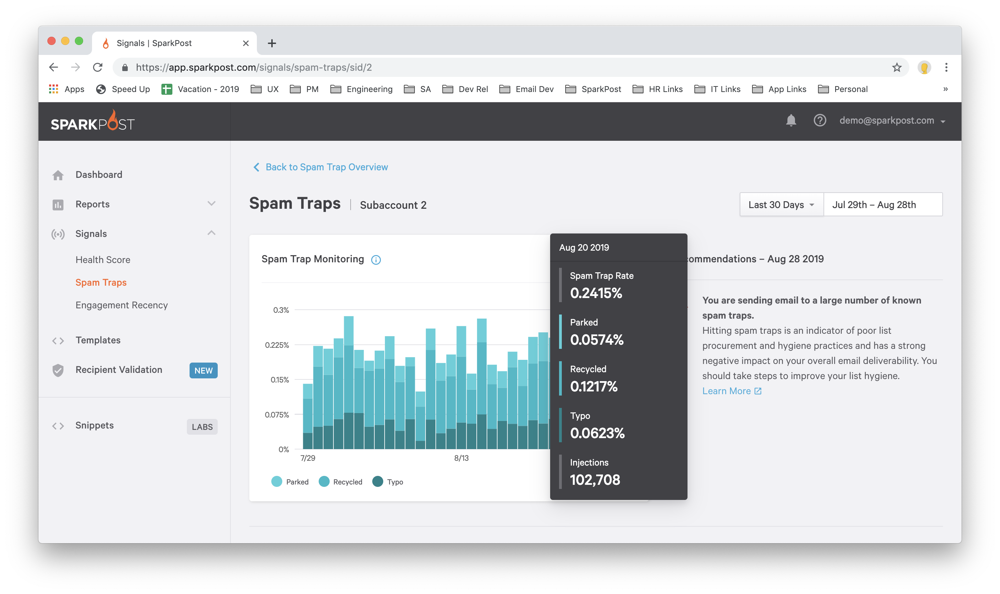

## Spam traps

Spam traps, also known as honeypots, are email addresses that are set up by blacklists, filter companies, and mailbox providers as a way to identify senders with bad list hygiene and list collection practices.

When you send to a high number of spam traps, your mail will be blocked or delayed.

### Monitored traps

With visibility across multiple commercial and non-commercial spam trap networks for the broadest coverage in the industry, SparkPost Signals is a crucial resource for maintaining the health of your email. Spam Trap Monitoring reports the share over time of your total email volume that was sent to known spam traps for each given day. This indicator is important to take note of since an excessive rate of spam trap hits indicates poor list procurement and hygiene practices. You can view the spam trap hits as a raw number or a ratio over the number of injections for that day.

### Trap types

Spam traps are categorized into different types based on their behavior and the way they can end up on your list.

Knowing the type spam trap you’re sending to can helu you find where your email program may have an issue.

* **Recycled** - Email addresses that once were real, but have been converted into a spam trap. If you have these on your list it’s probably a sign you need to clean out old unengaged recipients. You can look at your engagement recency cohorts (EU) to see if you are sending to a lot of unengaged recipients.
* **Typo** - Email addresses hosted on a domain that looks like a real mailbox provider, like gmal.com. These usually get onto your list when a real person tries to sign up but “fat fingers” their email address and accidentally adds a trap instead. These addresses signal that you should work to improve your enrollment process. Using a tool like Recipient Validation can help solve this problem.

* **Parked** - These are email addresses hosted by a parked domain provider. These addresses can point to list quality issues, though they will not affect your reputation.

## Dashboard

Spam Trap Monitoring allows you to see the raw count and percent of spam traps you are sending to in the selected time range. On the dashboard you can quickly set the date range to any of the presets or set a custom range to focus. To find specific issues, group the results by subaccount, and any IP pool, sending domain, or campaign.

## Details page

On each Spam trap details page, hover over each day to see how the count and rate of the total spam traps, as well as the stats broken down by each type of spam trap available. On the right hand side, you will find an assessment on how your performing for the day currently selected. Click on a different day to learn about your spam trap hits for that day. If your sending to a high number of traps, the assessment will provide a recommendation on where you should look for problems in your sending program.

_*Note:* Setting up spam traps is resource-intensive. To protect the integrity of the traps, SparkPost will never reveal which email addresses are traps. Similarly, the report may be empty if you send to a dangerously high percent of traps. This will only affect spammers._