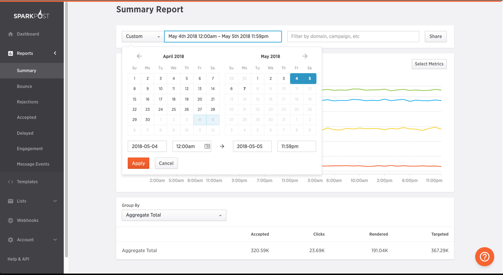
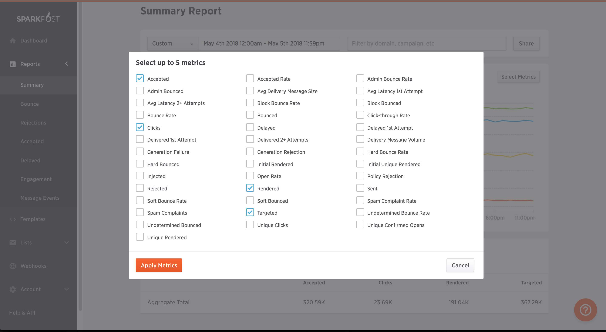
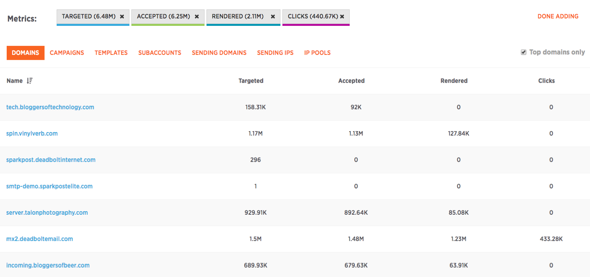

Summary in the Reports menu will load in the summary screen view, with a default time range of the last hour.  For large senders, there may be a short delay while the data is being compiled. The Calendar drop down provides preset time ranges and an optional custom date/time picker. You can also apply additional search criteria like recipient domain, campaign or template name in the search bar in the upper right.

Below the Summary graph are the various metrics you can choose. You can add up to five metrics per search by clicking on the Select metrics button to the upper right:

If you want to remove a particular Metric, uncheck it in the Select Metrics menu. To add a new Metric, check the checkbox next to the metric.  Once you are done, click on Apply Metrics, and SparkPost will compile your new Metrics. Below, you will see your Metric scores based on your selections:

You can download the selected dataset to a csv for further analysis by choosing the Save As CSV button in lower right.
