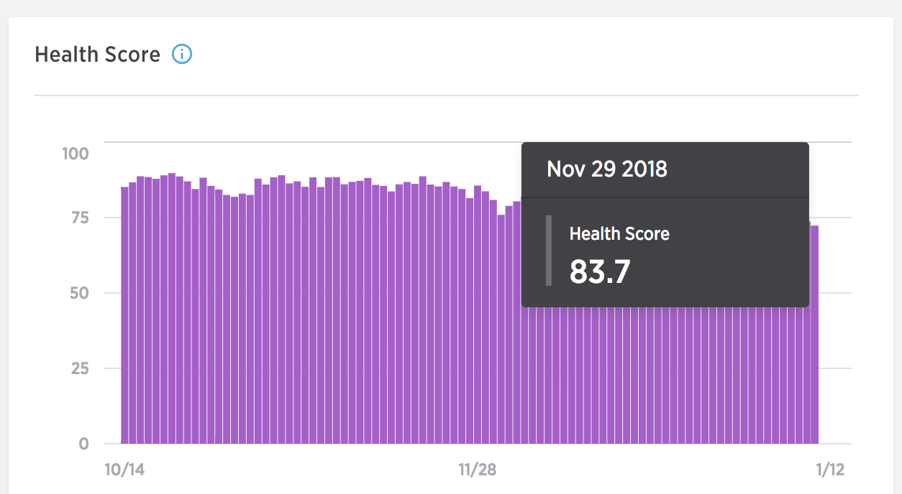
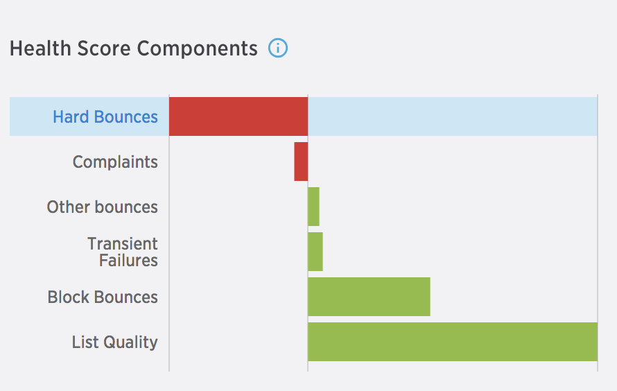
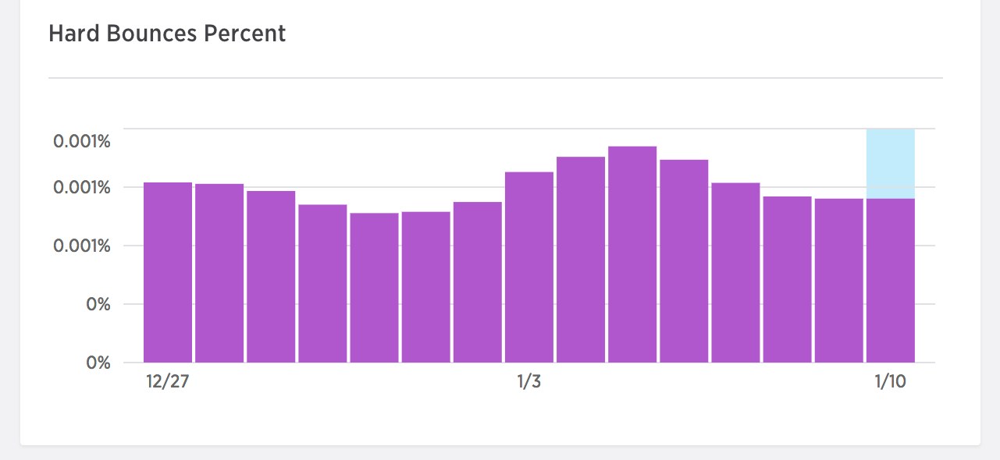

SparkPost Signals is an analytics suite that helps you improve email performance by diagnosing health issues before they impact your business. It analyzes your email sending and benchmark data from across our industry-leading email network to provide data-driven, predictive, and actionable insights that help you increase open rates, prevent blacklisting, and boost inbox placement.

## Dashboard
The dashboard contains leaderboards for the three signals provided: Health Score, Spam Trap Monitoring, and Engagement Recency. 

Each of row in these tables contains the summary for a different subaccount, and can be further sliced by campaign, IP pool, or sending domain to help catch issues across any of these facets. Additionally, you can view the data for up to 90 days to analyze trends over time.

Dive into the details page to see a deeper view of your scoring and find curated actions you should take to improve your sending, deliverability, and engagement.

_**Note:** Unlike SparkPost metrics which are calculated based on the number of sent emails, Signals is calculated based on the number of injected emails. Because of this, you'll see differing rates for some components such as hard bounces._

##  Health Score
Your Health Score is a predictive score that monitors your email health to identify problems before they negatively impact email delivery. Each day you'll receive a health score between 0 and 100, informing you of your sending health as compared to all senders on the SparkPost. A good score is anything above 80.

_**Note:** To provide the actionable insights and accurate analysis, the Health Score requires a minimum number of emails sent each day.  For any period where your sending does not pass these minimums, the app notifies you that it doesn't have enough data._

The Health Score is a combination of eight different components which are informed by all the events passing through SparkPost including bounces, spam trap hits, and user engagement. You can view these components for each day you have a health score on the right of the Health Score chart.

The relative size of the component in the chart indicates the impact it had on your health score.

The components are as follows:
* **List Quality** – Percent of injections sent to email addresses matching patterns that may indicate a low-quality list.
* **Hard Bounces** – Percent of injections that returned hard bounces.
* **Block Bounces** – Percent of injections that returned block bounces.
* **Complaints** – Percent of injections that received a spam complaint.
* **Transient Failures** – Percent of injections that returned transient failures.
* **Other Bounces** – Percent of injections that returned a different bounce category.
* **Engaged Recipients** – Percent of injections that were sent to new recipients or recipients who have engaged within the past 30 days.
* **Unengaged Recipients** – Percent of injections that were sent to recipients who most recently engaged more than 90 days ago or never engaged.

### Component changes over time

In the components chart, you can select a specific component to examine. When selected, a chart of the components change over time is displayed. This chart allows you to see not only how your health score changed, but also how each component shifted over the selected timeframe.

### Recommendations

Signals provides a list of items needing attention and actions to take to improve any of the components that are negatively affecting your Health Score. By taking action to improve these items you'll see your Health Score, and therefore your deliverability and engagement, improve over time.

## Spam Trap Monitoring
With visibility across multiple commercial and non-commercial spam trap networks, SparkPost Signals is a crucial resource for maintaining the health of your email. Spam Trap Monitoring reports the share over time of your total email volume that was sent to known spam traps for each given day. This indicator is important to take note of since an excessive rate of spam trap hits indicates poor list procurement and hygiene practices. You can view the spam trap hits as a raw number or a ratio over the number of injections for that day.

_**Note:** Your sending must stay within acceptable thresholds to receive the Spam Trap report. If you fall outside of these limits, no data is shown to maintain the integrity of the spam traps._

### Recommendations
If your spam trap hits exceed safe limits, Signals provides actionable advice identifying the most likely source of the problem and guides you to improve your [list quality](https://www.sparkpost.com/docs/signals/list-hygiene/) or [acquisition practices](https://www.sparkpost.com/docs/signals/subscriber-acquisition/).

## Engagement Recency
Mailbox providers like Gmail closely monitor recipient engagement to determine inbox placement, making their engagement a critical part of your email health. Engagement Recency summarizes how your recipient engagement changes over time, categorizing your recipients into different cohorts based on the recency of their last interaction.  With this data, Signals provides recommendations to increase your engaged recipients and reduce unsubscribes, bounces, and spam complaints.

_**Note:** For Engagement Recency to function, you must enable at minimum either open or click tracking. For best results, enable both._

Recipients are divided into the following cohorts:
* **Never Engaged** – Recipients who have received email but have not engaged with your messages in the past 365 days.
* **Not Recently Engaged** – Recipients who have engaged with your email in the past 365 days, but not in the past 90 days.
* **Semi-Recently Engaged** – Recipients who have engaged with your email in the past 90 days, but not in the past 14 days.
* **Recently Engaged** – Recipients who have engaged with your email in the past 14 days.
* **New Recipients** – Recipients who have received their first email from you within the past 7 days and who have not yet engaged with your messages.

### Recommendations

Signals provides guidance and changes you can make to your sending to ensure you're sending relevant content to recipients who are interested. It also issues warnings when your cohort breakdown enters dangerous levels, as recipient engagement plays a significant factor in inbox placement.
