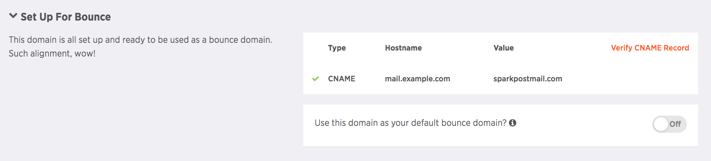

By creating a custom bounce domain, you can customize the address that is used for the Return-Path header (which denotes the destination for out-of-band bounces). This bounce domain overrides the default Return-Path (also known as the envelope FROM) value of "sparkpostmail.com" for all messages sent.

There are two options for adding and verifying custom bounce domains in SparkPost:

Option 1 (preferred option): 

1. Add a subdomain (e.g. mail.example.com) to be used as both a sending domain and a bounce domain. Add both the TXT record and CNAME record provided in SparkPost to your DNS.

Option 2:

1. Add your root domain (e.g. example.com) as a sending domain. Only add the CNAME verification if you understand the root domain CNAME record caveats (see note immediately below).

1. If using a root domain as a sending domain, add a separate subdomain (e.g. bounce.example.com) to be used as a bounce domain. Only add the CNAME record for that subdomain to your DNS and ignore the TXT verification.

*NOTE: Using a root domain as a bounce domain means you will **not** be able to receive any mail there, as all messages will be destined for SparkPost. If you intend to receive mail at a root domain, you **cannot** use it as a bounce domain. Additionally, using a CNAME record at a root domain means you **cannot** create any subdomains of the root domain, as per limitations of DNS. Because of this limitation, it is **not** recommended that you use a root domain as a bounce domain.

To configure a bounce domain, choose the subdomain you would like to use (e.g. bounce.example.com) and add the following CNAME record to your DNS settings:


| Hostname | Type | Value |
| --- | --- | --- |
| bounce.example.com | CNAME | sparkpostmail.com |

This DNS record will ensure that out-of-band/asynchronous bounces are routed to SparkPost for processing.

**Cloudflare users need to turn the cloud button next to the CNAME record in their DNS from orange to grey, in order for it to propagate and be recognized by SparkPost.**

Once you have configured your DNS settings, register and verify the domain with SparkPost by following the steps below. *Please note, it may take SparkPost a few minutes for the bounce domain to be ready for use after verification.*

## Using The SparkPost UI

If you prefer to use the SparkPost UI, you can create multiple bounce domains or single bounce domain that will be used for all of your outgoing mail.

1. Select Account and then [Sending Domains](https://app.sparkpost.com/account/sending-domains).
1. Click the New Domain button to add a sending domain. Again, please add a subdomain to avoid any issues with your root domain.
1. Navigate to your DNS and add the displayed CNAME record from SparkPost.
1. Select the "Verify CNAME Record" orange text in the  _Setup For Bounce_ record box.
1. Make sure the domain is verified by the green check mark. Please note that there is up to a 5 minute delay [for compliance verification](https://www.sparkpost.com/docs/getting-started/requirements-for-sending-domains/) before the domain can be used.

 

Once the CNAME record is verified in SparkPost, you will notice an orange button in the CNAME record box that says "Use this domain as your default bounce domain?" Turn this on if you want all of your transmissions to use this bounce domain. If you plan to configure multiple bounce domains, please refer to the end of the article for more information on how to set the bounce domain in your transmission.

## Using The SparkPost API

If you prefer to set up a sending domain as a bounce domain via the API, use the following instructions:

1. Register the domain with SparkPost by using the sending domains [create endpoint](https://developers.sparkpost.com/api/sending-domains.html#sending-domains-create-post).
1. CNAME-verify the domain by using the sending domains [verify endpoint](https://developers.sparkpost.com/api/sending-domains.html#sending-domains-verify-post).  Here's an example API call to CNAME-verify the mail.example.com domain:

    ```
    POST /api/v1/sending-domains/bounce.example.com/verify

    {
      "cname_verify" : true
    }
    ```

1. Optionally set the domain as your account/subaccount default bounce domain so that it is automatically used as the bounce domain for all messages sent through the account/subaccount (unless otherwise specified; please see the bottom of the article).  Here's an example API call to set a master account bounce domain 'bounce.example.com' as the master account's default bounce domain:

    ```
    PUT /api/v1/sending-domains/bounce.example.com

    {
      "is_default_bounce_domain" : true
    }
    ```

And here is an example API call to set a subaccount 123 bounce domain 'sub.bounce.example.com' as that subaccount's default bounce domain:

    ```
    PUT /api/v1/sending-domains/sub.bounce.example.com
    X-MSYS-SUBACCOUNT: 123

    {
      "is_default_bounce_domain" : true
    }
    ```

## Using Multiple Custom Bounce Domains

It is important to note that after you create and verify your bounce domain(s), they will not automatically be in use. You will need to specify the desired bounce domain directly in your transmission request:

1. SMTP – You will need to specify the bounce domain in the SMTP `MAIL FROM` command.

1. REST API – You will need to add the bounce domain to the domain part of the `return_path` field. Note that the SparkPost servers will overwrite the local part of the `return_path` address, so this local part can be anything in your transmission request. 

     For example:

     ```
       {
         "campaign_id": "testing",
         "return_path":"anylocalpart@bounce.example.com",
         "recipients": [
           {
             "address": {
               "email": "wilma@flintstone.com",
               "name": "Wilma"
             }
           }
           ],
         "content": {
           "from": {
             "email": "fred@flintstone.com",
             "name": "Fred"
           },

           "subject": "Hi!",
           "html": "Hello, thank you for creating a custom bounce domain."
         }
       }         

      ```

You also have the option of choosing to make a verified bounce domain the default bounce domain to use for all messages injected by the account (or subaccount).  See the `is_default_bounce_domain` flag described above. When a bounce domain is set as the default, all future transmissions will use the domain as their bounce domain (unless otherwise specified in the `return_path` string for transmissions or the `mail from` header in the SMTP payload).  The `is_default_bounce_domain` flag can be applied independently at both the master account and individual subaccount levels.  Each subaccount may select one of its bounce domains to be used as the subaccount default bounce domain.  If none of the subaccount's bounce domains are flagged as the default, then subaccount messages will fallback to a master account default bounce domain (if such a domain is configured).
