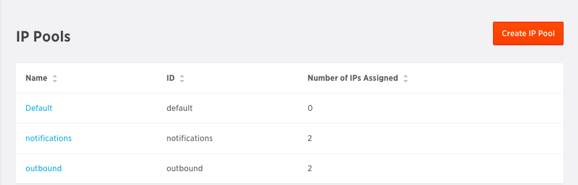

# Introduction #

DKIM signing by IP pool allows service providers to brand (or white label) the DKIM signature of the messages they send on behalf of their customers/senders. It gives the ability for service providers to use their own DKIM signing domain for groups of senders where having an individual DKIM domain for each from domain is impractical (e.g. because the service provider doesn’t have the ability or access to change their customers’ DNS, or the number of sending domains required of their customer base is very large.) It allows service providers to have different DKIM domains for each group of senders on different IP pools for more granular control of reputation management. This feature also allows the branding of the DKIM domain(s) registered with Yahoo (and similar inbox providers) who use DKIM keys/selectors as the basis for feedback loops.

_Note_: This feature is currently available on SPC, SPC EU and our Enterprise customers on Next Gen Architecture. Enterprise customers, please contact your TAM for an update on the availability of this feature.  

# DKIM Signing Logic #

The following explains the logic of how SparkPost will sign messages based upon signing domain and/or IP pool settings.


### **_DKIM Signing Domain = From Domain_** ###

For senders where the from domain and the DKIM signing domain (`d=`) match, you can use the sending domains API to create the domain and verify it using the DKIM method. Any messages (regardless of IP Pool being used) sent using that from domain will DKIM sign using the same `d=` domain. 

**Example:**

From Domain = `mysendingdomain.com`
DKIM `d= mysendingdomain.com`

_Note_: This is the result regardless of the IP pool being used.

More information on how to create sending domains via the API can be found [here](https://developers.sparkpost.com/api/sending-domains.html). The associated [knowledge base article](https://www.sparkpost.com/docs/getting-started/getting-started-sparkpost/#sending-domain-step-2-verifying-domain-ownership) on creating sending domains can be referenced for detailed instructions as well.

### **_DKIM Signing Domain Linked to IP Pool_**

For Service Providers who group their senders/customers by IP pool and would like to use a specific `d=` DKIM domain for each IP Pool, perform the following steps:

1. Use the Sending Domains API to create and verify the desired d= signing domain using DKIM verification method.
1. Use the IP Pools API and provide the desired DKIM signing domain in the signing_domain field for that IP Pool. For example:

```PUT /api/v1/ip-pools/mypool2  {
“name”: "My Pool 2",
“signing_domain” : “my-2.serviceproviderdomain.com” }

PUT /api/v1/ip-pools/mypool3  {
“name”: "My Pool 3",
“signing_domain” : “my-3.serviceproviderdomain.com” }
```

Reference API documentation for IP pools can be referenced [here](https://developers.sparkpost.com/api/ip-pools.html#ip-pools-ip-pools-resource-put).

The IP Pools UI can also be used to assign a default DKIM `d=` to a given IP pool. To access the IP pool page in the UI, click on Settings > IP Pools in the left frame. To create a new pool, click on the orange "Create IP Pool" button in the upper right.



Click on the IP pool name you wish to configure. The drop down will present your DKIM-verified sending domain that you can use as a DKIM- Signing domain for that IP Pool.
