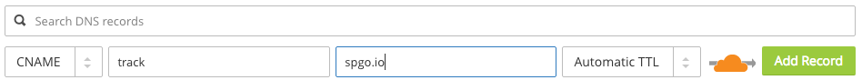
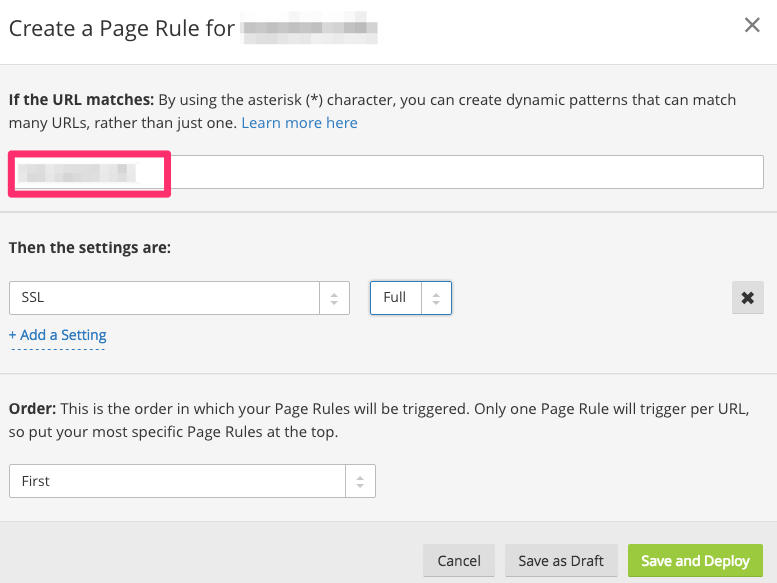

## Overview

SparkPost supports HTTPS engagement tracking for all self-service customers. This article describes how to use a Content Delivery Network (CDN) to enable SSL engagement tracking for your domain. After completing the steps below, your email recipients will see HTTPS links in the email you send. When they visit a tracked link, your CDN will handle the SSL connection, then pass the HTTP request on to SparkPost. SparkPost will record the click event and redirect the recipient to the original URL.

## Configuring SSL Certificates

In order for HTTPS engagement tracking to be enabled on SparkPost, our service needs to present a valid certificate that will be trusted by the email recipient’s browser.  SparkPost does not manage certificates for customer engagement tracking domains, as we are not the record owner for our customers’ domains.

As a workaround, you may use a Content Delivery Network (CDN) service, such as [Cloudflare](http://www.cloudflare.com) or [Fastly](http://www.fastly.com) to manage certificates and keys for any custom engagement tracking domains you configure.  These services forward traffic onwards to SparkPost so that HTTPS tracking can be performed.

## Step by Step Guide with CloudFlare

The following is a sample guide for use with CloudFlare **only**; please note, the steps to configure your chosen CDN will likely differ from CloudFlare in workflow. Please refer to your CDN's documentation and contact their respective support departments if you have any questions.

1. Create CloudFlare account
2. Go to “DNS” tab on the CloudFlare UI:

    

3. Add domain and then add the following Cloudflare NS records (**please note**, for other providers, the NS records to be used will differ):

    ```
    NS	aron.ns.cloudflare.com
    NS	peyton.ns.cloudflare.com
    ```
    These values can be found under the DNS tab on the Cloudflare UI.

    **Example:**

    Using the domain `track.example.com`, below is a command line DIG command to confirm that the NS records have been updated to reflect the required changes:

    ```
    dig example.com NS

    ; <<>> DiG 9.8.3-P1 <<>> track.example.com NS
    	;; global options: +cmd
    	;; Got answer:
    	;; ->>HEADER<<- opcode: QUERY, status: NOERROR, id: 25635
    	;; flags: qr rd ra; QUERY: 1, ANSWER: 2, AUTHORITY: 0, ADDITIONAL: 0

    	;; QUESTION SECTION:
    	;track.example.com.			IN	NS

    	;; ANSWER SECTION:
    	track.example.com.		86400	IN	NS	peyton.ns.cloudflare.com.
    	track.example.com.		86400	IN	NS	aron.ns.cloudflare.com.

    	;; Query time: 128 msec
    	;; SERVER: 10.76.3.194#53(10.76.3.194)
    	;; WHEN: Tue May  9 10:15:20 2017
    	;; MSG SIZE  rcvd: 88
    ```

4. Add a new CNAME entry that points your domain to `spgo.io`:

    **Example:**

    Using an engagement tracking domain of `track.example.com` in SparkPost, the appropriate CNAME record under the DNS tab of CloudFlare has been added.

    

5. Navigate to the Page Rules settings for the domain.
6. Create a page rule for the domain that sets SSL to “Full”. This is required for how CloudFlare will validate the certificate on the origin.

    

    More information on SSL options for Cloudflare can be found [here](https://support.cloudflare.com/hc/en-us/articles/200170416).

7. Turn the page rule "on."

    

8. Run the [Update a Tracking Domain API](https://developers.sparkpost.com/api/tracking-domains.html#header-port-secure-attributes) using the following Post Data:

    ```
    {
        "port"    : 443,
        "secure"  : true,
        "default" : true
    }
    ```

## Additional Resources for Content Delivery Networks

For a list of CDN providers (any of which can integrate with SparkPost to enable HTTPS engagement tracking), this [page](http://www.cdn-advisor.com/articles/).
