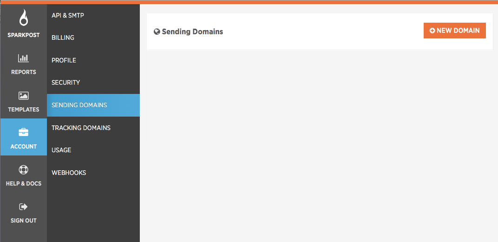
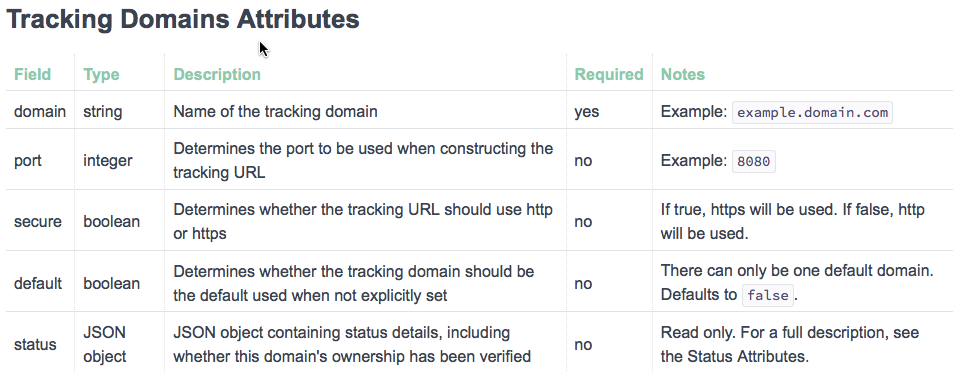
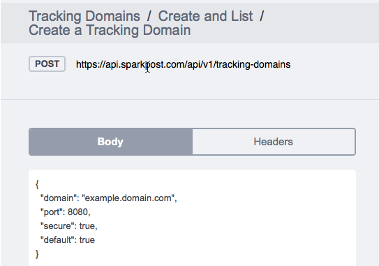
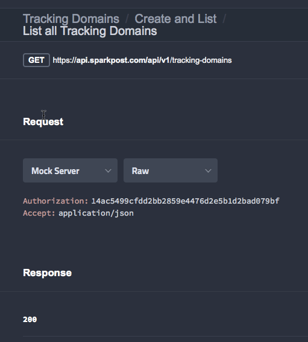
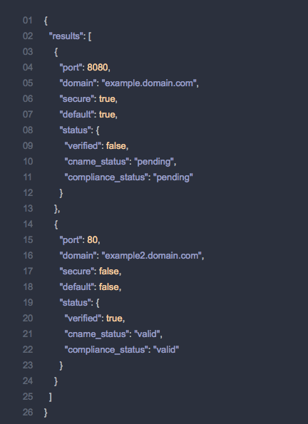
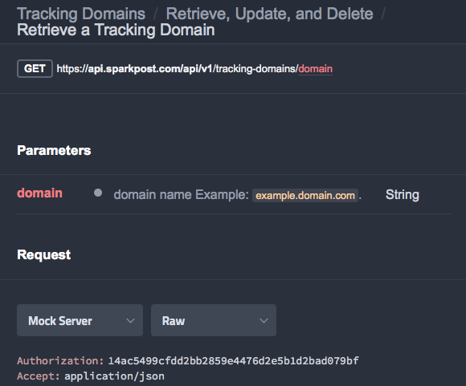
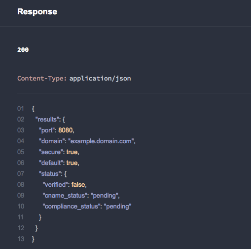
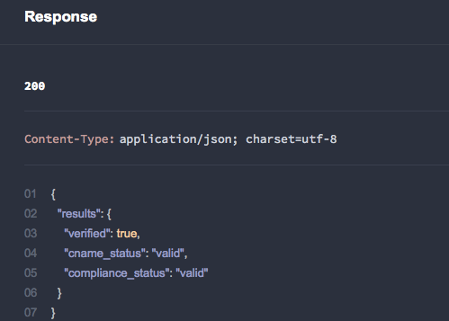
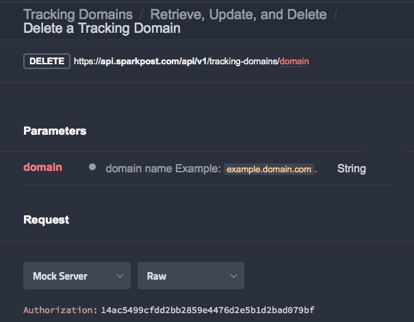
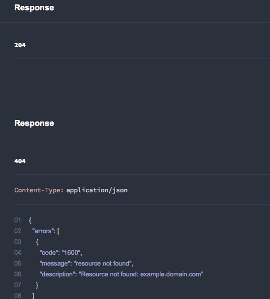

**Introduction**

A tracking domain (also referred to as an "engagement tracking domain") is the domain that a tracked link will redirect through before reaching the final URL path of the original link. It is also used as the path for the tracking pixel to track message opens. A recipient will see this domain if they mouse over a tracked link in an HTML message or if they receive a plain text message. SparkPost offers the option to configure one or multiple tracking domains per account.

There is a system default tracking domain that is used for tracking if you choose not to configure a custom tracking domain. For SparkPost.com this is "spgo.io". For SparkPost Elite, it is the domain configured by your Technical Account Manager during onboarding. Once a single custom tracking domain is configured, it becomes the default and will be the tracking domain used for all of your messages. When you configure multiple tracking domains, you will associate each one with a sending domain and designate one as the default for any sending domains that don't have a tracking domain associated with it.

**To summarize, when a message is sent:** 

*   If the sending domain has an associated tracking domain, that tracking domain will be used
*   If the sending domain does not have an associated tracking domain, the designated default tracking domain will be used
*   If there is not a designated default or if no customer tracking domains are configured, SparkPost will use the system default as described above **(Note: This is for SparkPost.com customers only)** 

**<u>Process and Configuration</u>**                      

If you would like to configure your SparkPost.com or SparkPost Elite account to use a custom tracking domain, the process is as follows:

1.  Determine what subdomain you wish to use for your custom tracking domain (e.g. click.myawesomedomain.com). **Please note,**       the tracking domain **must** be a subdomain and **not** a root domain!
2.  Make sure that the custom tracking domain you choose to use is one for which you have access and permission to modify the DNS.
3.  Edit your DNS zone file for your tracking domain to include the new CNAME (this is different depending upon who you use as your domain registrar, such as GoDaddy.com, Ghandi, or Moniker).
4.  Create a new CNAME record in your DNS zone file and set the host to your tracking sub-domain (e.g. click.myawesomedomain.com) with the value: "*spgo.io*" (**Note: For SparkPost Elite users, your CNAME record value should point to the tracking domain configured during your onboarding**                                                                                                                         ).
5.  Once you have completed creating your CNAME record(s) and have successfully saved the DNS changes, complete the set up through either the API or the UI (instructions for both below).
6.  Associate the custom tracking domain to a sending domain via UI or API.

<u>​**Setting Up Custom Tracking domains through the SparkPost UI**</u> 

To configure one or more custom tracking domains through the SparkPost user interface, follow the steps below.

**Setting up a Tracking Domain**                     
1\. Select **Account** and then **Tracking Domains** from the main menu.
2\. Click the **New Domain**        button to add a new tracking domain.

3\. Complete the Domain Name field and Set as Default button and then click the **Add Domain**        button to complete the process of adding a tracking domain.

<u>**Associate your Tracking domain(s) with one or more Sending domains**</u> 

1\. Select **Account** and then **Sending Domains**         from the main menu.

2\. Click the **New Domain**        button to create the new sending domain or select an existing sending domain

3\. Complete the **Sending Domain Name**             for each sending domain and select the **Linked Tracking Domain**                 you want to associate with it.

4\. Click the **Add Domain**        or **Update Domain**        button to complete the association.

**NOTE for SparkPost.com customers:**                              for information on how to configure your Sending Domains, please see the following Knowledge Base Article:
https://support.sparkpost.com/customer/en/portal/articles/1933318-creating-sending-domains

**Note:** As a general reminder, any newly configured tracking domains have to route back, either through delegation or use of CNAME records, to SparkPost or your SparkPost Elite instance in order for us to be able to report on opens and clicks. Misconfiguration of your tracking domain(s) could mean link redirection could fail, so please ensure you test prior to placing any new domains into production!

<u>**API Configuration: Custom Tracking Domains**</u> 

You can also configure custom tracking domains programmatically by using the SparkPost REST API.

  

**A. Creating a Tracking Domain**                           

**URL:** https://api.sparkpost.com/api/v1/tracking-domains (or your SparkPost Elite API endpoint)
**HTTP Method:**         POST 

 

 **B. List all Tracking Domains & the Response**                                         

**URL:** https://api.sparkpost.com/api/v1/tracking-domains
**HTTP Method:**         GET

**C. Retrieve a Tracking Domain**                            **& the Response**             
**URL:** https://api.sparkpost.com/api/v1/tracking-domains/domain
**HTTP Method:**         GET

**D. Verify a Tracking Domain and the Response**                                          

Initiate a check against the CNAME DNS record for the specified tracking domain. The domain's `status` object is returned on success.

**URL:** https://api.sparkpost.com/api/v1/tracking-domains/domain/verify
**HTTP Method:**         Post

 

**E. Deleting a Tracking Domain**                           

**URL:** https://api.sparkpost.com/api/v1/tracking-domains/domain
**HTTP Method:**         Delete

## Using a Tracking Domain 

Once a tracking domain has been associated with a verified sending domain, the appropriate tracking domain will be inserted into all links if click tracking is turned on. Note that click tracking is turned on by default in both SparkPost.com and SparkPost Elite, and you must specifically include the option to turn it off in either the transmissions options (REST), or the SMTP API (SMTP). 

More information about our click tracking options can be found here:

[REST API (Transmission)](https://developers.sparkpost.com/api/#/reference/transmissions)
[SMTP API (SMTP injection)](https://developers.sparkpost.com/api/#/reference/smtp-api)