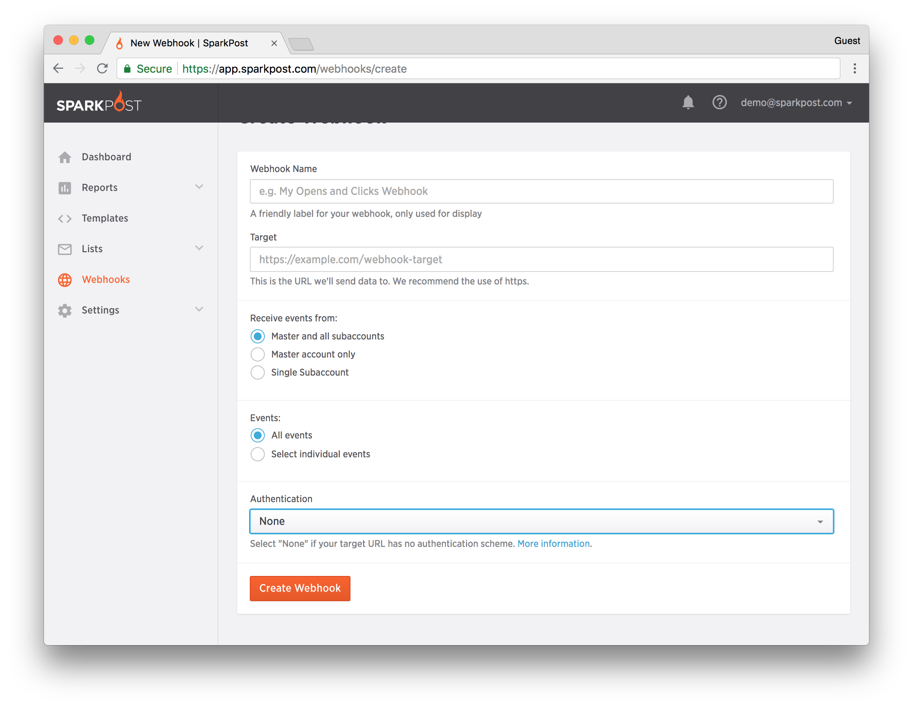
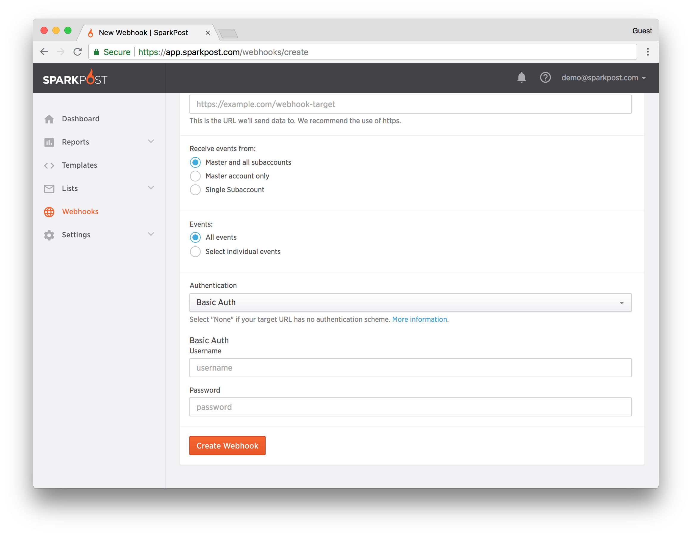

SparkPost offers 2 optional (but highly recommended) security measures that can be implemented when setting up a webhook, namely **OAuth 2.0** and **Basic Authentication**. These measures increase the security of your webhook event data and ensure that the data delivered originates from SparkPost.

**OAuth 2.0**

OAuth 2.0 requires an authentication token, which is issued by an authorization server, in order to connect to your webhook endpoint. The authentication token is checked by the receiving endpoint when accepting the HTTP request.

The following resources are available to learn more about OAuth 2.0.

**Please note that SparkPost is not responsible for the content located at these links**:

* [Specifications for OAuth 2](http://tools.ietf.org/html/rfc6749-specificationforOauth2)
* [An Introduction to OAuth 2](https://www.digitalocean.com/community/tutorials/an-introduction-to-oauth-2)

**Basic Authentication**

Basic Authentication (Basic Auth) allows users to provide the username and password associated with your HTTP endpoint when setting up a webhook (this is **not** your SparkPost username and password). When webhook data is sent, the Basic Auth fields are included in the header of the HTTP request.

**Header-Based Token Method (deprecated)**

The Header-Based Token method has been deprecated and is not available for new webhooks.

* Existing webhooks that use the Header-Based Token will continue to work; the token will be part of the HTTP request that delivers the data, and the token will be displayed in the UI.
* No changes are required to existing webhooks that use this token. However, we encourage our customers using this deprecated token method to switch to the more secure Basic Auth or OAuth 2.0 authentication methods.​

## Webhook Authentication Set Up

The authentication method is set to "None" by default when creating a new webhook.  To configure either Basic Auth or OAuth 2.0, select the appropriate value from the "Authentication" drop-down list.  While using either authentication method is optional, we strongly encourage our customers to configure one of these two methods for their webhooks.

 

**Basic Authentication**

To configure HTTP Basic Auth, provide the username and password that your target URL uses. Remember that the "Basic Auth Username" and "Basic Auth Password" is not the same username and password used to log into SparkPost.

 

**OAuth 2.0**

To configure OAuth 2.0, you need to provide the following information:

* OAuth2 Client ID and OAuth2 Client Secret (which is akin to username and password) that SparkPost will use to request the authentication token from your authorization server
* OAuth2 Token URL i.e. the URL of the authorization server from which SparkPost will request the token

​

## FAQ

**Q: How does SparkPost deal with expiring tokens?**

SparkPost assumes a token is expired if the webhook endpoint returns a response of 400 or 401.

**Q: Will SparkPost request a new token if our endpoint returns a 400 or 401 status?**

Yes.

**Q: When does SparkPost request a token from the OAuth provider?**

SparkPost requests a token when we are attempting to send data to the webhook target. We also request one when the webhook is initially created, or later modified/updated either via the UI or API.

**Q: Is the token included in the authorization header?**

Yes, the formation of this header is "Authorization: Bearer {token}".
