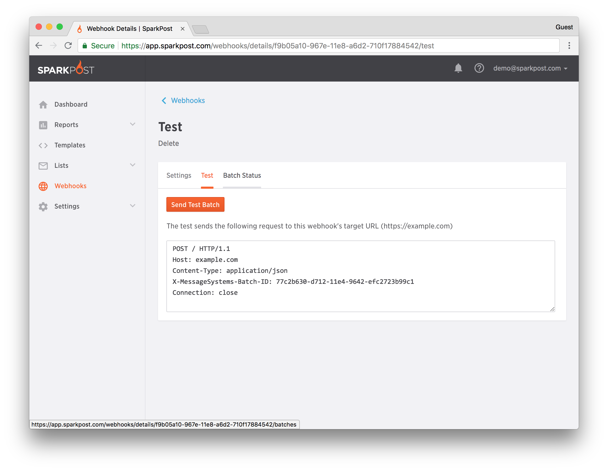

The SparkPost webhooks interface allows you to push web hook events of your choice to your own endpoint for processing.  You can also retrieve event level data through the [Message Events API](https://developers.sparkpost.com/api/message-events).

There are three (3) main categories of webhook events in SparkPost:

1.  Message Events: Describe the lifecycle of a message (transmission), including: injection, delivery, and disposition
2.  Generation Events: Provide insight into message creation failures or rejections (by SparkPost)
3.  Engagement Events: Describe what recipients "do" with your email, such as: opens (renders) and clicks

Each of the above categories have a variety of event types, each with a unique set of fields that will provide information to your webhook event consumer. Read the full list of [event-to-field mappings in SparkPost webhooks](https://developers.sparkpost.com/api/webhooks).

### How to define a Webhook in SparkPost 

There are two ways to create a webhook in SparkPost: Using the [SparkPost Webhook API](https://developers.sparkpost.com/api/webhooks) or using the SparkPost app (directions below). 

1.  [Login to SparkPost](https://app.sparkpost.com/) ([EU](https://app.eu.sparkpost.com/))
1.  Navigate to **Configuration** > [Webhooks](https://app.sparkpost.com/webhooks) ([EU](https://app.eu.sparkpost.com/webhooks))
1.  Click on the "Create Webhook" button
    
1.  Set the following values:
    1.  **Webhook Name:**       human friendly name for your webhook
    1.  **Target URL**    : The URL where your webhook event consumer resides and the path to the event handler. Example: http[s]://your.domain.tld/webhook/event/handler
    1.  **Basic Auth or OAuth**               [OPTIONAL]: The Authentication Token is still there for existing webhooks, but has been deprecated for new ones. 
    1.  **Events**:
        1.  All: The webhook will receive ALL events from ALL webhook categories
        1.  Select: You can choose which events you want to be sent to your webhook consumer
1.  Click the Add Webhook button, and your webhook will be saved.
    
1.  If you want to test that the webhook is working, click the "Test" tab.
1.  If you want to modify your webhook, click the "Setting" tab.
1.  If you want to delete this webook, click **Delete**.
