## Basic Platform Knowledge

* **[What is a user panel?](/analyst/general/what-is-a-user-panel)** Learn more about our panel and how it makes our data unique.
* **[Common Terminology & Definitions.](/analyst/general/common-terminology-and-definitions)** This article covers our most common terms, phrases and words and what they actually mean within the platform.
* **[Help! My searches have little-to-no email data.](/analyst/competitive-tracker/help-my-searches-have-little-to-no-data)** How you can contact our research team to troubleshoot little or missing data.

---

## Report Building

* **[How to Export Data.](/analyst/inbox-and-design-tracker/how-to-export-your-eds-data)** Learn what page(s) contain exportable data for you to download and use outside of the platform.
* **[How to Create a Pivot Table.](/analyst/competitive-tracker/organize-exported-data-with-pivot-tables)** Recommended for report-creation of all Competitive Tracker exports.

---

## Common Use Cases by Team

 The following sections show common use cases by team, and how you can use the platform to assist in your research.

**Marketing/Content Creation** 

* [How can I identify personalization of subject lines, templates, and email body content?](#how-can-i-identify-personalization-of-subject-lines-templates-and-email-body-content)
* [What key words or phrases generate engagement?](#what-key-words-or-phrases-generate-engagement)
* [How targeted are a brand's campaigns?](#how-targeted-are-a-brands-campaigns)
* [What are my subscriber's mutual interests?](#what-are-my-subscribers-mutual-interests)
* [What are other senders saying about my brand or product?](#what-are-other-senders-saying-about-my-brand-or-product)
* [What are email benchmarks that I can compare my performance to?](#what-are-email-benchmarks-that-i-can-compare-my-performance-to)

**Sales/Prospecting** 

* [What service provider(s) is a brand using?](#what-service-providers-is-a-brand-using)
* [What is a brand's list size?](#what-is-a-brands-list-size)
* [What countries do they mainly target?](#what-countries-do-they-mainly-target) 

---

## Marketing/Content Creation

### How can I identify personalization of subject lines, templates, and email body content?

*[Sending Domain](/analyst/competitive-tracker/sending-domain), [Advanced Search](/analyst/competitive-tracker/how-to-maximize-advanced-search-in-competitive-tracker)*

* The best way to identify personalization is to look at components of the message that are *redacted*. Since we monitor a live panel of users, our system redacts out all email components that are unique to each subscriber.
* Here are a few examples of redaction and what they may tell you about a particular message:

	+ Distinguishing **transactional** versus a **promotional** send:

	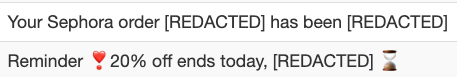
	
	*The first campaign is a transactional order update. The second email is a promotional campaign using the subscriber's first name in the subject line*
	+ Sophisticated senders use customer history to inform which product(s) to promote via the subject lines or email body
	
	
	
	*Sephora promoted a unique item for each recipient of this campaign*

### What key words or phrases generate engagement?

*[Advanced Search](/analyst/competitive-tracker/how-to-maximize-advanced-search-in-competitive-tracker), [Brand](/analyst/competitive-tracker/brand-tracker) or [Company Tracker](/analyst/competitive-tracker/company-tracker), [Sending Domain](/analyst/competitive-tracker/sending-domain)*

* This topic can be approached broadly our by looking into the use of specific terms.

	+ **Broad Analysis.** Perhaps you are in need of inspiration for subject lines, or just want a high-level view of what your competitors use in their subject lines. This type of analysis can inform deeper research topics or help you identify promotional versus transactional domains.
	
		- In the *Sending Domain*, or *Brand/Company Tracker* tabs, you can view a brand's most recent campaigns towards the bottom of each of these pages.
		- In *Advanced Search,* you can input several brands, or search across a specific industry for more search results. Setting a read rate limit provides a better idea of what campaign(s) generate higher engagement.
		
		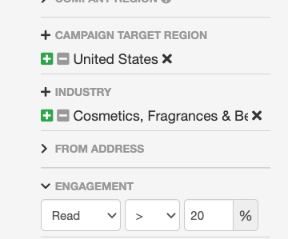

	+ **Specific Use-Case.** Whether you are promoting a single product or have a peak holiday promotion, *Advanced Search* can be used to gain inspiration for any upcoming send. Look for keywords or phrases in the subject line and/or body and develop highly customized searches for your research.
	
	 The screenshot below shows an example search for Mother's Day terms.
	
	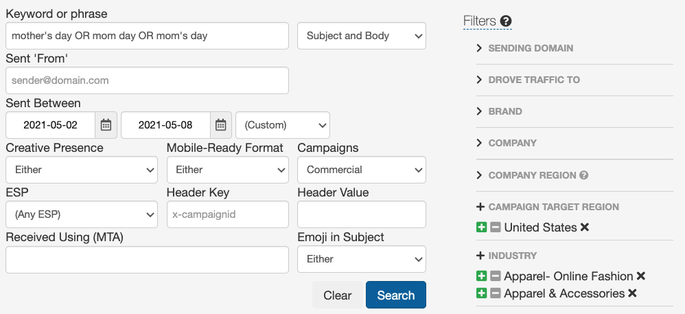
	
	 The platform accepts boolean operators, which allows you to search with multiple terms or identify phrases to eliminate from your search. Read more about boolean operators in our [Advanced Search Guide.](/analyst/competitive-tracker/how-to-maximize-advanced-search-in-competitive-tracker)

### How targeted are a brand's campaigns?

*[Sending Domain](/analyst/competitive-tracker/sending-domain), [Advanced Search](/analyst/competitive-tracker/how-to-maximize-advanced-search-in-competitive-tracker)*

* **Targeting** refers to what percentage of a brand's mailing list a campaign reaches. This can inform you of the complexity of a sender's email program, whether they do batch and blast sends or highly targeted campaigns to a small portion of their list.

	+ The Sending Domain tab shows a *% of List* column showing what percentage of the list the campaign reached.
	
	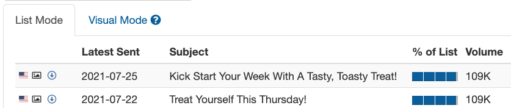
	
	*The above campaigns were sent to 96% of their list, indicating a wide-reaching promotional send to the majority of their audience* 
	
	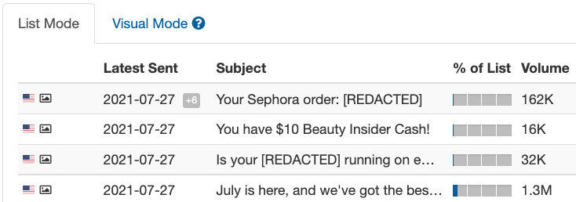
	
	*Sephora sends highly targeted (and dynamic) content to small groups of their subscribers. This is indicative of a highly sophisticated sender.*

* Targeting data is also included in any Competitive Tracker export. Look for the column *percentage\_of\_list.* See above for guides on exporting and sorting your data into an easy-to-read Excel format:

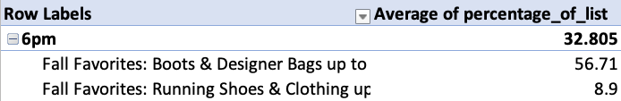

### What are my subscriber's mutual interests?

*[Sending Domain](/analyst/competitive-tracker/sending-domain) , [Overlap Analysis](/analyst/competitive-tracker/overlap-analysis) , [Brand Compare](/analyst/competitive-tracker/brand-compare)*
  
* Email subscriber overlap is important because it:
   
	+ Reflects a likely profile of your customers’ interests.
	+ Identifies key competitors for your customers’ attention in their inboxes, thus allows for examination of their email execution standards and practices.
	+ Identifies opportunities (especially the social sites) for subscriber acquisition and possible joint collaboration leveraging the shared audiences.
* Here is where you can find this data in the platform:
   
	+ **Competitive Overlap.** On the *Sending Domain* tab, open up data on your own sending domain and click the *Overlap* tab. In this tab, we'll show the highest overlap percentage of other senders within your industry.
	
	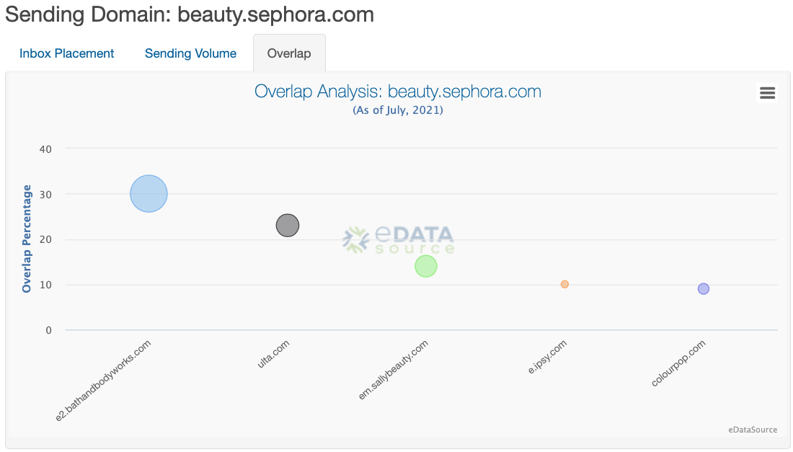
	
	
	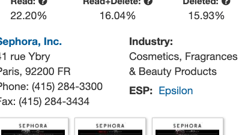
	
	*We have Sephora categorized under the Cosmetics industry, and 30% of their email subscribers also receive mail from Bath and Body Works*
	+ **Overlap Across All Industries.** On the main navigation tab, the section called *Overlap Analysis* will show overlap across all industries.
	+ **Custom Overlap.** Brand Compare allows you to create a custom side-by-side comparison between two to four brands of your choice. Once you've created a comparison, we show the projected volume of audience overlap between the benchmark and comparison brands.
	
	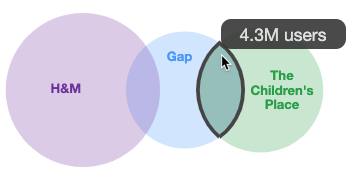

### What are other senders saying about my brand or product?

*[Advanced Search](/analyst/competitive-tracker/how-to-maximize-advanced-search-in-competitive-tracker), [Brand](/analyst/competitive-tracker/brand-tracker) or [Company Tracker](/analyst/competitive-tracker/company-tracker)*
  
* In Brand and Company Tracker, if we've detected other senders mentioning a brand in their emails, we will show those campaigns under the *Top Sending Partners* section. This provides a glimpse as to how other brands are talking about you or your competitors.

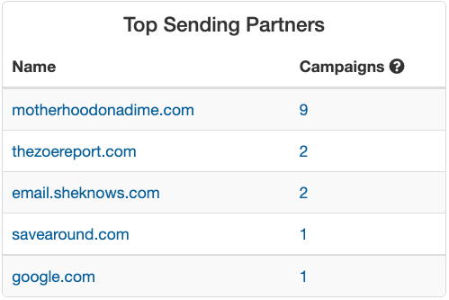

 Similarly, in Advanced Search, you can input domain(s) under the *Drove Traffic To* section. This will show sends from any sender in the time period selected that have mentioned the domain somewhere in their campaign.
   
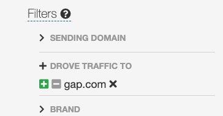

### What are email benchmarks that I can compare my performance to?

*[Advanced Search](/analyst/competitive-tracker/how-to-maximize-advanced-search-in-competitive-tracker)*

 In Advanced Search, you can create industry benchmark reports by setting parameters for your search, exporting the data, and creating a Pivot Table in excel. Please refer to this guide for step-by-step guidance on how to create a benchmark report.

---

### Sales/Prospecting

### What service provider(s) is a brand using?

*[Sending Domain](/analyst/competitive-tracker/sending-domain), [Brand](/analyst/competitive-tracker/brand-tracker) or [Company Tracker](/analyst/competitive-tracker/company-tracker), [Advanced Search](/analyst/competitive-tracker/how-to-maximize-advanced-search-in-competitive-tracker)*

* Company Tracker will show the ESP(s) across all *brands* under the Company in the top right corner. For example, looking at Gap, Inc will show the collective ESPs used across Gap brands (Gap, Banana Republic, Old Navy, etc).
* Brand Tracker shows ESP(s) across all *sending domains under* the Brand in the top right corner. Keeping with the Gap example, they may use Salesforce for their main sending domain(s), but use another ESP for international mail.
* Sending domain shows the ESP(s) for a single domain.
* Advanced Search enables you to set the ESP or IP Range to see all the brands and domains using that provider. Below is an example search you could perform if you are searching for senders on a specific provider, with mail targeting subscribers in the United States, with a volume threshold limit of 100k.

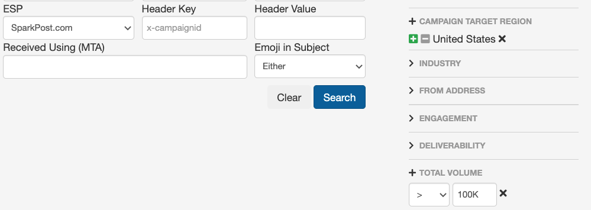

### What is a brand's list size?

*[Sending Domain](/analyst/competitive-tracker/sending-domain), [Advanced Search](/analyst/competitive-tracker/how-to-maximize-advanced-search-in-competitive-tracker)*

 We show Estimated Reach and Volume for a specific domain under the Sending Domain tab. In Advanced Search, you can also set volume limit thresholds (see the screenshot above). This data is viewable in Competitive Tracker CSV exports under the column *overall\_volume.* 
  
### What countries do they mainly target?

*[Sending Domain](/analyst/competitive-tracker/sending-domain), [Advanced Search](/analyst/competitive-tracker/how-to-maximize-advanced-search-in-competitive-tracker)*

 When in List Mode in the Brand/Company Tracker or Sending Domain tabs, we show country flags indicating where the majority of panelists were detected.
   
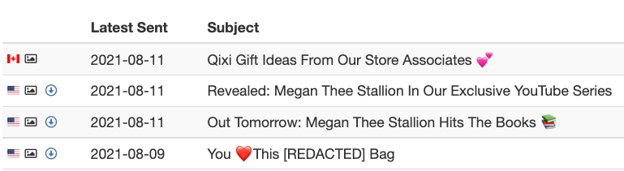

 In Advanced Search, you can set the *Campaign Target Region* to only include sends to a certain regions.
