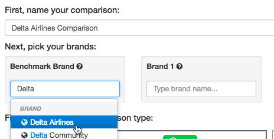
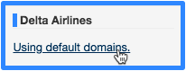
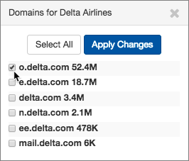
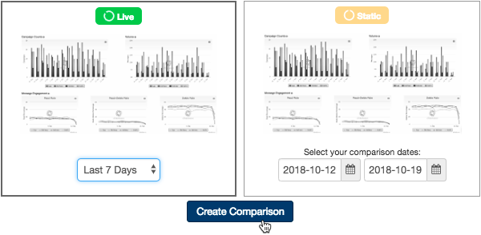
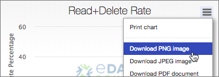
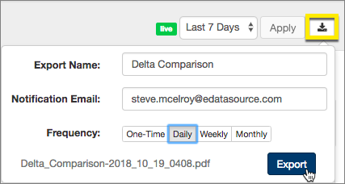
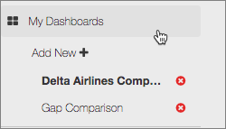

**Step 1 - Navigate to Brand Compare within Competitive Tracker.**

**Step 2 - Give your comparison a descriptive name and enter the brands you want to compare.** The first brand entered will be the brand others are compared to for overlap analysis.

**Step 3 - Select up to three other brands for the comparison, and then select "Using default domains" link for each brand to narrow the sending domains compared.** This will ensure your comparison evaluates the same types of email traffic (commercial, transactional, etc).

**Step 4 - Next, select a live comparison (7, 14, or 30 days) or a static comparison.** Once you have selected a live time period or static dates you can select "Create Comparison".

*Pro Tip: Static comparisons are limited to 95 days, but are great for seeing how your competitors performed during seasonal peaks (back to school, Black Friday, etc).* 

**Step 5 - Once your comparison is complete, you can either download images of individual charts or schedule a PDF export by pressing the "Download" button in the top right corner.** 

*Pro Tip:  You can schedule Live comparisons for export on daily, weekly or monthly frequency.  If you select to schedule an export you can have a PDF delivered right to you and/or your teammates inboxes.* 

**Step 6 - Enjoy your Brand Comparison and feel free to create another one!** Create additional comparisons by clicking "My Dashboards" in the lefthand navigation pane. From there you can add new comparisons or delete existing ones.

