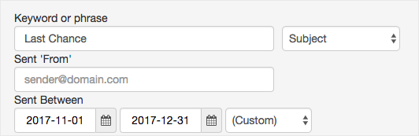
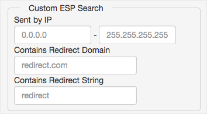
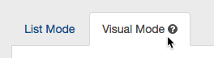
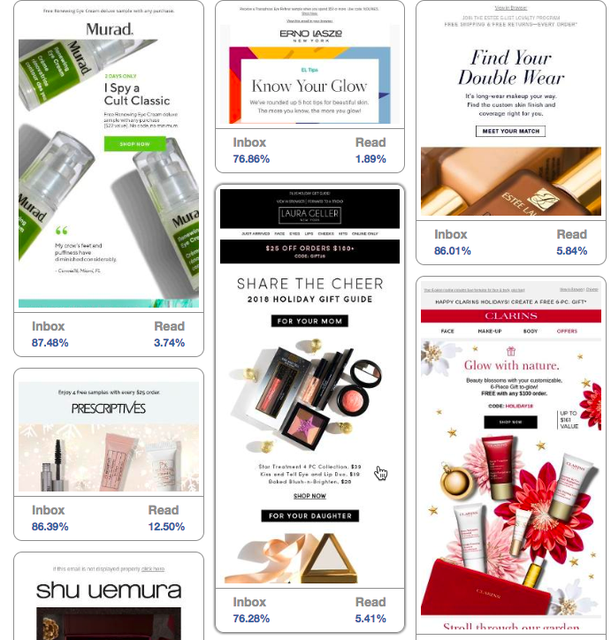
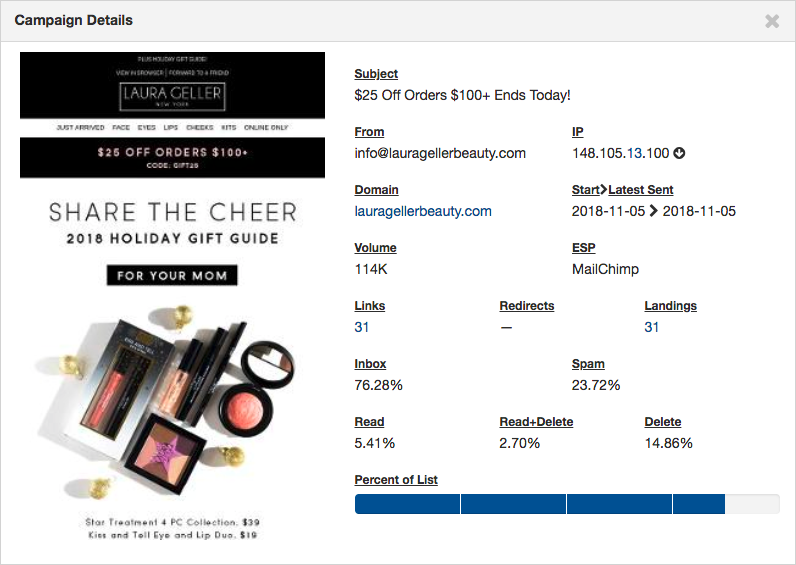
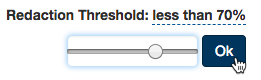

## Advanced Search is Ideal For:

* Assessing and comparing email performance in your industry
* Searching unique phrases in the campaign’s Subject/Body to narrow down results
* Finding industry competitors with high volume and low spam rates
* Evaluating overall industry performance and discover potential problems

* Conducting market research
* Evaluating your own performance across multiple domains
* ESP custom filters allow you to evaluate specific IPS and Redirect domains

## Save Your Queries, Set Alerts, and Export Results

* Save your queries by pressing the bookmark icon to conveniently revisit a successful search
* Create an Alert by pressing the bell icon to receive a notification for new campaigns that meet your search criteria
* Export your search results to further organize the data in a format that suits your needs

## Increase Search Performance

**Grouping** 

* Multiple terms or clauses can be grouped together with parentheses to for sub-queries
* Example: (Free or %) AND Fall

**Boolean operators** 

* \+ Indicates it must be present; - indicates it must not be present
* The + and – only affects the terms to the right of the operator. Example: Fall +Sale
* Familiar operators AND, OR and NOT are also supported. NOT takes precedence over AND. AND takes precedence over OR

## Watch your results come to life with Visual Mode

 This new Competitive Tracker feature offers a new way to view your advanced search campaigns. Use Visual Mode to see an image-focused display of your campaign search results.

 Click the campaign image to see deliverability details.

 Customize how much redacted campaigns you see with the "Redacted Threshold" slider in the top right corner.

