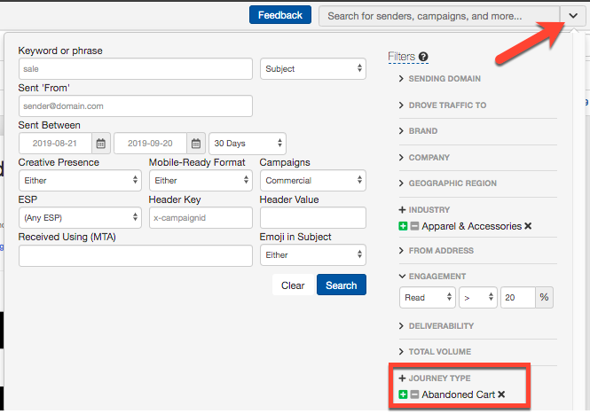
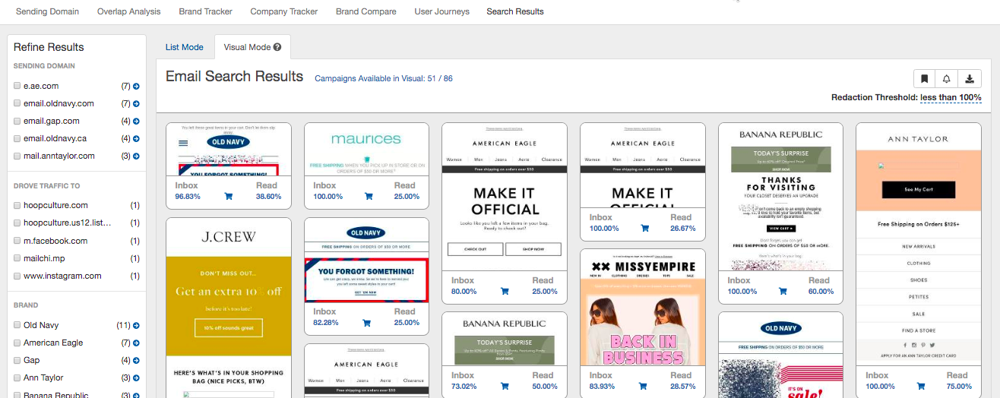
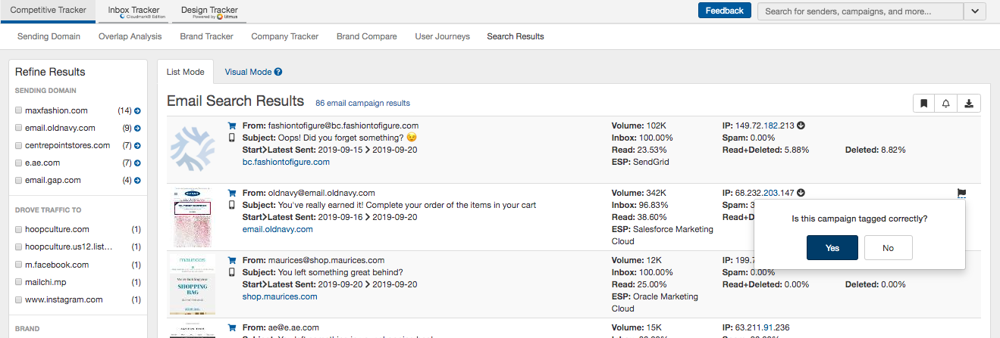
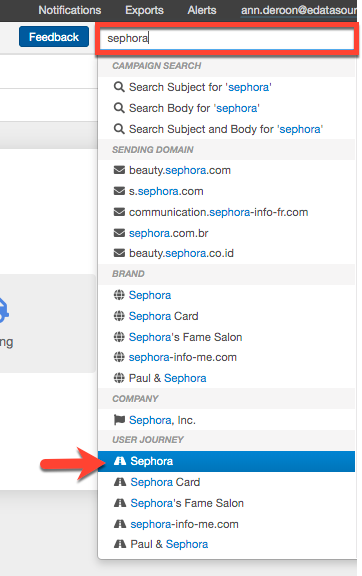
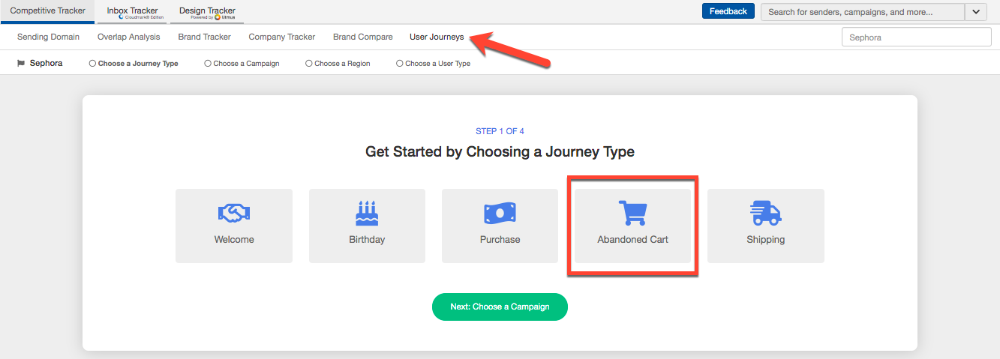
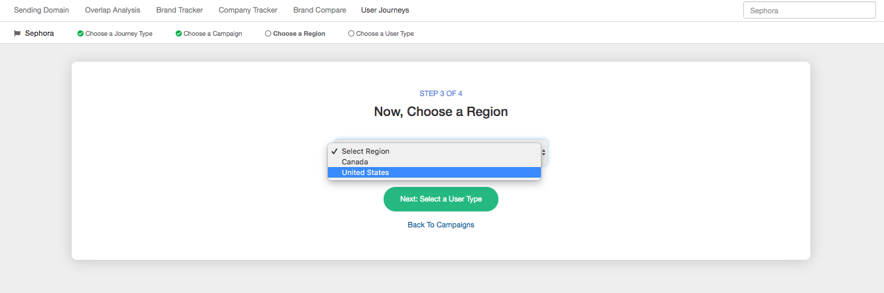
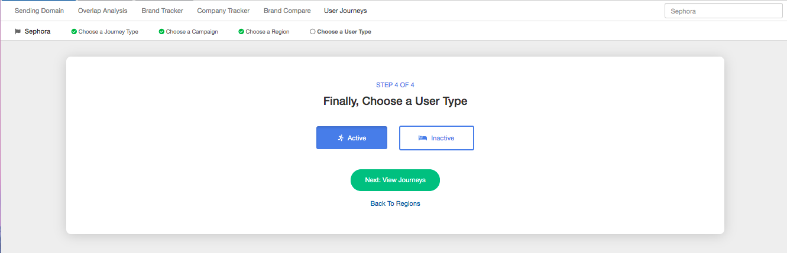
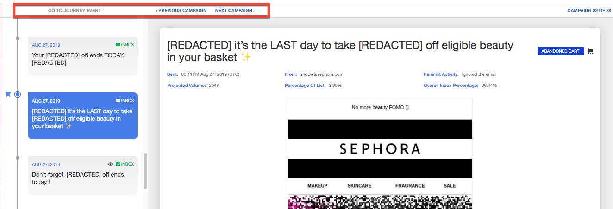
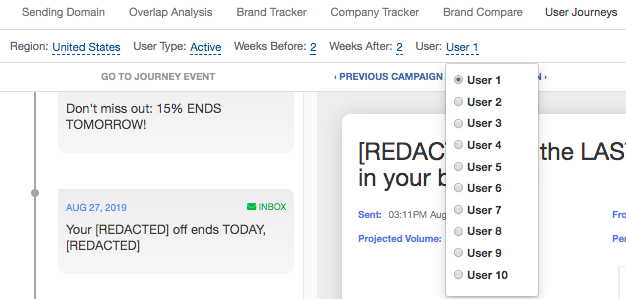

**Journey Mapping allows you to view email campaigns categorized by journey type, including Welcome, Birthday, Purchase, Abandoned Cart, and Shipping.** 
 Dive deeper to view messaging by target region and see how active versus inactive users experience email.
 
 With AI-powered marketing solutions and sophisticated dynamic content ruling email deployment, it’s more difficult than ever to understand a customer’s email journey. From the welcome email to the first purchase, what other messages landed in the inbox and were they opened? How does that experience compare with your competitor’s? That's just the tip of the iceberg.
 
*For a full video walkthrough of Journey Mapping, click* [*here*](https://www.hippovideo.io/video/play/Uo_CGQHPEH46PH1Bf7AyiQmBYn04TlP2PtrtjXiRiIQ) *.* 

**What will I learn from Journey Mapping?** 

* Quickly identify top-performing campaigns by type, view the subject line and creative, and see how the message fits into the overall email program as it is received by individual users
* View a user's email journey by brand to see regional differences in messaging or how an individual’s email experience is different when they’ve been active with the brand in the last 3 months or not
* Select a brand and pinpoint a journey type to see how many messages led up to that user’s action, like a purchase for example. How much time passes between purchase events?
* How many messages does an individual subscriber receive in a given day or week from a brand? Is there a clear limit for active and inactive subscribers?

**Let's get started!** 

 You'll find Journey Mapping in three places within Competitive Tracker:

* Advanced search
* Keyword search
* Competitive Tracker navigation

**Viewing Journey Mapping by Advanced Search**
 Open the advanced search menu to see a new filter option, Journey Type:

 Quickly see any campaigns that meet your filter criteria and have been categorized in your selected Journey Type. In this example, let's find Abandoned Cart emails in the Apparel industry with 20% or better read rates:

 Switch to Visual Mode to see all of the creative:

 We'd love to hear your feedback! Rate any of our tagged messages by clicking the flag icon in List Mode.

**Viewing Journey Mapping by Brand**

 From the keyword search, jump directly to all Journey campaigns for a specific brand:

 While viewing a sending domain, brand or company page, you'll see a new menu option. Either way, follow these 4 simple steps to start viewing a user's journey:

 Step 1: Choose a Journey Type

 Step 2: Choose a Campaign to kick off the journey view
   
 Note: If no campaigns are available, expand your date range or choose a different journey type
 

 Step 3: Select a target region from the available options
 

 Step 4: Choose to view the journey of an Active or Inactive user
 

**A few helpful tips:** 

*Jump to the next tagged journey campaign or scroll through each message received by User 1* 

*Change your filter options at any time or flip to view a different user's journey:* 

*An Active User is a subscriber who has read an email from the selected brand in the last 3 months. An Inactive User is someone who has opened other email in the 3 month window, but none from the selected brand.* 

 Need more help? Visit our other [help articles](/analyst/competitive-tracker/) 
