## CSV exports contain valuable data that is easily sortable in Excel. This step-by-step guide will show you how to create Pivot Tables to streamline your research and extract the actionable data you care about.

 In this guide, we'll cover:

* **[How to Export Data](#how-to-export-data)**
* **[How to Create a Pivot Table.](#how-to-create-a-pivot-table)**
 Basic overview of creating a Pivot Table in Excel.
* **[Recommended Pivot Tables by Use-Case.](#recommended-pivot-tables-by-use-case)**
 Recommended reports from your Advanced Search exports.

	+ **[Industry Benchmarks.](#industry-benchmark-)** Create a benchmark report to understand how your deliverability and engagement rates compare to industry averages.
	+ **[Targeting + Subject Line Analysis.](#targeting-subject-line-analysis-)** Research specific subject lines, and see whether the level of targeting affects the engagement.
	+ **[Sales Prospecting.](#sales-prospecting)** Make a customized prospecting report containing brands, volume thresholds, company headquarters, and senders on specific service providers to help inform your sales research.

---

## How to Export Data

*For more information on Advanced Search, check out this [guide](/analyst/competitive-tracker/how-to-maximize-advanced-search-in-competitive-tracker)!* 

**Step 1 - Look for the export/download icon.** 

**Step 2 - Fill out the details.** Name your export, choose the file type, and set the frequency you would like to receive the report. Then, press the “Export” button.

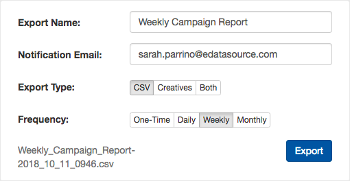

*Advanced Search* data can be exported as a CSV alone, or with creatives.

**Step 3 - Go to the “Exports” tab at the top**. From here you can download your report directly. Go to the “Scheduled” tab if you need to adjust your export settings.

---

## How to Create a Pivot Table

**After exporting the results, open the .csv file in Excel to create a Pivot Table.** 

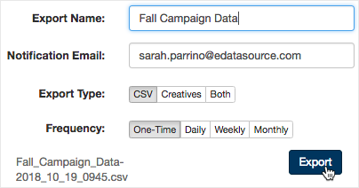

**Go to the Insert tab, press “Pivot Table” and press “OK”.** 

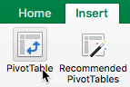

**In the PivotTable Fields pop-up, customize your Table to suit your data needs.** 

 In the “Field Name” section, check all the fields you want to include in your table. The checked fields will automatically appear in the “Values” section.

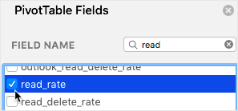

 From the "Values" section, drag and drop fields that you want to create as rows in your Pivot table.

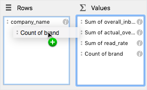

 Make sure to adjust the “Values”, like Read Rate and Inbox Placement, to an Average to reflect percentages by clicking the *i*. Further clean up the data by altering title names and removing unnecessary decimal places.

**And it's that easy to set up your pivot table! Keep reading to see some of our recommend pivot tables!** 

---

## Recommended Pivot Tables by Use-Case

### Industry Benchmarks:

 Gain insights into the deliverability of an industry by performing a simple advanced search and exporting the data into a pivot table.

 This example Industry benchmark report is looking at the industries of Apparel & Accessories, Apparel - Online Fashion, and Apparel - Athleisure for the last 30 days.

 Corresponding Advanced Search:

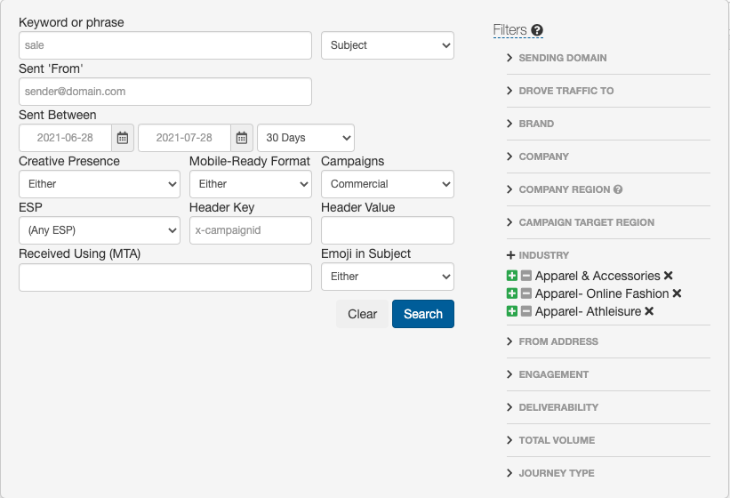

 To create an Industry Benchmark Report, follow the steps below:

* Select the following fields: industry\_type, overall\_inbox\_placement, read\_rate
* Drag 'industry\_type' from Values to Rows
* Select the *i* and change both overall\_inbox\_placement, read\_rate from sums to averages

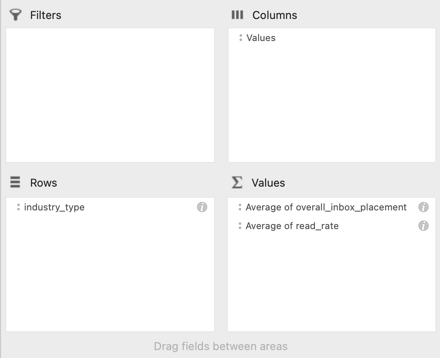

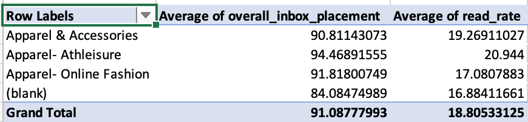

 You can further customize your benchmark reports to include other fields, such as overall volume or inbox placement for specific ISPs, such as Gmail or Yahoo.

 Recommendations:

* For a *Monthly Benchmark* report, we recommend using a 30-day timeframe
* For a *Quarterly Benchmark* report, we recommend a 90-day timeframe

### Targeting + Subject Line Analysis:

 With a targeted advanced search, you can dig into the performance of specific campaigns and analyze subject line performance.

 This example subject line analysis report is looking at the brand Target for campaigns sent to United States recipients over the last 30 days.

 Corresponding Advanced Search:

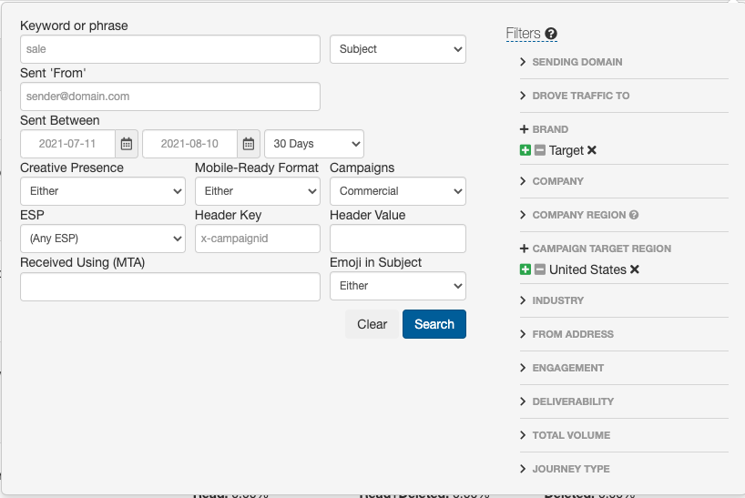

 To create a Subject Line Analysis Benchmark Report, follow the steps below:

* Select the following fields: brand, subject, read\_rate, percentage\_of\_list, overall\_volume, actual\_overall\_volume
* Drag brand and subject from Values to Rows
* Select the *i* for read\_rate to change from sum to average

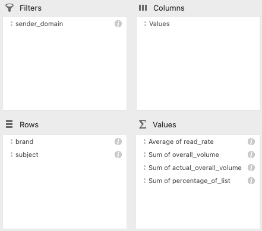

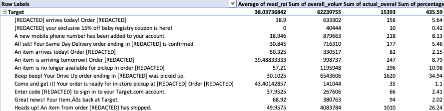

 You can customize your subject line analysis reports to include other fields, such as overall volume or inbox placement for specific ISPs, such as Gmail or Yahoo. Other ways to pivot the table could be adding domain as another field in rows, or adding domain as a filter to look at subject lines from specific domains for the brand.

### Sales Prospecting

 Advanced search is an excellent place to create a prospecting list! You can use the filters to search for campaigns that satisfy the criteria in a new client that you are looking for.

 This example sales prospecting report is looking for campaigns sent to United States recipients for the last 30 days, where expected volume is greater than 600k and deliverability is greater than 50% inbox.

 Corresponding Advanced Search:

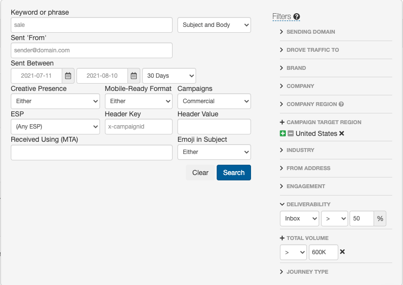

 To create a Sales Prospecting Report, follow the steps below:

* Select the following fields: brand, overall\_volume, inbox\_placement
* Drag brand from Values to Rows
* Select the *i* for inbox\_placement to change from sum to average

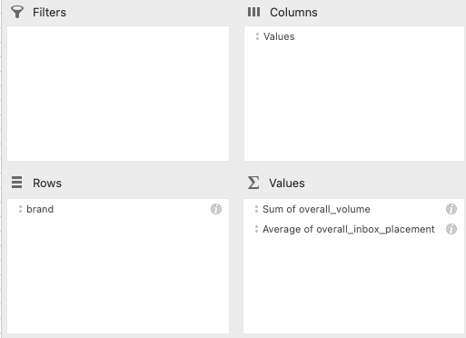

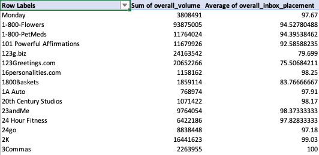

 You can customize your prospecting list by adding different fields you may be interested in. You could add company and sender\_domain as new rows. You could also use ESP in Filters, to see how prospective brands perform on specific ESPs.
