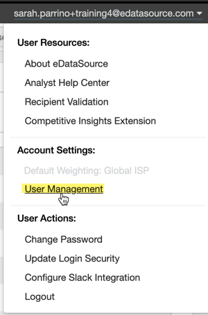
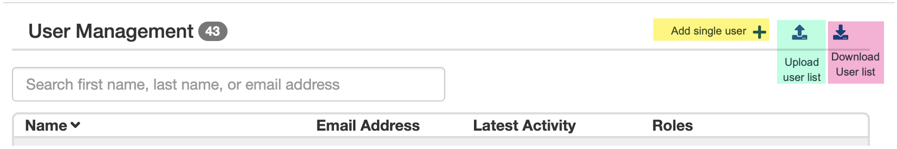
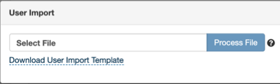
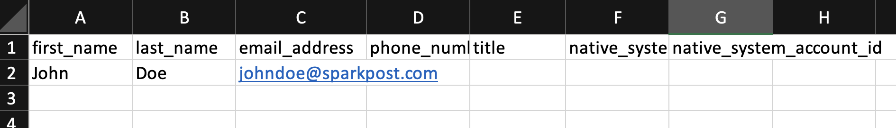
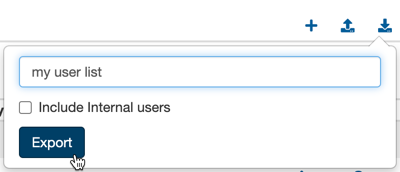
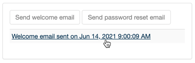
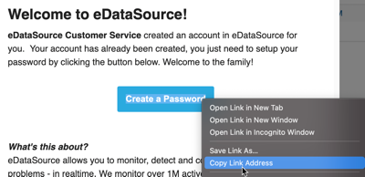
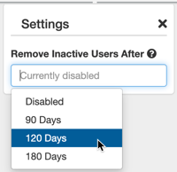

### Account Managers now have the ability to manage their users. This guide will show you how to:

* Add, upload and download a user list
* Manage existing users
* Automatically remove inactive users after a set time period

**To begin, navigate to the User Manager page by clicking your email address in the top right corner.** 
 Note that if you are not an assigned Account Manager, you will not see the User Management section. Another manager on the account can give you managerial permissions to access this setting. Please reach out to us if you are unsure of who the current account manager is.

### How to Add, Upload and Download a User List

 The User Management section allows you to add users individually or upload a CSV file to perform a mass upload of several users.

**To add an individual user,** 
 simply click the + icon in the top right corner. Fill out the required fields and then you can send their welcome email upon saving.

**To add several users at once,** 
 click the upload user list button. Then, download the user import template from the prompt. You can save this template for later if you anticipate having to regularly upload several new users at once.

 The only required fields in the user list template is First Name, Last Name, and Email. You can leave the phone numbers, titles, and native\_ids blank if you are unsure about those fields.

 Once you have added your users to the template, save it as a CSV file and upload it to the User Import prompt.

**You can also download a list of current users on the account.** 
 The "Include internal users" refers to internal SparkPost employees that may have a login on your account.

### Managing Existing Users

 User management includes editing a user, sending a welcome email, viewing usage history, and removing them from your account.

 If a user is having trouble receiving their welcome email, here's how you can get their welcome link directly:

1. Go to the user edit icon
2. Click "Send welcome email" or "Send password reset" on the right-hand side
3. Click on the "Welcome email sent" action on the right

4. Copy the "Create a Password" link and send it to them directly

### Removing Inactive Users

 To easily manage your existing users, we allow you to automatically remove an inactive user at a time period you specify. This setting can be found on the lefthand pane.
 *Note that this setting does not apply to inactive SparkPost employees' logins on your account.* 

 If you are out of seats and would like to add additional users, contact your Account Owner.
