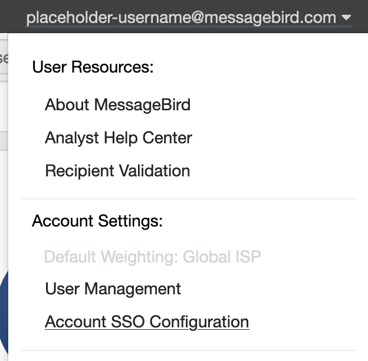

**To begin, navigate to the Account SSO Configuration page by clicking your email address in the top right corner.**

 _**Note** that if you are not an assigned Account Manager, you will not see the Account SSO Configuration section. Another manager on the account can give you managerial permissions to access this setting. Please reach out to us if you are unsure of who the current account manager is._

## How to Create a New SSO Configuration

**To add a new SSO Group,**
 Click the `Create New SSO Group +` button on the right side.

 Take note of the `SAML 2.0 Consumer (POST) URL` and the `Audience URI (SP Entity ID)` to be used later during your IDP setup.

 _**Note:** The URL is not valid until a new SSO Group Configuration is created and a friendly Name and User-Defined Id are given. If the value `default` is used for the User-Defined Id in the SSO Group Configuration, then `https://<url>/rest/auth/login_via_saml?accountId=<id>&ssoGroup=default` would be that URL._

 The `SAML 2.0 Certificate` and `SAML 2.0 Endpoint` can use placeholder values until we have access to the real values after configuring the IDP in a later step.

_Optional, if the account is configured on our end to allow it) Attribute Statements:_
* nativeUserId
* nativeAccountId

_The values for this pair can be anything your organization has available in the IDP that will uniquely identify a user (user.firstName/user.lastName or even email address are some options for this pair if no better identifiers exist)_

**Configure the IDP on your side, using the information above.**

### Finishing Configuration

The **Identity Provider metadata** (usually an xml file or a URL) is used as the source to finish the configuration

This can be uploaded or follow instructions below: 

* Obtain the **X509Certificate** from the XML and use it for the value of the `SAML 2.0 Certificate` on your SSO Group
* Obtain the **Location** from the **SingleSignOnService** section of the XML and use it for the value of the `SAML 2.0 Endpoint` on your SSO Group

## Configuring Users:

If nativeUserId and nativeAccountId are enforced for your account, each user inside of our tool that wants to log in via SSO will need these set:

And you may wish to limit access type for each user:

