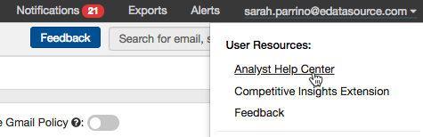

## Check out our Training Video Series:

* **[Inbox Tracker](https://youtube.com/playlist?list=PLiRQcb2qIjwXMKmS3LBexQPHq37CI3xUP)**
* **[Competitive Tracker](https://youtube.com/playlist?list=PLiRQcb2qIjwXGwhgO1N195v1Z25HGUP4q)**

***Note:*** These series are designed for eDataSource users only. If you are a user of a Child Account/End User of a direct partner of ours, please contact your account's Support team.

## Explore the Help Center:

 The help center can easily be accessed in a few ways. First, you can click your name in the top right corner and select "Analyst Help Center" in the dropdown menu.

## Message us directly:

 If you have a question that can be quickly answered by our Support team, click the chat icon in the bottom, right-hand corner to message us directly. We are available during normal business hours. If you prefer to connect via email instead, send us a message at [support@edatasource.com.](mailto:support@edatasource.com) 

