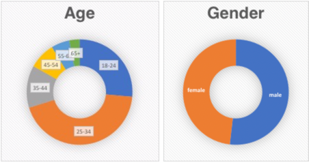

## What is a "User Panel"?

 One of the differentiating factors of eDataSource is our multi-source monitoring solution comprised of virtual personas, seed-based monitoring, consumer panel, and our forthcoming  IntelliSeed™ Network, scheduled to launch in late December, 2018. Each solution monitors and reports upon a unique aspect of your email programs.

 Our consumer panel provides the most expansive coverage on the market today, actively monitoring 42 global ISPs and capturing over 90% of all commercial email.  It is comprised of nearly a million active and real consumers. These are actual subscribers on your email lists.  We currently have subscribers at 42 global ISPs including Outlook, AOL, Yahoo, Time Warner, Comcast, Apple Mail, and many others.
 *Note, due to recent changes to Google’s policies, Gmail data will be limited in standard panel reporting starting in March of 2019 and will be enhanced by our new* 
*IntelliSeed™ Network, you can read more on this exciting new monitoring platform* 
[*here*](/analyst/inbox-and-design-tracker/intelliseed-sending-guide)
*.* 

 Regarding the eDataSource panel, the fact that these are
 **real users** 
 is what, generally, makes a consumer panel more accurate at all of the major ISPs. We are able to report upon deliverability that takes into account IP reputation, domain reputation, authentication results, infrastructure configuration, and most importantly
 **user** 
**engagement.** 

 User engagement is quickly becoming one of the most important factors in your overall deliverability at the major ISPs.  You may have great IP and domain reputation, SPF, DKIM and all your pre-tests render perfectly.  Seeds report 100% inbox placement at Gmail.  However, what you can't see is what is under the surface - the
 **actual deliverability** 
 to your list. Deliverability that is based upon whether your users are reading your emails or deleting them. This is what panel data provides insight into.  Using the eDataSource panel monitoring our deliverability solution will automatically combine both your seed testing and panel users to provide an accurate picture of your deliverability.  No doubt seeds are often necessary, especially to determine how the "clean slate" picture looks. But, panel data shows how your existing list is performing.
 
## Our Panel Statistics

 The eDataSource user panel is one of the most diverse user panel in the market today.  We have over 900k
 **active** 
 email accounts that are monitored on a daily basis, across the globe.
 
 Our panel is comprised of all age ranges and demographics. We are almost 50/50 split between male and female.
 

 The diversity of our panel is truly what sets eDataSource apart from other email panels.

## Common Questions & Answers

### Q: Given that all email applications are designed to change the natural flow and/or behavior of email, doesn't that distort the inbox monitoring being done?
  
 A: No, our consumer inbox monitoring is 100% accurate as recorded by the ISP.  The consumer panel inbox placement monitoring happens
 **prior** 
 to any rules or user-specific modifications happening to the email.  So, when you are viewing inbox placement based upon our consumer panel you are seeing thousands of samples
 **exactly** 
 as they were delivered by the ISP to
 ***your consumers.***
 In regards to engagement monitoring - all engagement monitoring, by definition, has some inherent biases built into the monitoring technology.  For example: monitoring through image tags embedded in the email, has to account for and adjust for images being blocked. Our consumer-based engagement monitoring is based upon tracking the IMAP open flag and is not impacted by blocked images or similar image-beacon blocking technology.
 

### Q: Is your panel GDPR Compliant?

 A: Yes. We have spent significant resources and effort ensuring that our consumer panel complies with all applicable privacy laws, including GDPR.  You can read more about that
 [here](/analyst/privacy-and-gdpr/consumer-panel-data-collection-and-privacy-practices).

 If you have any additional questions about our consumer panel, please don't hesitate to reach out.
 

