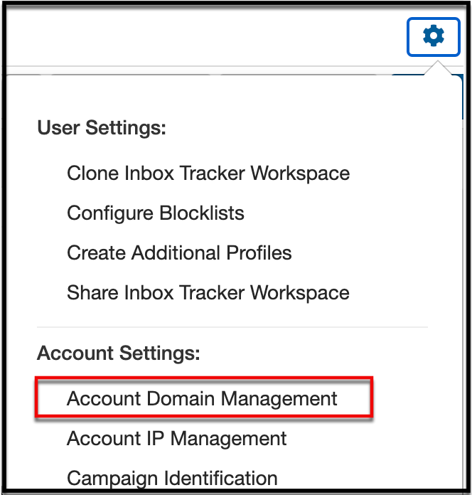
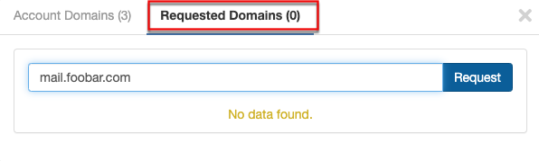
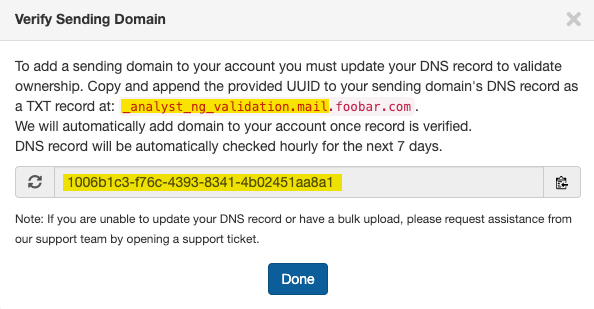
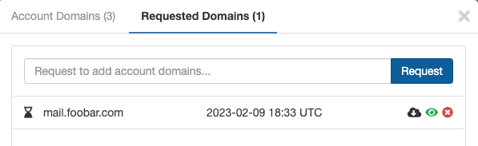
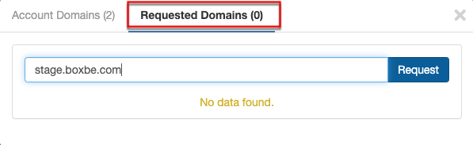
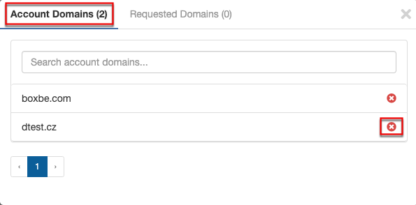

 If you need to make changes to the sending domains you are monitoring with Inbox Tracker we make make it easy and secure.

 In this article we will provide you with the steps to:

* Adding New Domains
* Adding Sub-domains for domains already on your account
* Remove Sending Domains

**To begin, navigate to the Account Domain Management** by selecting the Cog Icon.

*Note: To manage domains you must have the Account Manager role. If you are not assigned the Account Manager role you will have **View Only** access to review domains that are on the account or in a requested state.* 

### Adding new domains

 If you want to add a sending domain that is not related to any other domains on your account you will need to validate your ownership or control of the domain to ensure access is authorized. ***Note: These actions will require you to work with your network administrator to update DNS records.***

1. **Request the domain.**

2. **Complete Sending Domain validation steps.**

3. **Inbox Tracker automatically monitors the requested domain for DNS validation.** 

 Requested domains will be automatically checked every hour for 7 days to allow for time to update the DNS record. Once validated the domain will be added to your account and will be listed under Account Domains.

### Adding Sub-domains for domains already on your account

 If you are adding additional sub-domains for sending domains that are already on your account, you **will not** be required to validate your DNS record, you can simply add the domains. ***Example: If you have boxbe.com on your account, you can add stage.boxbe.com without a DNS validation requirement.***

### Removing Domains

 You can simply select the red X to remove any sending domains you no longer need.

 Happy Sending!!
 
