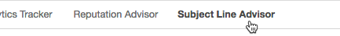

## Analyze past Subject Line performance with Subject Line Advisor, powered by Persado. Optimize future Subject Lines prior to deployment with Subject Predict.

**Navigate to Subject Line Advisor within Inbox Tracker.** Not seeing it? Contact us at [Support@edatasource.com](mailto:Support@edatasource.com) for details.

**Select a date range and review your past engagement.** 

 Includes average subject length, read rate, delete rate, etc.

**Compare frequently used emotional triggers to the recommend ones.** The Recommended Emotional Triggers had the highest read rates, but were used the least.

**Emotional Insights provides a view of frequency vs. read rate. A larger bubble indicates higher frequency.** Hover over to see the list of subject lines that were assigned to each emotion.

**The Emotional Comparison filter lets you control which emotions you want to examine more closely.** Click the emotion to filter both the chart and list of campaigns in the chart that follows.

**Character Count Correlation** tells you how the number of characters in your subject line affects the read rate.

**Top Words & Phrases** gives an additional view into the read rates of your most used words and phrases.

 Here is a list of the 15 most popular emotional tags in Subject Line Advisor:

## Have you tried a variety of emotions? Test out new subject lines using Subject Predict in Design Tracker.

**Use Subject Predict to test as many subject lines as you'd like.** A new campaign test is not necessary to use Subject Predict; just click in to any existing test in Design Tracker to access this feature.

**Once you are in the test campaign, just type in your subject and hit Predict.** 

**From there, you will see a detailed prediction of how your subject line will perform compared to an industry average.** 

**Alter the industry type and sending domain by clicking the underlined values.** Viewing results in a different industry may provide additional guidance on your subject line tests.

**The Persado emotional tag will appear above your test subject line.** Click the underlined section for suggested wording that may increase the projected open rate.

*Bonus tip: Try using subject predict to create a catchy preview text phrase.* 

*Previews show how the message appears in different email clients.* 

**Have fun, experiment, and enjoy your results!** 

