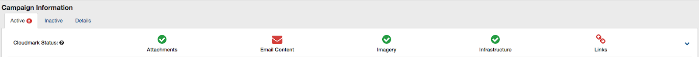

## SparkPost Analytics is proud to bring Cloudmark reported reputation and campaign specific spam verdicts directly to email marketers through Inbox Tracker.

### What is Cloudmark?

 Cloudmark is a security tool that analyzes billions of emails per day in an effort to identify and filter out spam. It is used by many email service providers, and is a spam-filter for over 1.6 billion email addresses. Inbox Tracker keeps a close eye on your Cloudmark reputation to warn you about issues that may impact inbox placement.

### How does it work?

 When you send an email to recipients at a domain that uses Cloudmark anti-spam filters, the filter will scan the entire email, compare the email to one it has seen in the past, and classify components of the email as either spammy or legitimate. Classifications, of either spammy or legitimate, will be returned for these five components:

* The Email Content
* Links
* Images
* Attachments
* Code

 Cloudmark then places these results into the header of your email. This information is used by the receiving domain as a factor in its own filtering decisions. Usually, if an email is deemed by Cloudmark to have spammy components, the inbox provider will decide to place some of the email in the spam folder. If there has been a history of spam, then it’s more likely that all of the email will be blocked.

 As an email sender using Inbox Tracker, you have access to the results of Cloudmark’s analysis, displayed in an easy-to-understand interface. You can use this information to troubleshoot your email deliverability and make any necessary adjustments to improve your delivery to inbox.

**How to Troubleshoot Cloudmark Reputation Issues** 

 Like all threat intelligence and monitoring solutions, Cloudmark does not provide the exact reason a particular tag or signature has been applied to an email, but there are some best practices you can follow to reduce your risk of encountering these issues.

***Compare and Contrast***

 Start by looking at multiple campaigns over a period of days or weeks (or whatever makes sense for your sending frequency). Try to determine:

* Are the flags on a particular campaign/template, or all of them?
* Is it a specific sending IP address is involved? If so, what is the Cloudmark reputation of that IP address?
* Do you notice a pattern in which brand is affected, or which type of email content?
* Are the Cloudmark flags campaigns on a certain day of the week, or on a certain date?
* Does the complaint occur when you send to a specific list of recipients?

 At the same time, identify which components of the email campaigns are being flagged. Is it the attachments, the email content, images, links, or the code that is to blame?

 To see when Cloudmark first deemed a component of the campaign to be spammy, click on the Details tab. Is there a change to your sending practices or email content that was made around this time?

### Additional common factors when investigating Cloudmark Reputation issues:

* **Poor list management:** Buying third-party-lists, scraping addresses from websites, sending to inactive subscribers, not honoring unsubscribes or complaints, sending to spam traps, or simply sending to subscribers who haven’t opted-in.
* **Infrequent template updates:** ISPs use complex algorithms to determine whether a message lands in the inbox or the spam folder. It is recommended to update your templates at least every year to disassociate complaints from your regularly used templated campaigns.
* **Broken automation:** Sending poorly-timed birthday emails, renewal notices, reminder emails, purchase confirmations.
* **A sudden increase in the frequency** of emails received, such as around the holidays or special events. Recipients are used to a certain frequency and may start flagging campaigns as spam if they feel that they are being overloaded with messages from one sender.
* **Including bad links** that point to known malware or phishing websites. Using commercial (non-custom) URL link shorteners. These link shortener domains are all too often used by spammers to disguise themselves, and so they often appear on industry blocklists. If you dynamically publish your subscriber's email address into your unsubscribe link, that can also be a source of the problem. If the link is not found in your HTML email content, query your subscriber database for the domain. If found, consider removing it from your active audience.

 After you have scrubbed the email's content and formatting, you can resend the campaign and see if any issues were detected.  If they are cleared they will be shown as gray numbers vs. red, and you will know your efforts have helped.

 If these steps have not resolved your Cloudmark issues, please reach out to the SparkPost team by sending an email to [support@edatasource.com.](mailto:support@edatasource.com) We will review your specific case and the steps you have taken toward a resolution to determine where to go next.
