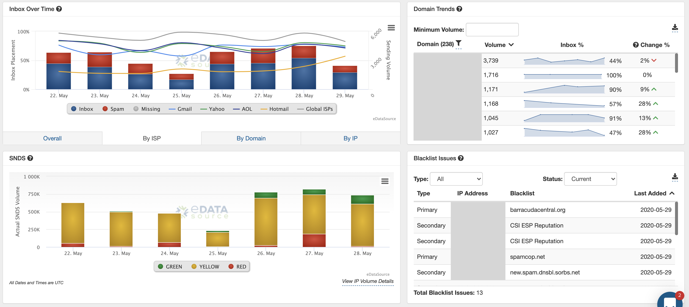

 Command Center was designed to support our ESP and agency partners who monitor large IP blocks and hundreds or thousands of sending domains. Brands will find it helpful too, for managing multiple programs running on individual IP sets or those with many domains.
 
 How does Command Center differ from the Inbox Tracker dashboard?
 
* Users of Command Center are able to easily monitor massive IP spaces with minimal effort.
* Command Center automatically will highlight and find problematic senders or IPs and bubble those issues to the top, at which point, they can drill down into specific senders within the Inbox Tracker dashboard.
* Blocklists can be monitored easily showing all of the offending IPs in a single view.
* Spam Trap data reveals the IP **and** sending domain that hit recycled or pristine spam traps allowing you to find primary offending domains on an IP pool.
* Significantly reduce the time to spot issues with our optimized monitoring intelligence, BEFORE they harm your reputation.

 If you'd like more information on Command Center, please reach out to your Account Manager or email us at [support@edatasource.com](mailto:support@edatasource.com).
 

