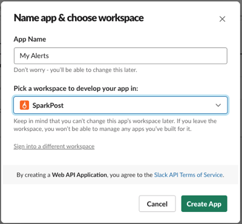
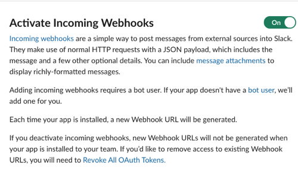
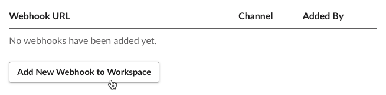
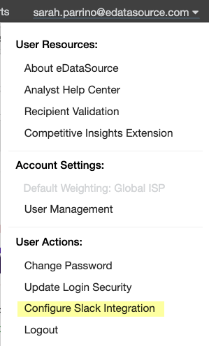
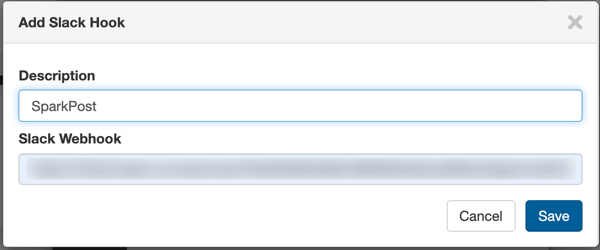
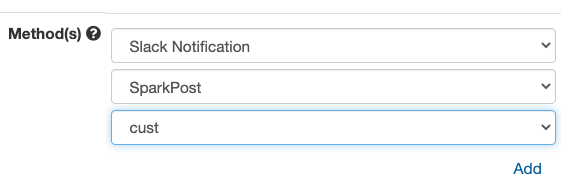

### Want an extra pair of eyes on your deliverability alerts? Sending your alerts to Slack not only allows for extra visibility, but it also enables one person to manage new and existing alerts for your team.

 Follow the simple steps below to begin sending your Inbox Tracker alerts to Slack.

**Step 1 - Create a new shared Slack channel for your alerts to be sent to.** Remember the name of this channel for future steps.

**Step 2 - Navigate to [this](https://api.slack.com/apps/new) page to create a new Slack app.** Creating this app allows for a connection point between your webhook url (for our platform) and the Slack channel you made in Step 1.

* Select *From Scratch*
* Name your app and select the workspace
* Press *Create App*

**Step 3 - Once you press Create App, you'll be taken to another page called Building Apps for Slack** . From there, click on *Incoming Webhooks* 

* Select the toggle to activate Incoming Webhooks

* Scroll down to the bottom of the page, and select *Add New Webhook to Workspace* 

* Select your Slack channel from Step 1 in the prompt that follows

**Step 4 - Copy the webhook url and go to Inbox Tracker.** Click your email address in the top right corner, and select *Configure Slack Integration* 

**Step 5 - Press the plus (+) in the prompt, add a description (your company name, for example), and the webhook URL from Step 4.** Press save.

**Step 6 - Next, click the plus (+) icon next to Channels.** Type in the Slack channel you want your alerts sent to.

* After the above step, a test notification will go through your channel confirming the connection

 Going forward, in the alert creation *Method(s)* section, you will then be able to select the workspace and the channel to send your alerts to. Note that you will need to update any existing alerts to go through the Slack channel.

