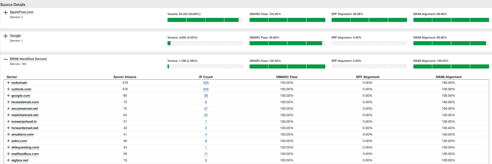

 Domain-based Message Authentication, Reporting and Conformance [(DMARC)](https://dmarc.org/) is an email authentication protocol. It is designed to give email domain owners the ability to protect their domain from unauthorized use, commonly known as email spoofing. The purpose and primary outcome of implementing DMARC is to protect a domain from being used in business email compromise attacks, phishing email, email scams and other cyber threat activities.

 The Inbox Tracker DMARC dashboard provides an overview of the performance of your monitored domains, once these have been set up in the [DMARC Policy Manager](/analyst/inbox-and-design-tracker/dmarc-policy-manager).

 The DMARC dashboard automatically displays sending domains under your account, with filtering options available to select specific Policies, ESP sources, or Profiles/Domains. Once you configure your sending domain DMARC policies to deliver to our system (via the RUA/RUF addresses), you can review DMARC data from that configuration date forward for up to two years.

**Here is a quick breakdown of the DMARC dashboard elements:** 

***Active & Inactive Domains*** The domains in your account will be shown as active or inactive (based on whether the “RUA and RUF” reporting address points towards our service). Click the dotted lines under the counts to show which domains are active and inactive.

***Total Volume*** provides the breakdown for DMARC, Non-DMARC, Forwarded and Threat/Unknown counts for the period being reviewed.

***DMARC Pass/Fail*** displays the percentage of messages that had domain alignment for SPF, DKIM, or both.

***Alignment by Source*** displays the ESP sources that provided DMARC records for the sending domains being reviewed. For each source you will see a DMARC pass percentage based on the SPF and DKIM alignment. If you see ESPs registered here that you are not using, then it’s likely that they are either valid sources that you perhaps did not know about (such as in-house MTAs or valid SaaS products making use of your domain) or they can be sources of spoofing / phishing mail. *Note: If a source has inconsistent (not 0% or 100%) alignment for SPF or DKIM, further investigation may be warranted, since typically your alignment from valid sources should be always aligned or never aligned (i.e. SPF is aligned to ESP vs. brand). In these cases, our system automatically highlights the source(s) with inconsistent alignment.* 

***Domain Based Threats*** displays a map showing where unknown or threat traffic is being reported. Total counts for each country are available by hovering over the area of interest.

***DMARC Domain Overview*** displays all sending domains for the account along with data points for each domain. From this interface users can review DMARC policy, SPF record, or review which sources (ESPs), Reporters (ISPs) and see the collection status for the domain. From this section you can export your data into a CSV or select the hyperlink to view each sending domain in much deeper detail.

 If you want to deeper review of the source details for a specific sending domain, you can select the Record Domain hyperlink. This action will open a new tab where you can review all of the DMARC data points that make up the total volume for the domain.

 This deeper domain view displays ***Total Volume, DMARC Compliance, SPF Alignment, DKIM alignment, Worldwide Distribution*** and ***Volume Distribution***.

***DMARC Capable Volume by Source*** allows you to review volume trends for each source over time.

***Source Details*** allows you to review each source by expanding the views using the “+” symbols on the left to show individual sending source details. This deeper source view is where you can track down where unaligned messages are coming from.

 As you continue to expand the source details, the “IP Count” column can be expanded to show each sending IP that is active on that source.

 This deeper level of detail, allows you to review how each IP is performing from an SPF and DKIM alignment perspective, along with other key details.

 For more information on the DMARC protocol you can check out these informative articles published by DMARC.org:

[DMARC Overview](https://dmarc.org/overview/) 

[DMARC.ORG FAQs](https://dmarc.org/wiki/FAQ) 
