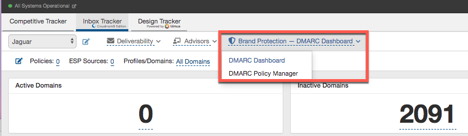
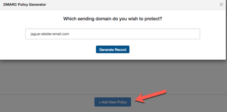
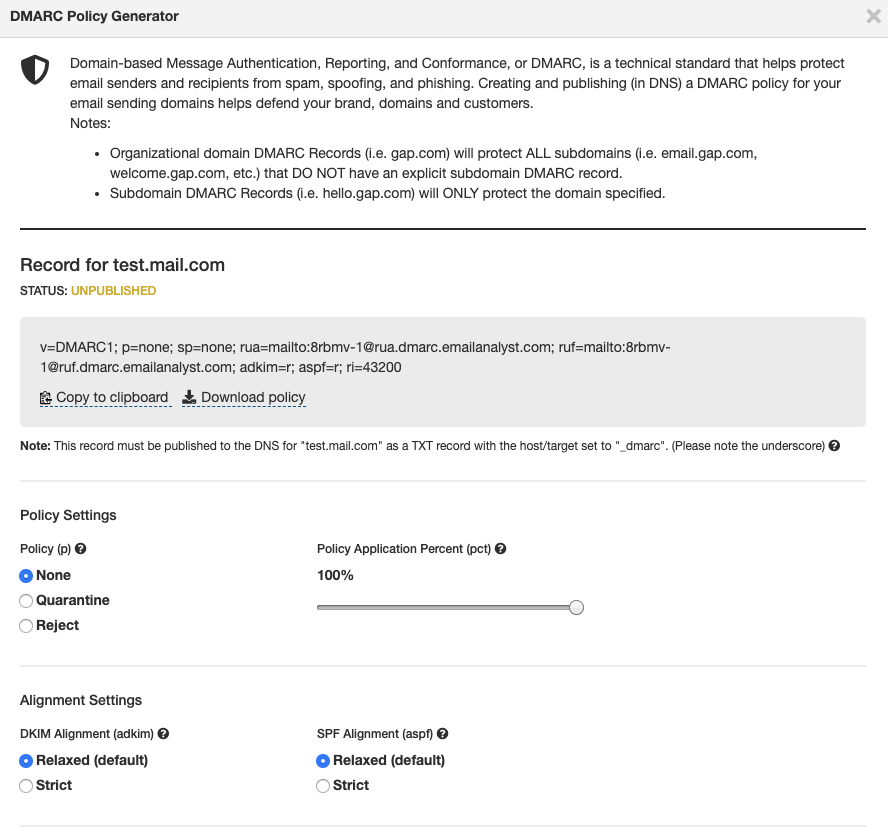

## DMARC, SPF & DKIM: Why?

* Reduce fraud by preventing phishing and malicious emails
* Gain operational visibility into your email channel and service providers
* Create trust in your brand and customer awareness
* Improve inbox placement because ISPs can determine you are the real sender
* Increase revenue because more of your email will make it to the inbox

## Get Started: Create or Update Your DMARC Record

 You'll find a new drop-down menu for Brand Protection within Inbox Tracker. From here, go to DMARC Policy Manager to create a new policy or update a policy you already have in place:

 Click Add New Policy and type in the sending domain, then Generate Record:

 The DMARC Policy Generator looks at your existing DMARC policy and adds the eDataSource RUA and RUF reporting addresses. If no DMARC record is found, we'll generate one. Simply creating the record will not alter your published DMARC policy.

 Review your policy settings and make adjustments as needed:

 The Policy Manager will walk you through the available DMARC policy settings and populate the eDataSource RUA and RUF report addresses.

 Your DMARC policy is ready to be published! Save & Download your DMARC record to a .txt file and pass the file to your DNS administrator to be published.

 All DMARC policies should start off as p=none. This allows you to have a DMARC policy without rejecting any mail.

 Once the record has been published, data will begin to populate on your DMARC dashboard. Plan to review your DMARC Dashboard for several weeks prior to moving to a more strict policy setting.
