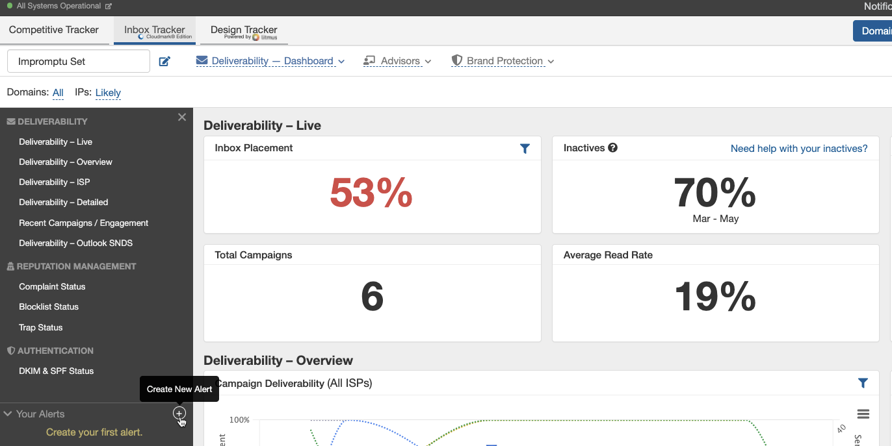
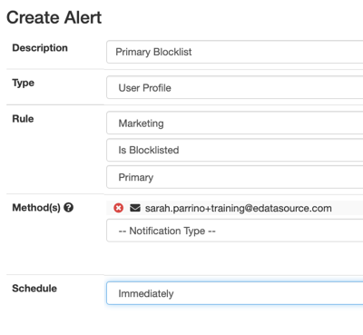
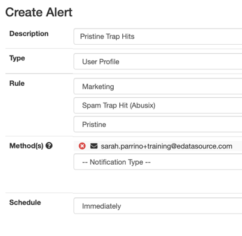
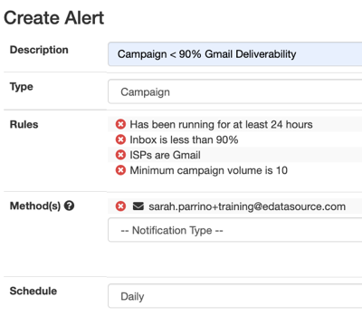
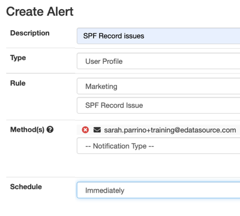
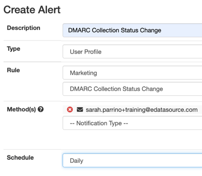
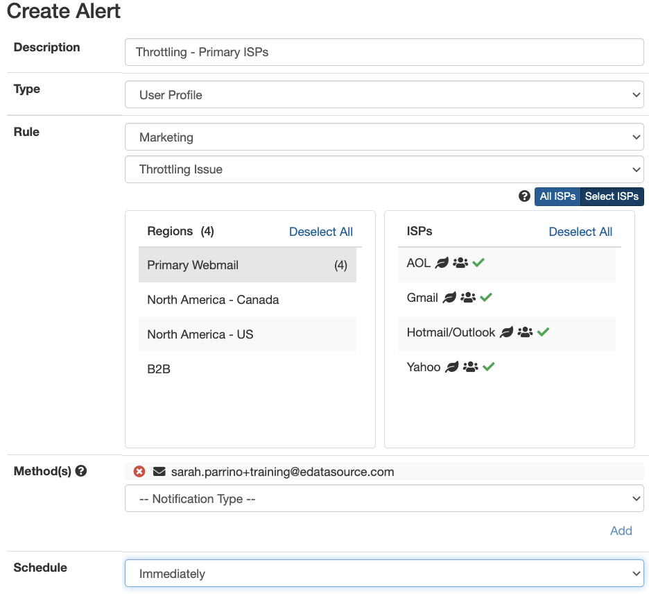

### Inbox Tracker alerts empower you to actively monitor deliverability at all times. Alerts can be sent via email, a designated Slack channel, SMS (for the highly committed), or other methods.

 In this article, we'll walk you through some base set of alerts that will help you get started. Set them up, try them out, and adjust to your own needs.

**To start, navigate to the Dashboard in Inbox Tracker.** On the lefthand pane, you'll find a section called *Your Alerts*. Press the plus (+) to Create a New Alert.

 There are a few fields we'll need to fill out.

* **Description** is the name of your alerts
* **Type** is what you want the platform to examine for alerting criteria. Here is an outline of the different types and what they can be used for:

	+ **Account** can be used to track event usage, such as seed or Analytics Tracker events
	+ **Account IP Group** allows you to set alerts on a specific set of IPs within an IP Group. *Account Managers can create or edit IP groups in Settings > Account IP Management.*
	+ **Campaign** gives the option of setting specific alerting criteria for campaigns that meet certain deliverability thresholds, such as from name, age, etc. See below for an example.
	+ **Domain** alerts on deliverability, blocklists, spam traps, and more for a single domain.
	+ **IP** alerts on a single or range of IPs. For large IP ranges, we recommend using Account IP Groups instead
	
		- Formatting examples:
			* 12.4.202.32
			* 12.4.202.32, 12.2.249.230
			* 12.4.202.32-12.4.202.35
	+ **ISP** can be set for a specific service provider on deliverability thresholds and throttling
	+ **Profile Types** 
	
		- **Account Profiles** can be created to include all the domains on your account. This is helpful for accounts with 100+ domains.
		- **User Profile** are profiles unique to your own workspace.
* **Method(s)** is where you want the alerts to go. We recommend email or [Slack](/analyst/inbox-and-design-tracker/configuring-slack-for-inbox-tracker), so multiple people can keep an eye on your alerts.
* **Schedule** is how often you want the system to check/notify you of your alert criteria. Note that some deliverability threshold alerts can fire prematurely without collecting all data if set to *Hourly*

## Now that we have the basics out of the way, here are the alert configurations we recommend:

### Blocklists

* **Blocklists can be indicative of poor list hygiene and complaints.** We categorize blocklists into two different categories: Primary and Secondary. Primary blocklists have the potential to impact deliverability, whereas Secondary blocklists are less serious and tend to delist on their own.
* You can check which blocklists you have in each category by going to *Settings* *Configure Blocklists*. Here is our recommended set up of these categories:

	+ Primary:
		- baracudacentral.org
		- spamcop.net
		- spamhaus.org
	+ Secondary:
		- abuseat.org (CBL)
		- blacklist.lashback.com
		- CSI (ESP) Reputation
		- new.spam.dnsbl.sorbs.net
		- psbl.org

 If you are a sender that manages a small number of domains, we recommend creating a User Profile containing all your primary domains and having a set up similar to this:

 If you manage more than 100 domains or want to be alerted on IP ranges instead, you can set up either an Account Level Profile alert or base the blocklist scan on an IP Group. See the videos linked above under **Types** for more information.

### Spam Trap Hits

* **Spam Trap hits can be indicative of poor list hygiene** and are often used by Internet Service Providers (ISPs) and blocklist operators to identify senders not following best sending practices.
* Spam Trap alerts are based on Pristine or Recycled traps within our Abusix network. You can read more about our spam trap types and sources [here](/analyst/inbox-and-design-tracker/spam-trap-types-and-sources) 
 .
* Here's an example alert set up for trap hits:

### Campaign Inbox Placement

* Campaign Type alerts allow additional filtering criteria to be added to look for specific conditions across all of the mail being monitored by the Inbox Tracker account.
* These alerts help you control what threshold(s) must be met in order for it to fire
* A few additional notes:

	+ We recommend creating an alert for both Gmail and Outlook (or any other ISP you want to closely watch)
	+ The "Minimum campaign volume" looks at the number of panelists detected on a campaign for a specific ISP ***if*** one is set.
	
		- If you average a large amount of panelists on most of your campaigns, you may want to increase this minimum threshold to a larger value.

**DKIM/SPF Record Issue** 

* DKIM or SPF record issues can be quickly identified with an alert for an individual domain or a user or account profile covering 1-n domains
* SPF Record issues can be quickly identified with an alert for an individual domain or a user or account profile covering 1-n domains
* Example Alert Setup:

**DMARC Alerts** 

* You must have a DMARC record created and published from our Policy Manager in order for these alerts to work. Read more [here](/analyst/inbox-and-design-tracker/dmarc-policy-manager).
* The DMARC protocol helps to authenticate and protect sending domains from unauthorized use and phishing. The DMARC protocol that is tied to SPF and DKIM alignment of your mail and provides Internet Service Providers with disposition instructions if email is not properly aligned.
* You can monitor overall DMARC pass percentage, SPF and DKIM Alignment percentage, detection of new sources, and processing status changes.

### Throttling

* Throttling alerts can identify ISP’s that are holding your mail before delivering into customer’s inboxes. An increase in Time To Deliver (TTD) generally means that your emails are under more scrutiny by the ISP
* Identify an increase of 50% or greater than 5 minutes over the previous 3-day TTD average for an individual domain or a user or account profile covering 1-n domains
* Example Alert Setup:

 We hope this article was helpful in giving you a starting point with alerts. Please reach out to us in our in-app chat if you need any additional help or guidance.
