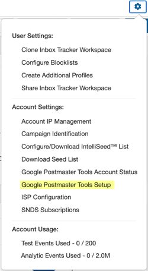

## Google Postmaster integration is an excellent way to have all your deliverability data in one place. In this guide, we'll cover:

* What is the benefit of setting up Google Postmaster tools?
* How to Configure Google Postmaster Tools for your Domain
* How to Sync Postmaster Data to Inbox Tracker
* How to set up Gmail Feedback Loop (FBL)

### What is the benefit of setting up Google Postmaster tools?

 Google Postmaster provides additional visibility on how Gmail rates you as a sender. It displays:

* Your domain and IP reputation
* If users are marking your emails as spam
* Whether you’re following Gmail's best practices
* Why your emails might not be delivered
* If your emails are being sent securely

 Postmaster data can be used to compliment your inbox placement results from panelist and seed reporting to better understand your deliverability and Gmail reputation.

### How to Configure Google Postmaster Tools for your Domain

 If you already have an active Google Postmaster account, please skip to the next section to learn how to sync Postmaster data to Inbox Tracker.

 To begin, login to <https://postmaster.google.com/> with a G-Suite address. Once logged in, follow the prompts in the pop up to begin adding and verifying your domain.

 To authenticate your domain, the txt record provided needs to be published to your domain's DNS before selecting "verify". A DNS administrator on your IT team can assist with this step. [Click here](https://support.google.com/a/answer/183895?hl=en#zippy=%2Cstep-add-the-verification-record-to-your-domain-host) for information on Google's website about adding the record to your DNS.

 Once the domain has been verified, you are ready to sync it to Inbox Tracker!

### How to Sync Google Postmaster to your Inbox Tracker Account

**Step 1: Navigate to Inbox Tracker and click the Settings icon.** Select *Google Postmaster Tools Setup* in the Account Settings section.

**Step 2: Copy the Inbox Tracker email address and add it your domain in Google Postmaster, following the steps in the prompt or outlined below.** 

1. On your computer, sign in to [Postmaster Tools](https://postmaster.google.com/?pli=1).
2. Point your cursor to one of your verified domains.
3. To the right of the domain, click More.
4. Click Manage Users.
5. At the bottom-right, click Add +
6. In the pop-up, enter the Inbox Tracker provided email address of the Google account you want to access your domain’s Postmaster Tools data.

**Step 3: Navigate back to Inbox Tracker and click the Settings icon.** Select *Google Postmaster Tools Account Status* in the Account Settings section. Schedule Inbox Tracker to receive your data by selecting the + icon for the domain you configured.

## 🎉 Congratulations! You have now synced Google Postmaster with Inbox Tracker. Data should be displayed within 24-48 hours after configuring the Postmaster Tools display.

 Once you have everything set up, here is a brief explanation of the data within each chart:

* **Delivery Errors** - Shows rejected and temp-failed traffic vs all authenticated traffic coming from that domain within a single graph.
* **IP Reputation** - IP reputation gives a sense of whether the Gmail spam filter might mark emails from that IP as spam or not. We overlay our Inbox Tracker Gmail Inbox percentage for the domain that is being reviewed.
* **User Spam Rate** - Shows the volume of user-report spam vs. email that was sent to the inbox.
* **Domain Reputation** - Shows whether the Gmail spam filter might mark emails from that domain as spam or not.
* **Spam Feedback Loop** - Only shows up for senders who’ve implemented the [Gmail Spam Feedback Loop (FBL)](https://support.google.com/mail/answer/6254652). *See below for more information.*
* **Authenticated Traffic** Shows traffic that passed SPF, DKIM & DMARC over all received traffic that attempted authentication.
* **Encrypted Traffic** - Shows TLS encrypted traffic vs. all mail received from that domain, and consists of two distinct graphs within the same dashboard.

 For more information, [click here](https://support.google.com/mail/answer/6227174?hl=en) for Google Postmaster's own documentation *Get started with Postmaster Tools.* 

### How to set up Gmail Feedback Loop (FBL)

 If you’re a large volume sender, we highly recommend that you set up the Feedback Loop (FBL) to identify campaigns in your traffic that are getting a high volume of complaints from Gmail users. *Note that FBL data will only pertain to @gmail.com recipients.* 

[Click here](https://support.google.com/mail/answer/6254652?hl=en) for a guide from Google on how to configure the Gmail Feedback Loop.
